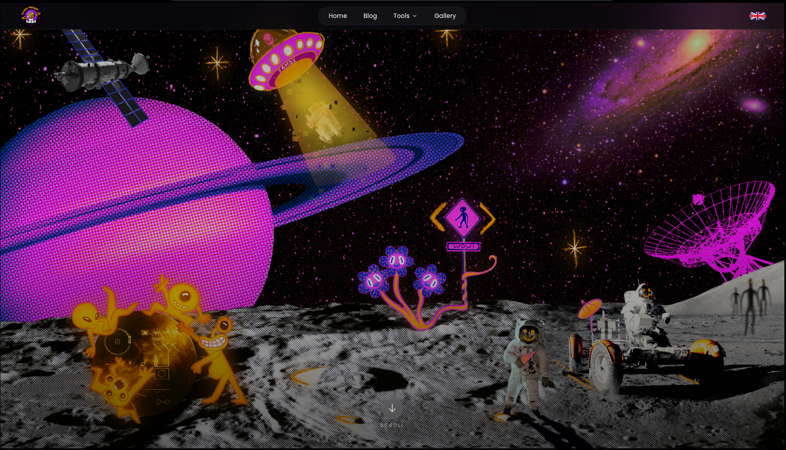

# RadioNugget

My personal portfolio showcasing projects and experiments in amateur radio and satellite communications. This site documents my technical explorations, from satellite reception and tracking to software-defined radio (SDR) experiments.

*designed by [Sol'hey](https://solhey.com/)*

## Projects

- **Technical Articles** - In-depth guides on satellite reception, NOAA weather satellites, SSTV, antenna design, and radio signal processing
- **AllMySat Tracking App** - My personal tracking satellite IOS app <3
- **Grid Square Calculator** - Maidenhead locator system utility for location sharing in amateur radio

Available in French and English (except for some diagrams)
