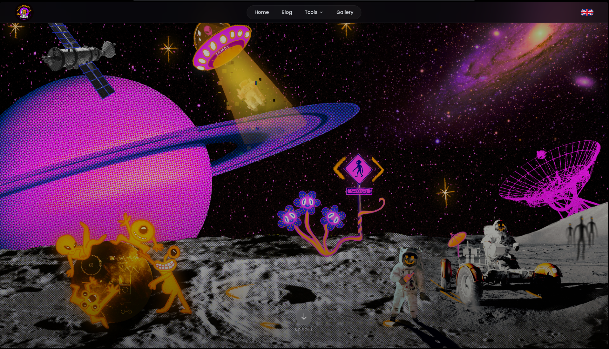

# RadioNugget

A comprehensive website for amateur radio enthusiasts featuring satellite tracking tools, educational blog content, and practical utilities.

*designed by [Sol'hey](https://solhey.com/)*

## Features

- **Satellite Prediction Tools** - Real-time satellite visibility predictions and orbital data
- **Grid Square Calculator** - Maidenhead locator system utilities for location sharing
- **Satellite Area Coverage** - Coverage maps and satellite information
- **Blog** - Technical articles and guides on radio communication topics
- **Image Gallery** - Personal content and resources
- **Multi-language Support** - Available in English and French

## Tech Stack

- Next.js 16 with TypeScript
- React 19
- Tailwind CSS
- D3.js for visualization
- Leaflet for mapping
- MDX for blog content
