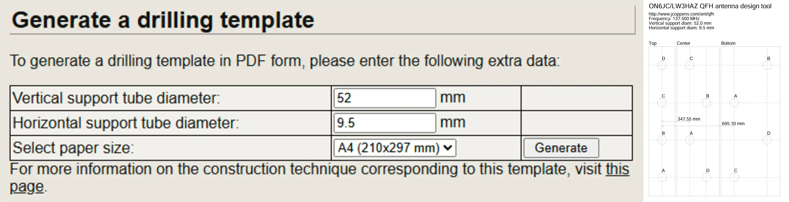

Lors de mon tout premier projet [Réception d'images satellites NOAA](./NOAA.html), j'avais fait une antenne **V-dipôle**, elle a l'avatange d'être très facile à réaliser et d'obtenir des résultats très convaincants. 
Le soucis, c'est les bandes grises d'**interférences** que j'ai sur toutes mes images comme par exemple [celle-ci](https://station.radionugget.com/images/NOAA-19-20240816-201800-MCIR.jpg).
J'ai essayé énormément de choses afin de les enlever, mais je n'y suis jamais parevenu. J'ai donc décider de changer d'antenne pour faire une **antenne quadrifilaire** ou antenne **QFH** (**Q**uadri**F**ilar **H**elicoidal). On verra bien si ça résoudra le problème :) 

# Fonctionnement d'une antenne QFH
L'antenne **QFH** est composé de 2 boucles **hélicoïdales**, enroulées autour d'un axe central chacune déphasées de **90°** l'une par rapport à l'autre. Si la notion de **déphasage** ne t'es pas familière, n'hésites pas à jeter un coup d'oeil à [mon cours](../Radio/Basics/phase.html).
Grâce à ce **déphasage**, les **hélices** produisent une **polarisation circulaire**. Je ferais un cours plus tard sur la notion de déphasage mais faut le voir comme la "direction" (du champ électromagnétique) de notre onde.
L'antenne **V-dipôle** qu'on avait faite a elle une **polarisation horizontale**, ce qui cause des pertes puisque le signal en provenance des satellites a lui une **polarisation circulaire**. Donc l'antenne **QFH** est idéale pour ce type de réception.

# Fabrication de l'antenne
## Théorie
Pour la fabrication de l'antenne, on va se servir de [ce super site](http://jcoppens.com/ant/qfh/calc.en.php) pour calculer nos mesures. 
- **Design Frequency** : Je mets **137.5MHz** puisque je veux recevoir des signaux satellites compris entre **137** et **138** **MHz**. 
- **Conductor Diameter** : Je mets **9.5mm** car je vais utiliser un tube de **cuivre** de **3/8"** soit **9.52mm**. En soit, on peut utiliser n'importe quel diamètre, plus gros permet d'élargir la bande passante de l'antenne et éventuellement améliorer les pertes par conduction. Mais ça reste des gains modérés.

Bref, pour tout le reste, on peut laisser par défaut, c'est très bien puis on clique sur **Calculate**. 
De là, on peut en tirer un schéma. 
À noter que j'ai enlevé **0.5cm** pour les **4 brins du haut uniquement** pour laisser de la place entre eux pour les relier.

## Pratique
C'est parti, on va commencer par regrouper notre cuivre pour que tous nos morceaux soient prêt ainsi que les coude 90°. On se coupe aussi un morceau de **PVC** de **1m20**.

Passons au trou en haut de notre antenne. Afin de faciliter le bricolage de cette dernière, j'ai utilisé un manchon **PVC** qu'on va venir placer au dessus de l'antenne. C'est dedans qu'on va raccorder nos 4 tiges du haut. 
Il va falloir faire 4 trous parfaitement perpendiculaire autour de notre manchon. Pour ça, toujours depuis [ce site](http://jcoppens.com/ant/qfh/calc.en.php), si on descend plus bas, on a une section bien pratique **Generate a drilling template**. On le remplis (correctement), avec le diamètre extérieur du tube où vous allez faire les trous, donc dans mon cas, le manchon qui fait exactement **58mm** de diamètre et on met aussi le diamètre des tiges qui vont rentrer dans les trous donc pour moi **9.5mm**.

Une fois fait, ça nous sort un template à imprimer, on peut découper et garde uniquement la partie **Top**.
À présent, on peut l'enrouler autour de notre tube de **PVC**. À ce moment, c'est important que le papier face pile le tour du tube, même **1mm** de décalage pourrait avoir un impact sur l'alignement des **4 tiges** de cuivre. Si jamais ça ne fait pas pile le tour, ça ne peut qu'être du à une mauvaise mesure du diamètre. 

À présent, on va s'occuper de raccorder nos tiges dans le manchon. Déjà, pour travailler plus efficacement, on peut retirer le manchon du tube. Il existe plusieurs méthodes pour raccorder les tiges mais voici un schema des liaisons à respecter : 

D'abord, on va faire des petits trous au bout des tiges du cuivre et les limer.

Ensuite, on aplati un tube de cuivre et on garde 2 morceaux qui serviont pour les matériaux conducteurs du schema. 
À ce stade, on peut tester avec des vis d'accrocher la plaque aux tiges.

Retirons la plaque et passons à la **soudure à l'étain** avec le câble coaxial, merci papa. Ça donne quelque chose comme ça : 

Pour la soudure de la tige central du câble, ça ne pose pas de problème, par contre, pour la tresse, ça ne prenait pas, donc on la placé dans une cosse qui elle même est soudée à la plaque.
On peut à présent remettre le manchon en haut du tube. 
Passons au tige du bas en revenant sur la section **Generate a drilling template** sur le [calcualteur](https://jcoppens.com/ant/qfh/calc.en.php).
Cette fois-ci, pour le **Vertical  support tube diamter**, on va devoir prendre le diamètre extérieur du **tube**, **52mm** dans mon cas (⚠️ Attention à pas prendre celui du manchon).
Pour le **Horizontal support tube diamter**, c'est toujours le même, le diamètre de nos tube de cuivre, **9.5mm**.

Ensuite, on découpe la partie **Bottom** de notre template pour l'enrouler autour du tube. Pour savoir à quelle distance il faut le placer, notez sur le template la valeur **695.10mm** qui représente la distance que vous devez mesurer en partant des tiges du haut jusqu'au point **A**. En fait, il s'agit de la distance **H2** sur le schéma du début.

À présent, c'est optionnel mais on peut faire faire 2 trous sur le tube de **PVC** afin d'enrouler le câble coaxial autour du tube. Cela permet de réaliser un **balun**. Sans trop rentrer dans les détails, ça permet de faire comme une **bobine** et ainsi adapter l'**impédance** du **câble** avec celle de l'**antenne** et ainsi améliorer les performances de notre antenne.

Très bien, ça commence à prendre forme, on va pouvoir s'atatquer aux courbures des longues tiges.

# Tests