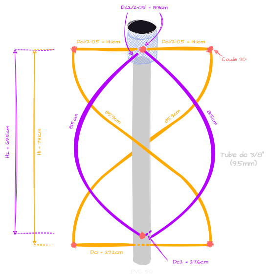

Lors de mon tout premier projet [Réception d'images satellites NOAA](./NOAA.html), j'étais parti sur un modèle d'antenne **V-dipôle**, elle a l'avatange d'être très facile à réaliser et d'obtenir des résultats très convaincants. 
Le soucis, c'est les bandes grises d'**interférences** que j'ai sur toutes mes images comme par exemple [celle-ci](https://station.radionugget.com/images/NOAA-19-20240816-201800-MCIR.jpg) 
J'ai essayé énormément de choses afin de les enlever, mais je n'y suis jamais parevenu. De là est né l'idée de "tout simplement" changer d'antenne et de partir sur ce qui est considéré comme la meilleure antenne pour ce type de réception, j'ai nommé, l'**antenne quadrifilaire** ou antenne **QFH** (**Q**uadri**F**ilar **H**elicoidal).
Alors c'est parti pour en faire une soit même et on verra bien si ça résoudra le problème :) 

# Fonctionnement d'une antenne QFH
L'antenne **QFH** est composé de 2 boucles **hélicoïdales**, enroulées autour d'un axe central déphasées de **90°** l'une par rapport à l'autre. Si la notion de **déphasage** ne t'es pas familière, n'hésites pas à jeter un coup d'oeil à ce [ce cours](../Radio/Basics/phase.html).
Grâce à ce **déphasage**, les **hélices** produisent une **polarisation circulaire**. C'est essentielle car dans les communications satellites, les signaux peuvent subir des rotations en traversant l'atmosphère ou en raison de la rotation du satellite lui même. Ainsi, la **polarisation circulaire** permet de minimiser les pertes de signal dues à ces rotations.

# Fabrication de l'antenne
Pour la fabrication de l'antenne, je me suis (très) fortement inspiré de 2 modèles dont les liens vers leur article sont [ici](https://www.instructables.com/Building-a-QFH-Antenna-and-How-I-Did-It/) et [ici](https://usradioguy.com/wp-content/uploads/2020/05/20200307-How-To-Build-A-QFH.pdf). Il ne s'agit là que ma manière d'expliquer ce que j'ai compris et en français 🇫🇷 :) 
Pour les mesures, on va se servir de [ce calculateur](http://jcoppens.com/ant/qfh/calc.en.php). Y a pas mal de chiffres mais on va uniquement se focaliser sur ce qui nous sert vraiment.
Donc pour la **Design Frequency**, je mets **137.5MHz** puisque je veux recevoir des signaux satellites compris entre **137** et **138** **MHz**. 
Et je change aussi le **Conductor Diameter** qui représente le diamètre du matériau conducteur qu'on va utiliser pour l'antenne. Dans mon cas, je vais utiliser un tube de **cuivre** de **10mm** parce que c'est ce que j'avais donc je met **10**. En soit, on peut utiliser n'importe quel diamètre, ça permet d'élargir la bande passante de l'antenne et éventuellement améliorer les pertes par conduction. Mais en vrai, ça reste des gains modérés.
Bref, pour tout le reste, on peut laisser par défaut, c'est très bien puis on clique sur **Calculate**. 
De là, on peut en tirer un schéma. 
À noter qu'on enlève **0.5** pour les **4 brins du haut uniquement** pour laisser de la place entre eux à l'intérieur du tube pour la soudure.
