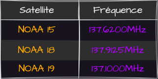
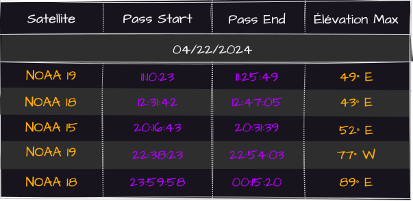
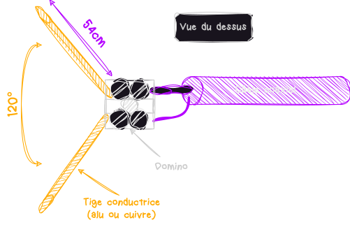
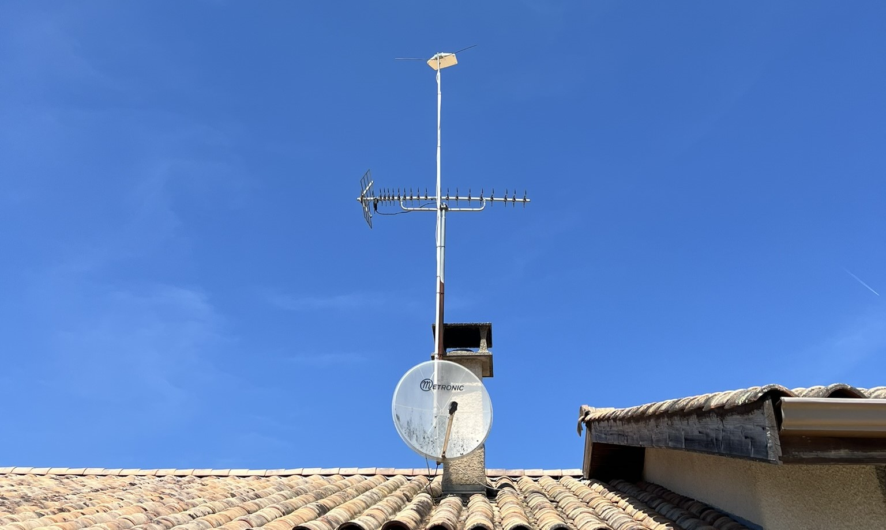

Pour tout curieux souhaitant débuter dans le milieu de la [SDR](../Radio/SDR/sdr.html), recevoir des images satellites en fabriquant sa propre antenne est un excellent point de départ pour acquérir des bases en **radiofréquence**. On va pousser ce projet un peu plus loin en faisant en sorte que ces images satellites se récupèrent **automatiquement**.

# Compréhension du projet 
## Qui sont les NOAA ?
Les satellites [NOAA](https://fr.wikipedia.org/wiki/NOAA_POES) sont des satellites météorologiques américains situés à une altitude d'environ `850km`. Pour comparer, l'**ISS** est à environ `400km`. 
À ce jour, il y en a 3 qui vont nous intéresser : 


Leur fréquence étant publique, n'importe qui avec le matériel adéquat peut recevoir leurs images. Ils ne sont plus en période d'exploitation mais tant que la **NASA** considère qu'ils ne sont pas un danger, ils continuent de les laisser tourner. 
## Orbite héliosynchrone 
Ces satellites ont une orbite circulaire qui les font passer d'un pôle à l'autre de la **Terre**. Ce sont des orbites dites **polaire** et plus précisément **héliosynchrone**. Mais pour plus d'infos sur les différents types d'orbites, tu peux cliquer [ici](../Space/Satellite/type-orbits.html).
Ils se présentent toute l'année sous le même angle par rapport au Soleil : 


Ainsi, comme la **Terre** tourne sur elle même, le satellite peut balayer toute sa surface. Grâce à des [logiciels](https://www.qsl.net/kd2bd/predict.html) ou [sites web](https://www.amsat.org/track/), on peut calculer ses orbites et prévoir le passage de chacun par rapport à des **coordonnées géographiques**. Ils passent à peu près 2 fois par jour au-dessus d'une même zone.
Par exemple, voici une liste de prédictions au dessus de la ville où est installée mon antenne: 

## Transmission APT
Les **NOAA** ne prennent pas directement des photos de la Terre. Ils utilisent un [radiomère à balayage](https://fr.wikipedia.org/wiki/Radiom%C3%A8tre_Avanc%C3%A9_%C3%A0_Tr%C3%A8s_Haute_R%C3%A9solution) qui effectue un **scan** comme le ferait un scanner papier à une vitesse de 2 lignes par seconde, donc c'est lent. 
Pour cela ils vont utiliser le mode [APT](https://en.wikipedia.org/wiki/Automatic_picture_transmission) (**A**utomatic **P**icture **T**ransmission). Il date de 1960 et seules ces 3 satellites l'utilisent encore. La qualité n'est que de `4km` pour 1 pixel. 
Voici un exemple d'image transmise que j'ai reçu avec ce système :


La transmission est composée de **deux canaux d'images**, des **informations télémétriques** et des **données de synchronisation**. 
- Le premier canal (image de gauche) d'image est pris avec un capteur dans les longueurs d'onde visibles. (Un autre capteur peut être utilisé en fonction de la quantité de nuages). 
- Le second canal (image à droite) utilise un capteur **infrarouge**. 
- La bande à **gauche** de chaque image sont des données de **synchronisation**. Comme les ondes peuvent faire des rebonds dans l'atmosphère ou sur d'autres obstacles, elles peuvent ne pas arriver dans le bon ordre jusqu'à l'antenne, donc ces **bits de données** sont là pour les remettre dans le bon ordre et être sûr qu'on reçoive le scan correctement. 
- Les **2** bandes à **droite** de chaque image sont des données **télémétriques**. Il s'agit d'informations envoyés concerant le satellite ainsi que des données pour la météo (c'est à ça qui sert après tout). 
  
Toutes ces données vont être envoyées ligne par ligne à l'horizontal. 
Avant d'être diffusées, les images recoivent des corrections géométriques permettant ainsi d'être exempt de la **distorsion** causée par la **courbure** de la Terre ([car oui, la Terre n'est pas plate](https://www.youtube.com/watch?v=l4Po4cdCsI0)).
Ainsi, avec ces deux images capturées, on peut obtenir d'autres types d'image. Par exemple, voici une image thermique générée par les deux images précédentes : 

C'est grâce à ce genre d'image que les personnes dans la météorologie seront à même de prédire le temps qu'il va faire ⛈️.

## Fonctionnement d'une antenne et SDR
Pour récupérer leur images, il va nous falloir une **antenne** ainsi qu'un récepteur **SDR**.
Ainsi, je vous recommande de lire les 2 articles que j'ai fais, [le premier](../Radio/Basics/antennes.html) pour comprendre comment on choisit une antenne en fonction de la **fréquence** qu'on veut écouter.
[Le second](../Radio/SDR/sdr.html) qui explique ce qu'est la **SDR** (**S**oftware **D**efined **R**adio).

# Mise en place du projet
## Partie matérielle
### Fabrication de l'anntenne
Pour ce projet, j'ai décidé de partir sur une antenne **V-dipôle** qui sera placée **horizontalement**. Ce n'est pas l'antenne optimale pour ce projet (à cause de sa [polarisation](https://culturesciencesphysique.ens-lyon.fr/ressource/simu-polarisation.xml)) mais ça reste la plus simple à construire donc on va partir là dessus pour débuter.
Les signaux **APT** sont très résistants donc au final, même avec une antenne non parfaite, on recevra quand même des trucs, le plus important, c'est surtout d'avoir un ciel dégagé avec l'antenne placée le plus haut possible.
Comme vu sur les cours des antennes, pour qu'elle soit **résonnante** à la fréquence de **137MHz**, on peut faire le calcul suivant : `λ=300/137≈2.18m`.
On va faire une antenne **demi-onde** donc elle devra faire une longueur de `2.18/2` soit `1.09m`. 
De plus, comme on fait un **dipôle**, on va devoir diviser à nouveau par **2** pour avoir la longueur de chaque pôle. Donc `1.09/2≈0.54`. On sait à présent que chaque pôle devra faire **54cm** pour être efficace au **137MHz**. 
Afin d'avoir une impédance de **50Ω**, l'angle formé par les 2 pôles doit être de **120°**.


Le raccordement entre les pôles et le câble se fait avec un domino. On relie la tige centrale du câble à l'un, et la tresse autour du câble à l'autre. On peut analyser ses performances avec un testeur d'antenne.


Le deux valeurs à prendre en compte sont 
- L'impédance -> **R (Ω)** qui est de **58Ω** donc pas les **50Ω** idéales mais relativement proche donc c'est cool.
- Le rapport d'onde stationnaire -> **VSWR** qui doit être au plus proche de **1**. Et là, **2.8**, c'est pas terrible. 

Les premiers résultats n'étant pas très convaincant, je décide d'enlever le domino et de plutôt venir souder les parties entre elles pour que le contact se fassent au mieux. Je récupère à la déchetterie une vieille antenne TV pour caravane qui me permet de facilement régler l'orientation des pôles pour ajuster l'**impédance** de l'antenne. Et voici le résultat final : 


- Le **VSWR** est très proche de **1** ce qui est vraiment pas mal pour le coup. 
- L'**impédance** de **42Ω** n'est pas parfaite mais reste tout à fait correct. 

### Placement et Orientation
Une antenne **dipôle** n'est pas **omnidirectionelles** et il va falloir la placer correctement. Les **NOAA** avec leur orbite polaire arrive soit par le **nord** soit par le **sud**. Par conséquant, on doit orienter l'antenne dans l'une de ses directions, n'importe laquelle. Si on la place vers le **nord** alors que le satellite arrivait par le **sud**, on aura juste à retourner l'image.  :) 
Voilà le rendu final de l'antenne sur le toit orienté plein **sud** dans mon cas : 

Évidemment, la parabole et l'antenne râteau n'ont rien à voir pour ce projet. 
### Raspberry
Pour ce projet, j'utilise un **Raspberry 4 model B** qui tourne sur **Raspbian lite OS** en **64-bits**. Il n'aura pas d'**interface graphique** afin d'éviter toutes fréquences parasites provoquées par la consommation du **CPU** et de la **RAM** à cause des composants graphiques. 
Ce dernier sera placé dans les combles dans un tupperware pour le protéger de la poussière. Pour le récepteur **SDR**, j'utilise la clé **RTL-SDR V4**. Elle sera reliée à l'antenne par **11m** de câble coaxial **TV** au pif mais c'est mieux de prendre un bon câble style du **RG58**


### Filtre
Bien que la clé **SDR** a pour rôle d'enregistrer dans la fréquence qu'on lui demande, elle n'est pas parfaite et il y aura toujours des signaux parasites autour. Pour régler ce problème, on peut être tenté par utiliser un **LNA** (**L**ow **N**oise **A**mplicator). Il va nous permettre de filtrer et amplifier les signaux dans une gamme de fréquence bien spécifique. Par exemple, pour ce projet, il faudrait un **LNA 137MHz** comme [celui-ci](https://www.amazon.fr/NooElec-SAWbird-NOAA-Applications-Fr%C3%A9quence/dp/B07TWPR871/ref=sr_1_1?__mk_fr_FR=%C3%85M%C3%85%C5%BD%C3%95%C3%91&crid=3JXDFIBNMHG1C&dib=eyJ2IjoiMSJ9.mFFmWr9UNDTELd7jA4G3G_iBBoiZyBRdYts8EgwXjuPBWJLnSzPtd_hfNc6sTTgiroKvpfoo1WDs9PUSsw-bGdF9iZwPsRWrWcLuK9lIbKwP4fd7HcMHoxqDOJy0zJAWGNPMXH_JHCNHBzbCmf7j052pjModyeE24G2PRjrts9uRofPh-Hig5qU23rs-xIFGjjdblbDF-z591mkmuFgJmsfqtFTj0ovWvRypJBq-TU33UGYfUyFhZocThOVzagjOwaeGVeWTvkWXhrZhwu7GRGdtG05_gowpSti7dIi5EWQ.UU5r_ajUrMU4Jy6f6F7zP7GwyrtH0BbD78t7OoBGTf8&dib_tag=se&keywords=nooelec+137&qid=1726996924&sprefix=nooelec+13%2Caps%2C97&sr=8-1). 
Il est important de le placer au plus prêt de l'antenne, afin d'amplifier le signal dès que possible. Ainsi, on est sur que le signal ne se perde pas durant le trajet. 

⚠️ Mais attention, l'efficacité d'un filtre dépendra de pleins de facteurs compelxes. Car même si le signal du NOAA sera amplifié, le **bruit parasite** le sera aussi. Et dans mon cas, pour l'avoir testé, ça ne change vraiment rien d'avoir un filtre donc je ne recommande pas d'investir dedans.

## Partie logicielle
Afin de tester toute notre chaîne matérielle, on peut d'abord brancher notre récepteur **SDR** à un ordinateur avec un logiciel comme [SatDump]([../Space/Satellite/satdump.html](https://www.satdump.org/about/)) et tenter de récupérer un signal manuellement. J'en ai fais un guide [juste ici](../Space/Satellite/satdump.html).
Si tout fonctionne, en théorie on pourrait s'arrêter là pour le projet, mais pour aller plus loin, on va faire en sorte d'automatiser tout ça pour avoir un site qui contiendra toutes nos images récupérées 🖼️.
### Github
Pour ce projet, j'ai décidé d'utiliser ce [dépôt Git](https://github.com/jekhokie/raspberry-noaa-v2) qui va grandement nous être utile. 
Pour l'installer, on le `git clone` sur le **Raspberry**, puis on édite le fichier `config/settings.yml` pour y mettre nos coordonnées **géographiques** ainsi que d'autres paramètres selon nos besoins. 
On a plus qu'à lancer l'installation et nous voilà avec un site web affichant tous les passages prévus des satellites, un enregistrement qui se lance automatiquement et une page **Capture** avec l'ensemble des images récupérées. Super pratique ! 
### Accès à distance 
A l'aide du dépôt **Github** précédemment cité, un serveur web **nginx** est créé en `localhost` sur le **Raspberry** accessible donc que depuis le réseau local. 
Si vous avez un **nom de domaine** et que vous souhaitez accéder à votre site depuis n'importe où, vous pouvez associer votre site à l'adresse IP de votre box internet. Grâce au tool **GitHub**, on a la possibilité de générer des certificats **HTTPS** très facilement pour améliorer la sécurité du site. Vous pouvez consulter [ce guide](https://github.com/jekhokie/raspberry-noaa-v2/blob/master/docs/tls_webserver.md) pour en savoir plus. Dans mon cas, ma station est accessible depuis [ici](https://station.radionugget.com).

### Prédiction
On a un **cronjob** qui va se lancer chaque jour à **00h00**. Il va s'occuper d'aller chercher les [TLE](../Space/Satellite/orbits.html) (**T**wo **L**ines **E**lements) des satellites en ligne. Il s'agit d'une représentation standardisée des **paramètres oribtaux** des objets en **orbitre terrestre**. C'est grâce à ces paramètres que l'on va pouvoir prédire à quelle heure un satellite va passer au dessus d'un point donné. 
Une fois récupérée, on a une base de donnée à jour contenant la position des satellites qui nous intéressent. 
Ainsi, on peut faire appel à l'outil `predict` qui comme son nom l'indique, va prédire le passage des satellites en sa basant sur les **TLE**, et sur une **position géographique**. Ce dernier va nous donner une intervalle durant laquelle le satellite va passer en nous indiquant l'élévation maximale du passage. 
Un exemple de la commande lancée manuellement : 
```bash
> nugget@noaa:~ $ predict -p "NOAA 15" -t /home/nugget/.config/satdump/satdump_tles.txt
1714330922 Sun 28Apr24 19:02:02    0  173  192   17  358   3297  35014 * 0.000000
1714331020 Sun 28Apr24 19:03:40    7  175  196   23  359   2648  35014 * 0.000000
1714331117 Sun 28Apr24 19:05:17   15  178  200   29    0   2017  35014 * 0.000000
1714331212 Sun 28Apr24 19:06:52   29  185  204   35    2   1446  35014 * 0.000000
1714331299 Sun 28Apr24 19:08:19   49  202  208   40    4   1030  35014 * 0.000000
1714331365 Sun 28Apr24 19:09:25   64  248  211   43    5    886  35014 * 0.000000
1714331410 Sun 28Apr24 19:10:10   59  293  213   46    6    919  35014 * 0.000000
1714331461 Sun 28Apr24 19:11:01   45  318  215   49    7   1079  35014 * 0.000000
1714331532 Sun 28Apr24 19:12:12   29  331  218   53    9   1423  35014 * 0.000000
1714331618 Sun 28Apr24 19:13:38   17  337  222   58   12   1937  35014 * 0.000000
1714331713 Sun 28Apr24 19:15:13    8  341  226   63   16   2543  35014 * 0.000000
1714331810 Sun 28Apr24 19:16:50    1  343  230   69   21   3185  35014 * 0.000000
1714331830 Sun 28Apr24 19:17:10    0  344  230   70   23   3314  35014 * 0.000000
```
Ici, on demande les prédictions du satellite **NOAA 15** en précisant un fichier **TLE** à jour. L'élvation est indiqué par la **5ème** colonne.
On voit que le prochain passage aura lieu entre **19:02** (première ligne) et **19:17** (dernière ligne) et que l'élévation maximale aura lieu à **19:09** (6ème ligne) et sera de **64°**. 
À noter que j'ai configuré l'outil pour qu'il fasse les enregistrements uniquement pour les passages avec une élévation supérieure à **40°**, autrement, la réception n'est pas top. 
Mais au final, qu'est ce qu'on enregistre, des images ? Et bien non. En réalité, l'enregistrement consiste en la récupération d'un fichier audio ! 
La commande principale est celle-ci : 
```bash
timeout "${RECORD_TIME}" rtl_fm -f "${FREQUENCY}M" -s 60k -g 40 -p 55 - | sox -t raw -r 60k -es -b 16 -c 1 - "${wav_file}" rate 11025
```
Décortiquons là en prenant comme exemple la prédiction de **NOAA 15** vu précédemment : 
- `timeout "${RECORD_TIME}"` -> On laisse tourner la commande pendant `${RECORD_TIME}` secondes. Dans notre cas, ça serait la soustraction entre le timestamp de la dernière ligne et la première soit `1714331830-1714330922=908`  qui vaut environ **15 minutes**. 
- `rtl_fm` est la commande permettant de démarrer l'enregistrement avec notre clé **SDR**. On lui passe comme argument : 
	- `-f` -> La fréquence en **MHz** qui est de **137.62** pour **NOAA 15**.
	- `-s` -> La fréquence d'échantillonage en **kHz**. Dans notre cas, on capture **60 000** échantillons du signal chaque seconde. **60k** est une bonne valeur pour conserver une bonne qualité sans avoir un fichier trop lourd.  
	- `-g` -> Le [gain](../Radio/Basics/power.html) est une mesure de l'amplification du signal par rapport au bruit de fond. Plus cette valeur est élevée, plus on pourra percevoir des signaux faibles mais en contrepartie il y aura plus de bruit. Il faut alors trouver un juste milieu en faitant plusieurs essais afin de conserver le signal sans avoir trop de bruit. À ce jour, je n'ai pas encore trouvé la valeur idéale mais **40** me convient. 
	- `-p` -> Il s'agit de la **préaccentuation**. Il s'agit d'une technique pour compenser les pertes et améliorer le bruit en fonction du récepteur **SDR**. **55** semble faire unanimité pour ma clé **RTL-SDR V4**
	- `-` -> C'est juste pour dire de ne pas rediriger le résultat de la commande dans un fichier ou sur le terminal mais va être redrigié vers la commande `sox` avec le `|`. 
- `sox` est une commande nous permettant de faire des opérations sur des fichiers audio. Ici, on va s'en servir pour obtenir un fichier `.wav` : 
	- `-t` -> On indique qu'en entrée, on a un fichier brut `.raw`. (C'est ce que nous sort `rtl_fm`).
	- `-r` -> On précise à quel fréquence d'échantillonage est le fichier brut. Donc, il faut que ça soit aussi **60k**.
	- `-es` -> On spécifie l'encodage des échantillons. `es` désigne un encodage avec **virgule flotante avec signe**. C'est juste pour avoir une représentation plus précise qu'avec un encodage avec **entier**. 
	- `-b` -> C'est la résolution des échantillons en **bits**. Donc là, nos échantillons sont représenté par des nombres en **16 bits**. C'est une norme courante dans le traitement numérique cette valeur. Ça permet des échantillons pas trop lourd mais avec une précision suffissante quand même. 
	- `-c` -> Le nombre de canal, faut le spécifier et comme on est pas en stéréo, on met **1** ce qui signifie **mono** donc. 
	- `rate` -> On réduit la fréquence d'échantillonage à **11025Hz** car le tool qu'on utilisera par la suite pour la conversion demande cette valeur. 
  
### ~~Magie~~ Conversion 
Ok, à présent, on a un super fichier audio. Il nous reste plus qu'à le transformer en une image à l'aide du logiciel `WXtoIMG`. Ce dernier prend uniquement en entrée notre fichier `.wav` et s'occupe de faire la magie tout seul. On peut lui spécifier un mode de transformation pour l'image. Ce dernier va combiner les 2 images reçues du satellite pour en créer une selon notre besoin. Par exemple, on peut en générer une thermique comme celle qu'on a vu au début mais on peut aussi lui demander de coloriser l'image du mieux qu'il peut et même afficher les frontières le long des mers et océans. Voici un des résultats que j'ai reçue le **18 avril** par **NOAA 18** :  

Les images que je récupèrent sont disponibles sur ma station [juste ici](https://station.radionugget.com/captures).

# Suite et Améliorations
## METEOR
Si vous avez tout correctement configuré, vous avez du voir qu'il y a 2 autres satellites appelés **METEOR** qui sont récupérés. Ce sont aussi des satellites météos qui émettent sur les `137MHz`. C'est pour cela qu'avec le même matériel que pour les **NOAA**, vous pouvez les recevoir. Plus d'infos sur ces satellites russes [ici](../Space/Satellite/meteor.html).

## HRPT
En réalité, ces satellites peuvent envoyer de plus belles images que ça. On l'a dit, mais le protocole **APT** date de **1960** alors que ces satellites ont été envoyés dans les années **2000**. En fait, c'est juste pour une question de rétro-compatibilité avec de vieux équipements. Mais si non, les météorologues vont utiliser un protocole plus récent, le [HRPT](https://en.wikipedia.org/wiki/High-resolution_picture_transmission) ( **H**igh-**R**esolution **P**icture **T**ransmissions). Les **NOAA** envoient avec ce mode sur des fréquences plus hautes, **1700MHz**. Leur récéption demande plus de conaissance et surtout une antenne tout autre. Il s'agit de la suite logique de ce projet afin d'avoir des images toujours plus belles car là où l'**APT** nous donnait du **4km/pixel**, l'**HRPT** nous donne du **1km/pixel**. C'est comme passé d'un écran **FULL HD** à de la **4K** :)  

