Lors de mon tout premier projet de [réception d'images satellites](./NOAA.html), j'avais fait une antenne **V-dipôle**. Elle a l'avantage d'être très facile à réaliser et d'obtenir des résultats très convaincants. 
Le souci, c'est les bandes grises d'**interférences** que j'ai sur toutes mes images comme par exemple [celle-ci](https://station.radionugget.com/images/NOAA-19-20240816-201800-MCIR.jpg).
J'ai essayé énormément de choses afin de les enlever, mais je n'y suis jamais parevenu. J'ai donc décidé de changer d'antenne par une **antenne quadrifilaire** ou antenne **QFH** (**Q**uadri**F**ilar **H**elicoidal). On verra bien si ça résoudra le problème :) 

# Fonctionnement d'une antenne QFH
L'antenne **QFH** est composée de 2 boucles **hélicoïdales**, enroulées autour d'un axe central chacune déphasées de **90°** l'une par rapport à l'autre. Plus d'info sur le **déphasage** [ici](../Radio/Basics/phase.html).
Grâce à ce **déphasage**, les **hélices** produisent une **polarisation circulaire**. Il faut le voir comme la "direction" (du **champ électrique**) de notre onde.

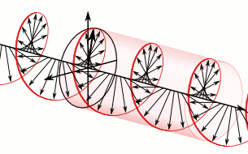
L'antenne **V-dipôle** qu'on avait faite a elle une **polarisation horizontale**, ce qui cause des pertes puisque le signal en provenance des satellites a lui une **polarisation circulaire** 🌀.

# Fabrication de l'antenne
Gardez en tête que votre antenne ressemblera à ça, parce que sur les schémas en **2D** on dirait pas forcément :

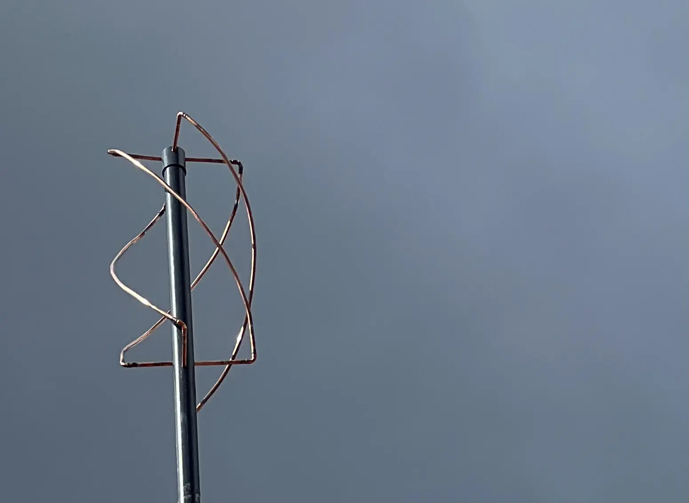
## Théorie
Pour la fabrication de l'antenne, on va se servir de [ce calculateur](http://jcoppens.com/ant/qfh/calc.en.php). 
- **Design Frequency** : Je mets `137.5MHz` puisque je veux recevoir des signaux satellites compris entre `137` et `138MHz`. 
- **Conductor Diameter** : Je mets `9.5mm` car je vais utiliser un tube de **cuivre** **3/8"** soit `9.52mm`. En soit, on peut utiliser n'importe quel diamètre, plus gros permet d'élargir la bande passante de l'antenne et éventuellement réduire certaines pertes. Mais ça reste des gains modérés alors prenez ce que vous avez.

Bref, pour tout le reste, on peut laisser par défaut, c'est très bien puis on clique sur **Calculate**. 
De là, on peut en tirer un schéma en à peu près. À noter les `-0.5cm` sur les **4 brins du haut uniquement** afin de laisser de la place entre eux pour les relier.

## Bricolage
C'est parti, on va commencer par dresser la liste de ce dont on va avoir besoin (hors outils). En ce qui concerne le cuivre, j'avais déjà des couronnes qu'on utilise pour la climatisation. C'est du cuivre dit **recuit**, et qui donc est malléable.

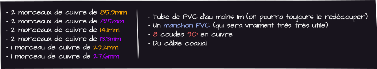

### Haut de l'antenne 
Afin de faciliter le bricolage, j'ai utilisé un manchon **PVC** qu'on va venir placer au dessus de l'antenne. 
Il va falloir faire 4 trous parfaitement perpendiculaires autour de notre manchon. Pour ça, toujours depuis [ce site](http://jcoppens.com/ant/qfh/calc.en.php), si on descend plus bas, on a une section bien pratique **Generate a drilling template**. On la remplit, avec le diamètre extérieur du manchon (`58mm`) et celui des tubes de cuivre (`9.5mm`).

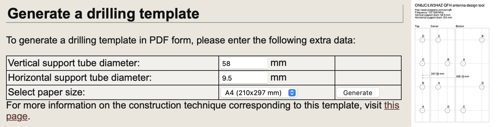
Une fois fait, ça nous sort un template à imprimer, on peut découper et garder uniquement la partie **Top**.
Ensuite, on l'enroule autour de notre tube de **PVC**. À ce moment, c'est important que le papier fasse pile le tour du tube, même `1mm` de décalage pourrait avoir un impact sur l'alignement des **4 tiges** de cuivre. Si jamais ça ne fait pas pile le tour, c'est probablement dû à une mauvaise mesure du diamètre. 

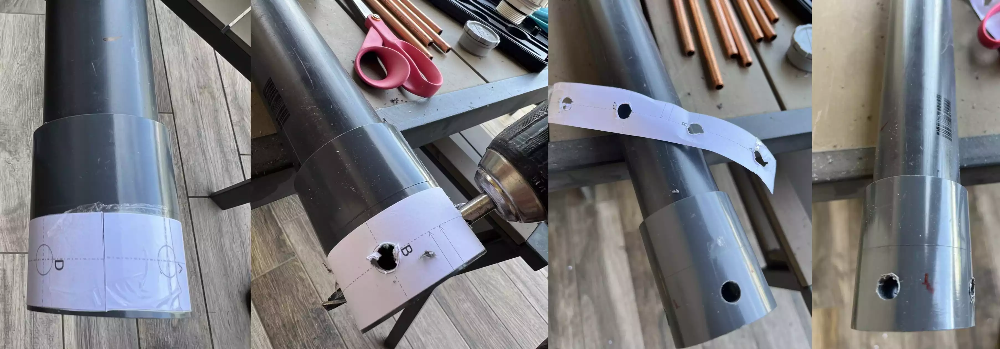

### Bas de l'antenne 
Revenons sur la section **Generate a drilling template** du [calculateur](https://jcoppens.com/ant/qfh/calc.en.php). Cette fois-ci, on va prendre le diamètre extérieur du **tube PVC** (`52mm`).
⚠️ Attention à ne pas prendre celui du manchon comme pour le haut de l'antenne.

Ensuite, on découpe la partie **Bottom** de notre template pour l'enrouler autour du tube. Pour savoir à quelle distance il faut le placer, notez sur le template la valeur `695.10mm` qui représente la distance que vous devez mesurer en partant des tiges du haut jusqu'au point **A**. En fait, il s'agit de la distance **H2** sur le schéma de l'antenne.

### Courbure des tubes
On peut placer les coudes (sans les fixer) aux extrémités de nos 4 longues tiges et les positionner sur le haut ou le bas de l'antenne, n'importe. On peut à la limite légèrement serrer les coudes aux tubes si jamais ça glisse trop histoire de faire notre courbure tranquillement.
Pour la courbure, plusieurs techniques existent mais dans mon cas, j'ai fait la courbure à la main selon ce principe : 

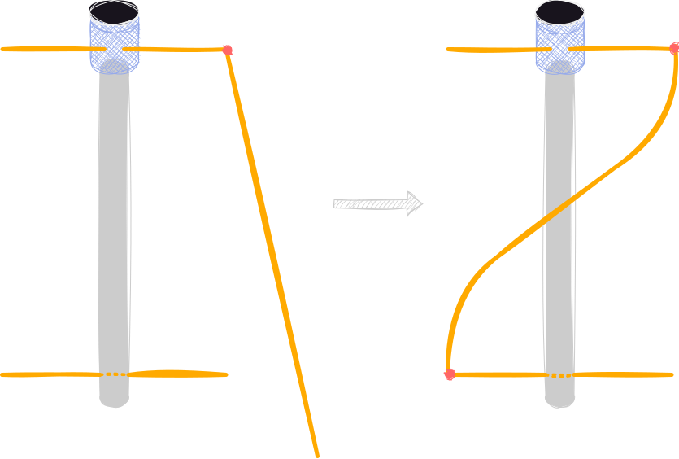

⚠️ MAIS ATTENTION, les signaux satellites qu'on veut recevoir ont une **polarisation circulaire DROITE** (**RHCP**). Ça veut dire qu'il faut courber nos tubes dans le sens **antihoraire** quand on regarde depuis le haut afin de donner à notre antenne une **polarisation circulaire GAUCHE** (**LHCP**) !
Quand on est satisfait de sa courbure, on peut fixer définitivement les coudes aux tubes. J'avais la chance d'avoir accès à de l'abrasure forte qui est plus simple et plus rapide que la soudure à l'étain. 

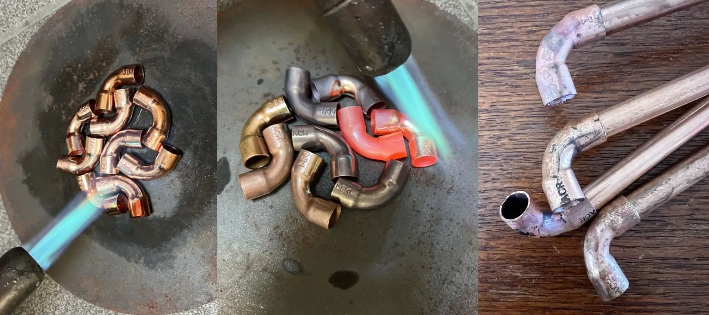
L'eau sur le cuivre sert à le refroidir pour éviter que la chaleur se propage et fasse fondre le PVC 🥵.
À la place de cette technique, on peut aussi serrer fort les coudes avec le tuyau, le contact ne sera pas parfait mais ça peut dépanner.

### Balun
À présent, nous allons réaliser 2 trous en haut du tuyau afin de faire un **balun**. 
En effet, le signal est converti en courant dans un sens dans une des branches et dans l'autre sens dans l'autre branche. On dit alors que le courant est **symétrique** dans l'antenne.
Mais dans un câble **coaxial**, le courant n'est transmis QUE dans le **centre du câble** et donc dans un seul sens. Le courant est alors **asymétrique**. La tresse extérieure est reliée à la masse et agit comme isolant afin d'éviter que le câble se comporte comme une antenne (et aussi pour protéger le signal).
Bref, si on ne fait rien, une partie du signal reçue va aller à la masse ce qui provoque de grosse pertes. Ainsi, on vient placer un **balun** pour **bal**enced->**un**balanced ou dit autrement **symétrique->asymétrique** qui vient régler ce souci.

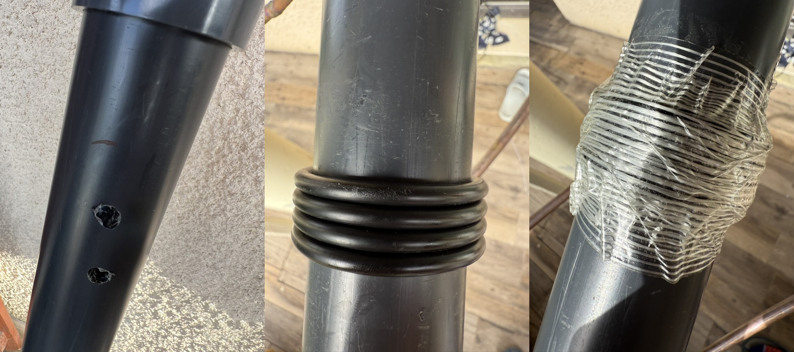

On parle de **balun 1:1**. Le premier **1** représente l'**impédance** du côté **symétrique** donc l'antenne (`50Ω`) et le deuxième celle du côté **asymétrique** donc le câble (`50Ω`). Dans un **balun 1:1**, ces **2 impédances** sont **égales**.
Les **4 tours** ne sont pas une règle absolue mais semblent être une bonne balance pour les [ondes VHF](https://fr.wikipedia.org/wiki/Très_haute_fréquence)

### Câblage
Il existe plusieurs méthodes pour raccorder les tiges mais voici un schema des liaisons à respecter : 

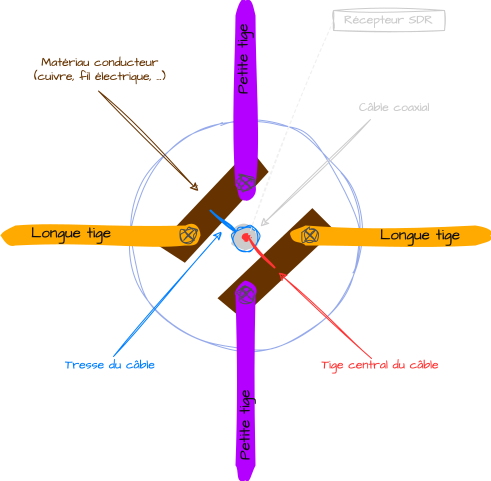
D'abord, on fait des petits trous au bout des tiges du cuivre et on les lime.

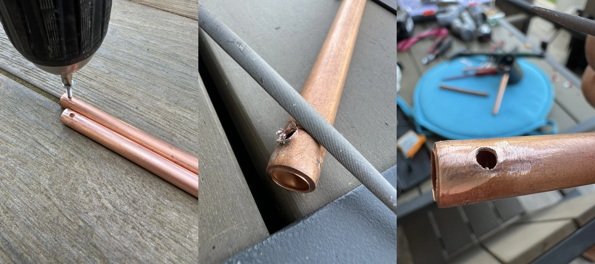

Ensuite, on peut faire le câblage comme sur le schéma. Je l'ai fais sans soudure en torsadant les câbles entre eux et en les serrant bien à l'aide de colliers de serrage. 

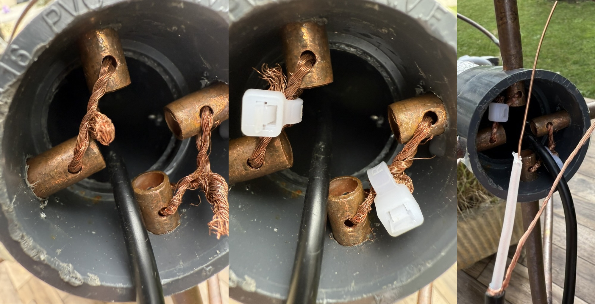
L'idéal reste quand même la soudure mais pour des signaux comme ceux des **NOAA** et **METEOR**, ça fera l'affaire.

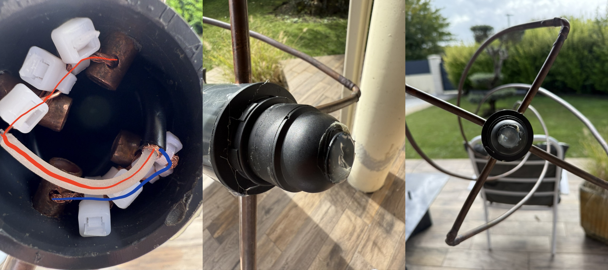
J'ai représenté le courant en provenance de l'âme du câble en rouge et celui en provenance de la tresse en bleu.
On peut ensuite fermé le dessus pour protéger le câblage de la pluie.

### Installation
J'ai fais un petit trou en bas du tube pour y faire sortir le câble, ça évite de l'écraser lorsque l'on pose l'antenne à plat. 

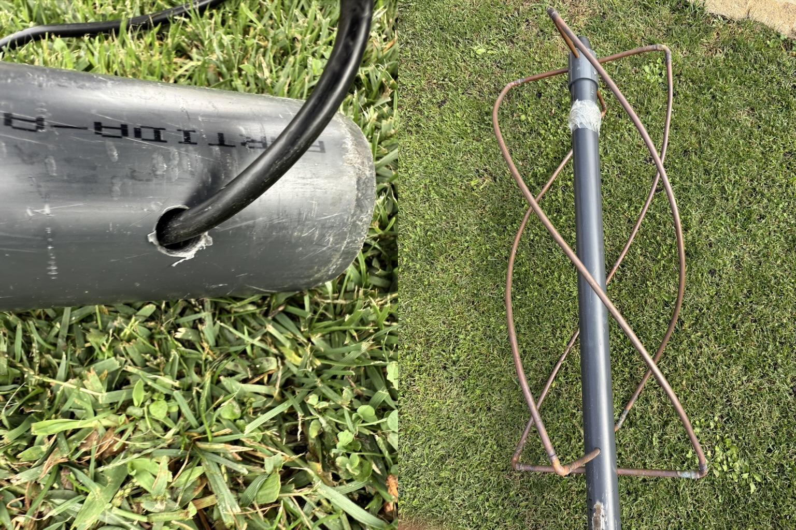
Pour la placer le plus haut possible, j'ai rajouté une longueur de tube PVC. Je n'avais pas de manchon pour les relier, donc j'ai mis un **té**.
Et voilà l'antenne fièrement installée en haut de mon toit. 

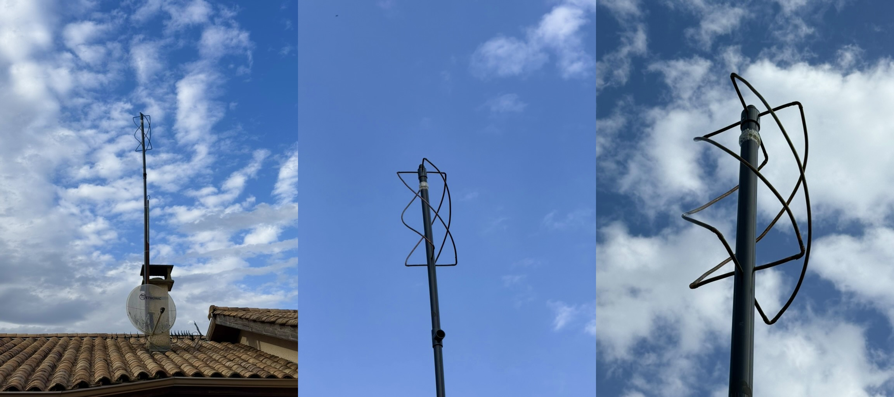

# Tests
Sortons notre testeur d'antenne pour voir ces performances. Bien que les valeurs soient surtout utiles dans le cas où l'on souhaite émettre, elles nous permettent quand même de voir si notre antenne est bien calibrée.

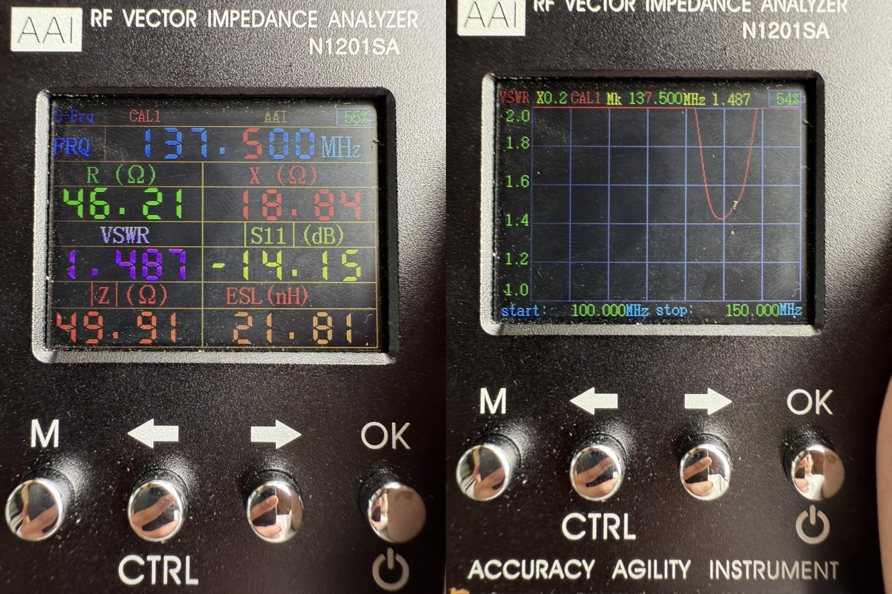
Le **VSWR** est à `1.487` est vraiment pas mal pour une antenne **QFH** faite à la main. Tant que c'est `<1.5`, on peut considérer que l'antenne est bien calibrée. 
L'**impédance** à `46.21Ω` est très bien aussi, puisque qu'elle match à peu près les `50Ω` de notre câble.

Et enfin, voici ce qu'on peut tirer de cette antenne : 

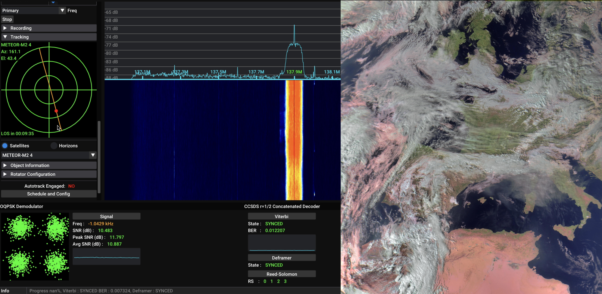

Concernant la problématique de départ, mes images ne contiennent (presque) plus aucune interférences ! Vous pouvez d'ailleurs voir la différence sur [ma station](https://station.radionugget.com/captures?page_no=1) à partir du **15/10**, date à laquelle, j'ai changé d'antenne.
