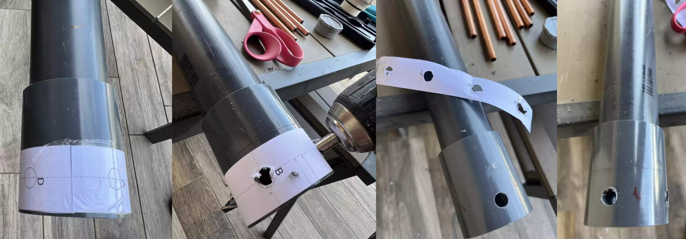
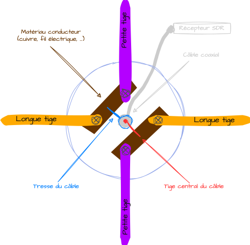
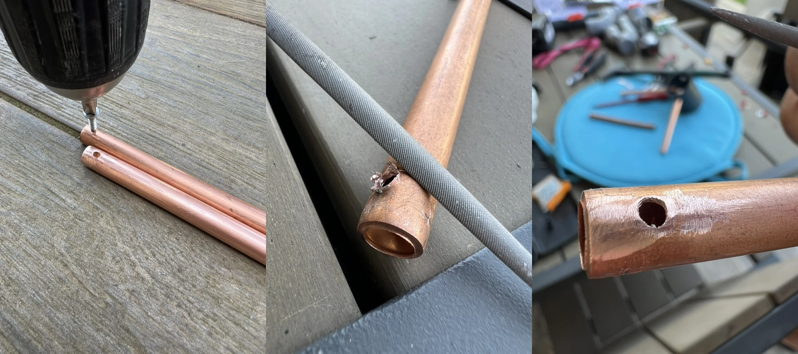
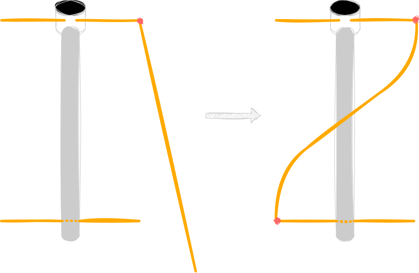

Lors de mon tout premier projet [Réception d'images satellites NOAA](./NOAA.html), j'avais fait une antenne **V-dipôle**, elle a l'avantage d'être très facile à réaliser et d'obtenir des résultats très convaincants. 
Le souci, c'est les bandes grises d'**interférences** que j'ai sur toutes mes images comme par exemple [celle-ci](https://station.radionugget.com/images/NOAA-19-20240816-201800-MCIR.jpg).
J'ai essayé énormément de choses afin de les enlever, mais je n'y suis jamais parevenu. J'ai donc décidé de changer d'antenne pour faire une **antenne quadrifilaire** ou antenne **QFH** (**Q**uadri**F**ilar **H**elicoidal). On verra bien si ça résoudra le problème :) 

# Fonctionnement d'une antenne QFH
L'antenne **QFH** est composée de 2 boucles **hélicoïdales**, enroulées autour d'un axe central chacune déphasées de **90°** l'une par rapport à l'autre. Si la notion de **déphasage** ne t'est pas familière, n'hésites pas à jeter un coup d'oeil à [mon cours](../Radio/Basics/phase.html).
Grâce à ce **déphasage**, les **hélices** produisent une **polarisation circulaire**. Je ferais un cours plus tard sur la notion de déphasage mais il faut le voir comme la "direction" (du **champ électrique**) de notre onde.
L'antenne **V-dipôle** qu'on avait faite a elle une **polarisation horizontale**, ce qui cause des pertes puisque le signal en provenance des satellites a lui une **polarisation circulaire** 🌀.

# Fabrication de l'antenne
## Théorie
Pour la fabrication de l'antenne, on va se servir de [ce super site](http://jcoppens.com/ant/qfh/calc.en.php). 
- **Design Frequency** : Je mets **137.5MHz** puisque je veux recevoir des signaux satellites compris entre **137** et **138** **MHz**. 
- **Conductor Diameter** : Je mets **9.5mm** car je vais utiliser un tube de **cuivre** de **3/8"** soit **9.52mm**. En soit, on peut utiliser n'importe quel diamètre, plus gros permet d'élargir la bande passante de l'antenne et éventuellement réduire certaines pertes. Mais ça reste des gains modérés.

Bref, pour tout le reste, on peut laisser par défaut, c'est très bien puis on clique sur **Calculate**. 
De là, on peut en tirer un schéma. À noter que j'ai enlevé **0.5cm** pour les **4 brins du haut uniquement** pour laisser de la place entre eux pour les relier.

## Bricolage
C'est parti, on va commencer par dresser la liste de ce dont on va avoir besoin (hors outils). En ce qui concerne le cuivre, j'avais déjà des couronnes qu'on utilise pour la climatisation. C'est du cuivre dit **recuit**, et qui donc est maléable.

### Haut de l'antenne 
Afin de faciliter le bricolage, j'ai utilisé un manchon **PVC** qu'on va venir placer au dessus de l'antenne. 
Il va falloir faire 4 trous parfaitement perpendiculaires autour de notre manchon. Pour ça, toujours depuis [ce site](http://jcoppens.com/ant/qfh/calc.en.php), si on descend plus bas, on a une section bien pratique **Generate a drilling template**. On la remplit, avec le diamètre extérieur du manchon (**58mm**) et celui des tubes de cuivre (**9.5mm**).

Une fois fait, ça nous sort un template à imprimer, on peut découper et garder uniquement la partie **Top**.
Ensuite, on l'enroule autour de notre tube de **PVC**. À ce moment, c'est important que le papier fasse pile le tour du tube, même **1mm** de décalage pourrait avoir un impact sur l'alignement des **4 tiges** de cuivre. Si jamais ça ne fait pas pile le tour, c'est probablement dû à une mauvaise mesure du diamètre. 

### Câblage
Pour la câblage, on va retirer le manchon du tube pour être plus tranquille. Il existe plusieurs méthodes pour raccorder les tiges mais voici un schema des liaisons à respecter : 

D'abord, on fait des petits trous au bout des tiges du cuivre et on les lime.

Ensuite, on aplati un tube de cuivre plus fin et on se garde 2 morceaux qui serviront pour les matériaux conducteurs comme sur le schéma. À ce stade, on peut tester avec des vis d'accrocher la plaque aux tiges.

Retirons la plaque et passons à la **soudure à l'étain** avec le câble coaxial. Ça donne ça : 

Pour la soudure de la tige central du câble, ça ne pose pas de problème, par contre, pour la tresse, ça ne prenait pas, donc je l'ai placé dans une cosse qui elle même est soudée à la plaque.
On peut à présent remettre le manchon en haut du tube. 

### Bas de l'antenne 
Revenons sur la section **Generate a drilling template** du [calculateur](https://jcoppens.com/ant/qfh/calc.en.php). Cette fois-ci, on va prendre le diamètre extérieur du **tube PVC** (**52mm**).
⚠️ Attention à ne pas prendre celui du manchon comme pour le haut de l'antenne.

Ensuite, on découpe la partie **Bottom** de notre template pour l'enrouler autour du tube. Pour savoir à quelle distance il faut le placer, notez sur le template la valeur **695.10mm** qui représente la distance que vous devez mesurer en partant des tiges du haut jusqu'au point **A**. En fait, il s'agit de la distance **H2** sur le schéma de l'antenne.

### Courbure des tubes
On peut placer les coudes (sans les fixer) aux extrémités de nos 4 longues tiges et les positionner sur le haut ou le bas de l'antenne, n'importe. On peut à la limite légèrement serrer les coudes aux tubes si jamais ça glisse trop histoire de faire notre courbure trnaquillement. On peut aussi demander à une autre personne de nous aider à le tenir. 
Pour la courbure, plusieurs techniques existent mais dans mon cas, j'ai fait la courbure à la main selon ce principe : 

⚠️ MAIS ATTENTION, les signaux satellites qu'on veut recevoir ont une **polarisation circulaire DROITE** (**RHCP**). Ça veut dire qu'il faut courber nos tubes dans le sens **antihoraire** quand on regarde depuis le haut !
Quand on est satisfait de sa courbure, on peut fixer définitivement les coudes aux tubes. J'avais sous la main accès à de l'abrasure forte qui est plus simple et plus rapide que la soudure à l'étain. 

L'eau sur le cuivre sert à le refroidir pour éviter que la chaleur se propage et fasse fondre le PVC 🥵.

Et voilà à quoi ça ressemble à la fin. On peut venir jouer avec les courbures et l'alignement pour la rendre la plus symétrique possible.

# Tests