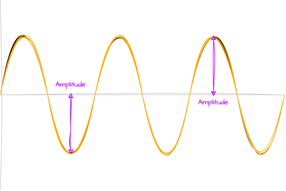
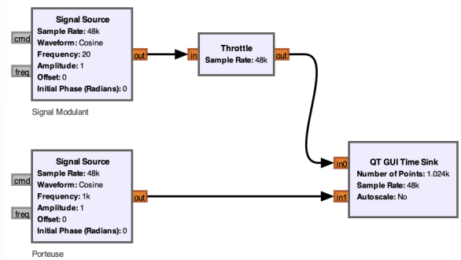
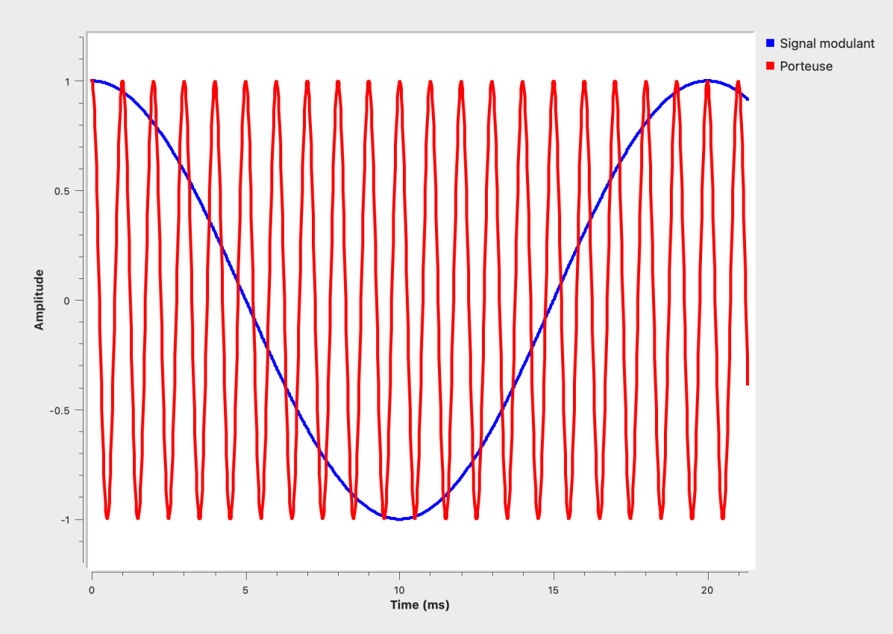
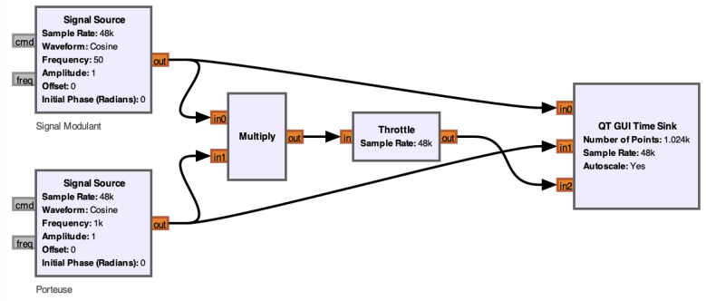
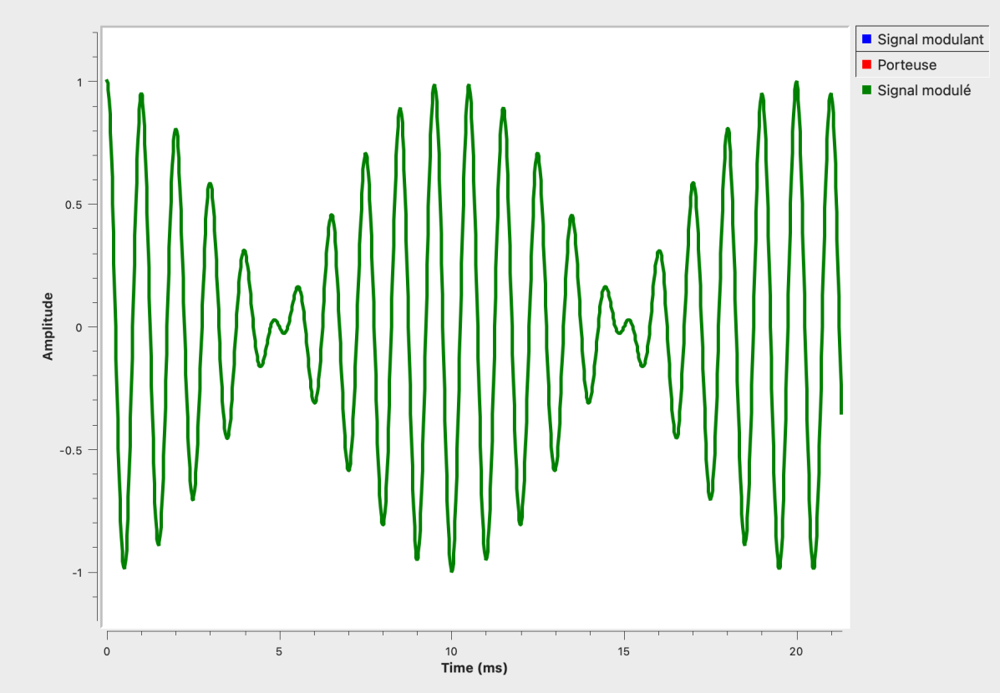
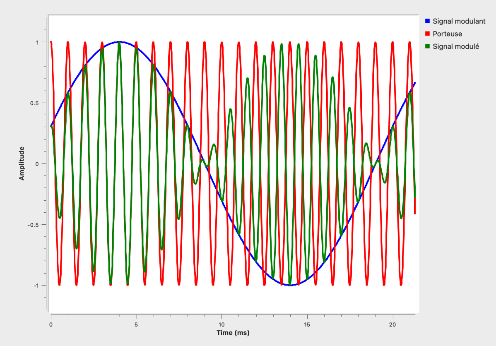

Les signaux bruts qu'on veut émettre sont souvent **faibles** et peuvent grandement s'atténuer sur de longues distances. En modulant notre signal, on va pouvoir **porter** l'information sur une onde beaucoup plus **puissante** 💪🏽. 
Bien que les sources d'émission se mettent plus ou moins d'accord pour utiliser des fréquences différentes, la **modulation** permet d'éviter les **interférences** en évitant que les signaux se mélangent. 

#  La modulation
Imaginons qu'on ait un signal à transporter, du son par exemple. On l'appellera **signal modulant**. Ce type de signal a une fréquence **basse** et est très **faible**. 
Pour le transporter, il nous faut un autre signal qu'on apellera **onde porteuse** qui sera une onde avec une fréquence **élevée** et donc **puissante**. C'est elle qui transportera notre signal faible. 

Avec nos deux signaux réunis, on va venir les **superposer** ([c'est des maths derrière](https://fr.wikipedia.org/wiki/Modulation_d%27amplitude#Principe)), et on obtient notre signal modulé. Il existe plusieurs manières de faire tout ça, et en guise d'exemple, on va voir le type de modulation le plus simple à appréhender, la **modulation d'amplitude**. 

#  L'amplitude 
L'**amplitude** d'un signal représente sa **hauteur maximale** par rapport à sa position au repos. C'est en quelque sorte la puissance du signal radio. 

Cette valeur est importante pour déterminer la qualité du signal modulé. Plus l’amplitude du **signal modulé** est élevée, meilleure en théorie sera la **qualité** de la réception, car cela permet de mieux différencier le **signal utile** du **bruit ambiant**. 
En **modulation d'amplitude** noté **AM**, on va venir faire varier l'**amplitude** de l'**onde porteuse** en fonction de l'**amplitude** du **signal modulant**. 
Pour mieux comprendre, on va utiliser un très célèbre logiciel nommé [GNURadio](https://www.google.com/search?client=safari&rls=en&q=gnuradio&ie=UTF-8&oe=UTF-8). Ce n'est pas très grave de ne pas savoir comme il fonctionne. Mais dans l'idée, ça permet de manipuler des signaux radio en utilisant des blocs qu'on vient relier entre eux.

Donc là, on place 2 blocs `Signal Source` qui permettent de générer un signal, un pour notre **Signal Modulant** qui a une fréquence de `20Hz` et un autre qui sera notre onde porteuse avec une fréquence de `1000Hz` donc bien plus élevée que le signal modulant.
Le bloc `Throttle`, on s'en fiche pour ce cours mais sachez qu'il est là pour éviter de faire crash le PC en réduisant la cadence à laquelle le CPU voudrait éxecuter le programme. Un seul placé quelque part suffit, c'est pour ça que y en a juste un. Bref, revenons à ce qui nous intéresse.
Le bloc `QT GUI TIME SINK` va nous permettre de visualiser nos deux signaux dans le **temps**. 
Voilà ce qu'on obtient lorsque l'on lance notre programme : 

On voit nos 2 jolies sinusoides, la rouge qui est notre **porteuse** et la bleu notre **signal modulant**. 

#  Modulation d'amplitude
À présent, superposant nos deux signaux en les **multipliant**. ([Les fameuses maths qui se cachent derrière](https://fr.wikipedia.org/wiki/Modulation_d%27amplitude#Principe)). 

Donc ici, on a juste rajouté le bloc `Multiply` et on renvoie le signal modulé dans notre `QT GUI Time Sink`. J'ai aussi laissé les 2 autres signaux reliés au `QT GUI Time Sink` pour qu'on puisse mieux comprendre. Et pareil, le bloc `Throttle`, vous pouvez l'ignorer.
Lançons le programme et laissons apparraître uniquement le **signal modulé** pour voir à quoi il ressemble. 

On peut voir cette forme caractéristique d'un signal modulé en **amplitude**. 
Et maintenant, affichons nos 3 signaux (modulant, porteuse et modulé)

On comprend déjà mieux, lorsque que l'**amplitude** de notre **signal modulant** diminue, ça diminue en conséquence l'**amplitude** de la **porteuse**. 

C'est tout pour ce cours simplifié sur la **modulation d'amplitude**. Il existe bien d'autres types de modulation ([FM](https://fr.wikipedia.org/wiki/Modulation_de_fr%C3%A9quence#:~:text=En%20modulation%20de%20fr%C3%A9quence%2C%20l,(att%C3%A9nuation%20et%20bruit%20importants).), [PM](https://fr.wikipedia.org/wiki/Modulation_de_phase#:~:text=La%20modulation%20de%20phase%20ou,Cette%20modulation%20est%20non%20lin%C3%A9aire.), ...) qu'on choisit en fonction de ce que l'on veut transmettre, de notre bande passante, du bruit environnant, etc, ... mais on garde ça pour une prochaine fois :) 

