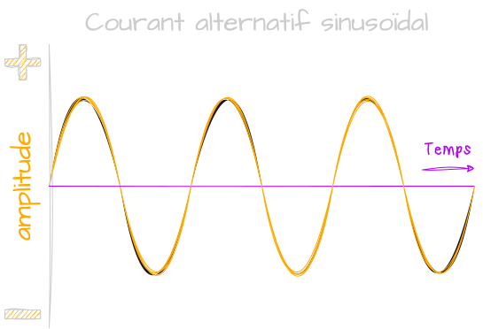
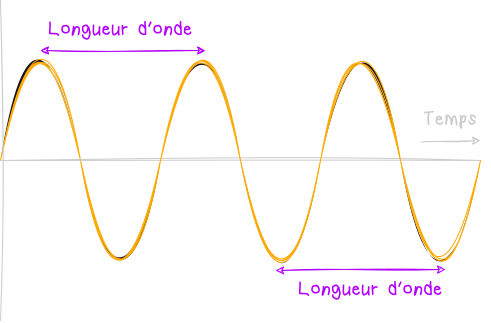
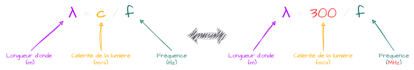
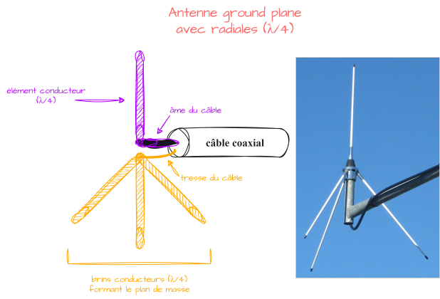

Une antenne n'est rien de plus qu'un morceau de métal. Son but est de transformer une **énergie électrique** en une **onde électromagnétique** pour transmettre un **signal radio** et inversement pour en recevoir. Nous allons dans ce cours voir les différentes notions importantes à comprendre afin de bien choisir son antenne, que ça soit pour un projet [SDR](../SDR/sdr.html) ou n'importe.

# Fréquence
Pour choisir son antenne, il va d'abord falloir savoir sur quelle **fréquence** on veut travailler. Mais d'abord, c'est quoi la **fréquence** ?
Quand on branche une prise de courant dans une maison, le courant qui y circule est dit **alternatif**, cela signifie qu'il change de sens à intervalle régulier (Le courant va du + vers le - et vice-versa). Le changement ne se fait pas en mode brutal, mais progressivement, formant une jolie **sinusoïde**. 

En **France** par exemple, cet intervalle oscille à **50Hz**, ça signifie qu'il change de sens **100 fois par seconde**. C'est ce qu'on appelle la **fréquence** avec comme unité le [Hertz](https://fr.wikipedia.org/wiki/Hertz). 
Une **radio**, c'est aussi un **oscillateur**, on parle de [VFO](https://fr.wikipedia.org/wiki/Oscillateur_%C3%A0_fr%C3%A9quence_variable) (**V**ariable **F**requency **O**scillator), terme barbare pour dire qu'on peut changer la fréquence. 
Par exemple, en voiture, on peut tourner la roulette pour mettre une fréquence de **102.4MHz** (NRJ). Cela signifie qu'on a **102,4 millions** d'**oscillations** par seconde ! 

#  Longueur d'onde
Le facteur le plus important d'une antenne est sa longueur que l'on choisira en fonction de la **fréquence** qui nous intéresse. On dira que notre antenne est **résonante** à une fréquence spécifique. Ce qui signifie qu'elle transformera efficacement l'**énergie électrique** en **onde radio** et inversement.
Pour que notre antenne soit en **résonance** avec une fréquence, elle devra correspondre à une proportion spécifique de la **longueur d'onde du signal**.

La longueur d'onde se calcule ainsi, sachant qu'on a une version simplifiée comme on connaît la **vitesse de la lumière** et que l'on travaille surtout avec des **fréquences** en `MHz` :

Quand on a calculé la **longueur d'onde** du signal qu'on souhaite exploiter, on va pouvoir choisir une **fraction** de cette valeur pour dimensionner l'antenne, généralement une **demi-onde** (`λ/2`) ou une **quart d'onde** (`λ/4`).
Par exemple, supposons qu'on veut une antenne pour travailler sur la fréquence `433MHz`, on calcule sa **longueur d'onde** : `300/433≈0.70cm`. Si on part sur une antenne **demi-onde**, sa longueur devra donc être égale à la **moitié** de la longueur d'onde soit `34.5cm`.
Une fois qu'on connaît la taille de notre antenne, il va falloir déterminer quelle forme elle va prendre. Mais avant ça, il va falloir faire une parenthèse sur la notion d'**impédance**.

# Impédance
Alors, on va faire simple. Pour que notre signal radio soit efficacement transféré entre l'antenne et le récepteur/émetteur, il faut que les **deux** soient bien adaptés  l'un à l'autre. Cette adaptation est déterminée par une propriété appelée **impédance**.
Il faut la voir comme la **résistance** d'un circuit électrique mais adaptée aux **courants alternatifs**. En **radiofréquence**, on voudra que l'**impédance** de l'antenne match avec celle de notre appareil de réception/émission. Une valeur est utilisée presque partout de manière général, c'est `50Ω`. C'est par exemple l'**impédance** des récepteurs **SDR**. Bref, ça signifie qu'on cherchera toujours à avoir une antenne au plus proche de ce `50Ω`.

# Types d'antenne
Ils existent tout un tas de type d'antenne donc on va pas toutes les présenter, mais jetons un coup d'œil à 3 d'entre elles importantes à connaître.
## Dipôle (Doublet)
L'antenne la plus basique que l'on puisse faire est une antenne **doublet**. Elle existe en mode replié (qu'on appelle [trombone](https://rogerbeep.fr/les-cours-2/antennes-ouvertes-fermees/#:~:text=Une%20antenne%20est%20ferm%C3%A9e%20lorsque,est%20proche%20de%20200%20%CE%A9%20.)) et en mode classique qu'on appelle **dipôle**. C'est sur cette dernière qu'on va s'intéresser bien que la **trombone** suit le même principe. 
Dans sa version basique, il s'agira d'une antenne **demi-onde** (`λ/2`), avec chacun des pôles qui aura une longueur de `λ/4`. Cette dernière est alimenté en son milieu et se place de manière isolée dans l'espace et loin du sol.

L'angle entre les **2 pôles** peut être ajuster afin de régler l'**impédance** de notre antenne. Dans le cas où ils sont droits comme sur le schéma, on aura une impédance de `75Ω`. En mettant un angle de `120°`, on aura nos `50Ω` comme sur [ce projet](../../Projects/NOAA.html).
De plus, une **dipôle** peut être placé **horizontalement** ou **verticalement** selon la [polarisation](https://culturesciencesphysique.ens-lyon.fr/ressource/simu-polarisation.xml) des ondes que l'on souhaite exploiter.
Enfin, ce type d'antenne concentre son énergie dans deux directions, la rendant très efficace lorsque l'on connaît la direction du signal que l'on souhaite recevoir.

## Ground plane
Pour l'antenne **ground plane**, on va avoir un conducteur **vertical** d'une longueur d'un quart d'onde (`λ/4`) qui va être monté au-dessus d'un **plan de masse** que l'on appelle **ground plane**, d'où le nom. Ce plan de masse agit comme un **miroir** qui vient "compléter" l'antenne en réflétant les ondes devenant ainsi l'équivalent d'un **dipôle**.
Pour former ce plan de masse, on peut utiliser des tiges métalliques qu'on appelle des **radiants** réparties uniformement autour de la base donnant à notre antenne une apparence d'araignée 🕷️. Pareil que pour le **dipôle**, si on veut une antenne à `50Ω`, il faudra un angle de `120°` entre les brins.

Autrement, on peut utiliser la terre, la mer, un toit de voiture, n'importe tant que c'est conducteur. 

## Yagi
Les antennes **Yagi** utilisables des ondes [HF](https://fr.wikipedia.org/wiki/Haute_fr%C3%A9quence) aux ondes [UHF](https://fr.wikipedia.org/wiki/Ultra_haute_fr%C3%A9quence), sont des antennes **directives**. On les appelle aussi antennes *râteaux*, c'est celles que l'on a en général sur nos toits pour la télévision terrestre.
L'idée est de partir sur un **doublet** demi-onde (`λ/2`), et d'ajouter des éléments parasites non alimentés afin de **concentrer** l'énergie dans une direction. On aura des élements **directeurs**, plus courts que le **doublet**, placés devant lui et des éléments **réflecteurs** qui eux, seront plus long à l'arrière. 

En augmentant le nombre d'éléments, l'**impédance** diminue et le **gain** augmente ↗️. Ces antennes sont très pratiques dans le cas où l'on souhaite travailler avec un signal qui vient d'une direction bien précise, afin de **concentrer** toute son énergie vers lui.

# Conclusion
Vous devriez déjà mieux comprendre comment choisir votre antenne et ajuster sa longueur en fonction de ce que vous voulez recevoir.

Il existe une infinité de possibilités, n'hésitez pas à me contacter sur [Instagram](https://www.instagram.com/radionugget/) si vous avez des questions :)