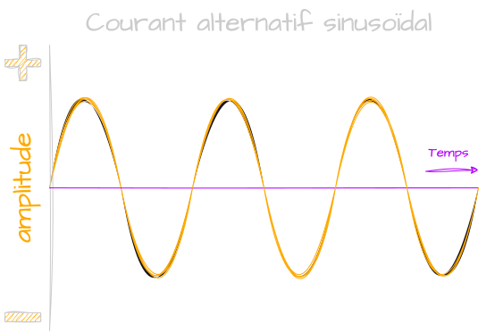

L'antenne est l'un des éléments les plus importants en **radiofréquence**. On en retrouve sous plein de formes, chacune optimisée pour une certaine fréquence. La science des antennes peut très vite devenir complexe, c'est pourquoi nous verrons dans ce cours simplement quelques bases.

#  Fréquence
Quand on branche une prise de courant dans une maison, le courant qui y circule est dit **alternatif**, cela signifie qu'il change de sens à intervalle régulier (Le courant va du + vers le - et vice-versa). Le changement ne se fait pas en mode brutal, mais progressivement, formant une jolie **sinusoïde**. 

En **France** par exemple, cet intervalle oscille à **50Hz**, ça signifie qu'il change de sens **100 fois par seconde**. C'est ce qu'on appelle la **fréquence** avec comme unité le **Hertz**. 
Une **radio**, c'est aussi un **oscillateur**, on parle de [VFO](https://fr.wikipedia.org/wiki/Oscillateur_%C3%A0_fr%C3%A9quence_variable) (**V**ariable **F**requency **O**scillator), terme barbare pour dire qu'on peut changer la fréquence. 
Par exemple, en voiture, on peut tourner la roulette pour mettre une fréquence de **102.4MHz** (NRJ). Cela signifie qu'on a **102,4 millions** d'**oscillations** par seconde ! 
#  Longueur
L'antenne la plus basique qu'on puisse faire est une antenne **dipôle**. C'est juste deux pièces de métal de **même longueur** reliées par un câble coaxial. 
La longueur ne se choisit évidemment pas au hasard. Les transmissions radio se propagent avec une longueur physique qu'on appelle **longueur d'onde**. 

Elle se calcule avec cette formule : `λ = c / f`
avec **λ** la longueur d'onde en **m**, **c** la célérité de la lumière en **m/s** et **f** la période en **Hz**. 

Pour faire des calculs plus simples, dans notre cas, la vitesse à laquelle se déplace l'onde est la vitesse de la lumière dans l'air donc **300 000 000m/s** et nos fréquences sont en **MHz** donc on pourrait transformer notre formule en : `λ=300/f`
avec **f** en **MHz** et **λ** toujours en **m**. 

Donc, pour en revenir à notre longueur d'antenne, cette dernière est directement liée à la longueur d'onde. En fait, dans le cas d'un **dipôle** simple, la longueur de l'antenne est égale à la **moitié** de la **longueur d'onde**. Et donc, chaque **pôle** fait **un quart** de la longueur d'onde. On parle d'antenne **demi-onde**. 
Bref, tout ça pour dire qu'on dira qu'une antenne est **résonnante** à une certaine fréquence si elle est adaptée à cette dernière. Et d'ailleurs, ça peut se mesurer avec un appareil spécifique. Il nous donne le **SWR** (**S**tanding **W**ave **R**atio), le **rapport d'onde stationnaire**. Plus cette valeur sera proche de **1** et plus l'antenne sera **résonnante** à une certaine fréquence. 
#  Impédance 
Dernière notion importante à prendre en compte dans une antenne, il s'agit de l'**impédance**. 
En **électricité**, on utilise souvent des **résistances**, elles ont des valeurs fixes en **Ohm** noté **Ω**. Cela permet de s'opposer à un courant électrique. 
Ok, mais en radio, on va souvent utiliser des **condensateurs** et des **bobines** et ces derniers ont une résistance qui sera variable en fonction de le **fréquence** du courant. 
- On parle de **conductance** pour un **condensateur** (unité en **Farad**) 
- On parle d'**inductance** pour une **bobine** (unité en **Henry**). 

Plus la fréquence dans un circuit sera élévé, plus un **condensateur** aura une **conductance** **faible** et donc s'opposera moins au courant. C'est d'ailleurs comme ça qu'on peut faire un filtre **passe-haut** qui laissera passer que les hautes fréquences.
À l'inverse, pour une **bobine**, plus la fréquence est basse, plus son **inductance** est **faible**. Et cette fois, on peut faire des filtres **passe-bas**. 

À noter qu'en mettant ces deux composants en parallèle avec leurs caractéristiques modifiables, on va pouvoir choisir des fréquences bien précises, c'est comme ça que fonctionne les **VFO**. 
Bref, voilà pourquoi on parle d'**impédance**, c'est ni plus ni moins que la **résistance** dans un **courant alternatif**.

En radio, une valeur est devenue une norme internationale car elle est un bon compromis entre facteurs techniques et pratiques, c'est **50Ω**. Ça permet de minimiser au mieux les pertes et par conséquent, les constructeurs se sont mis d'accord pour faire du matériel avec cette impédance comme les câbles coaxiaux par exemple. 
Donc pour la réalisation d'une antenne, il faudra veiller à avoir une valeur au plus proche de ce **50Ω**. 