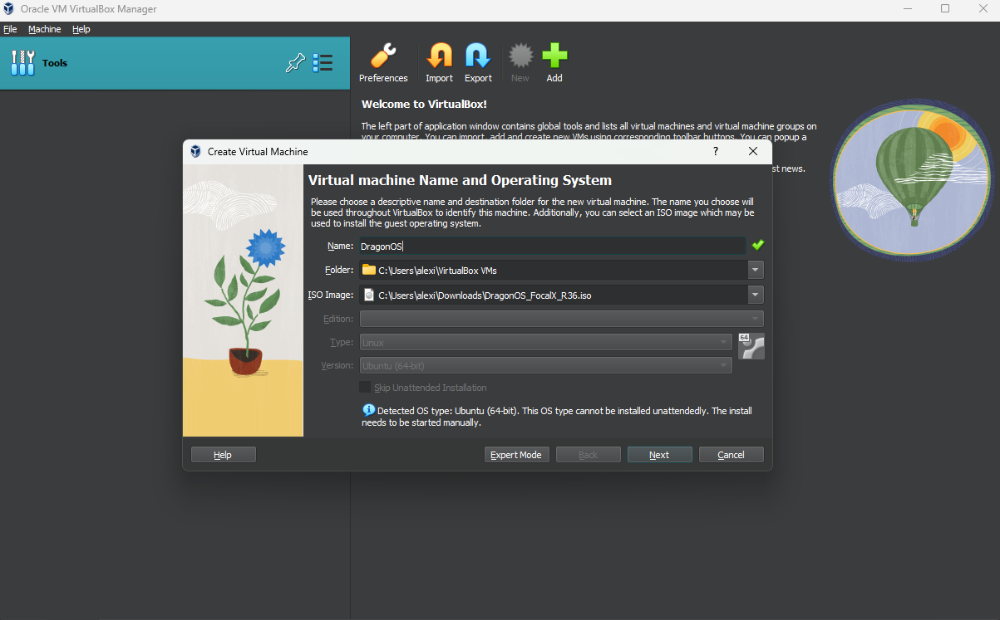
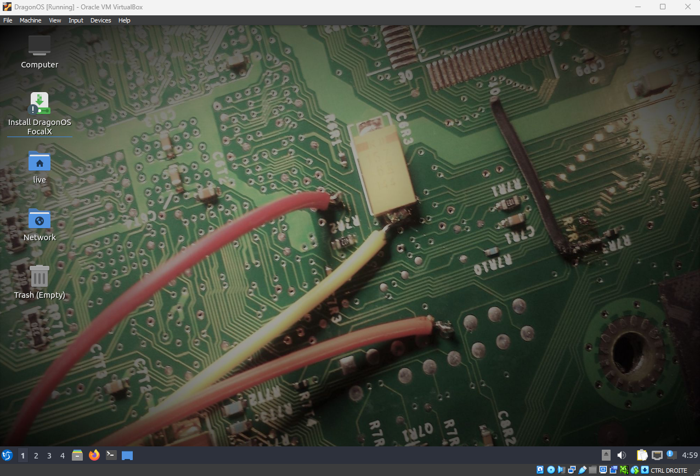
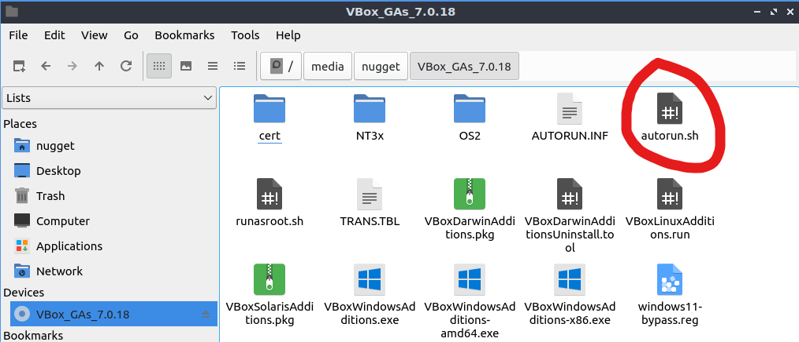
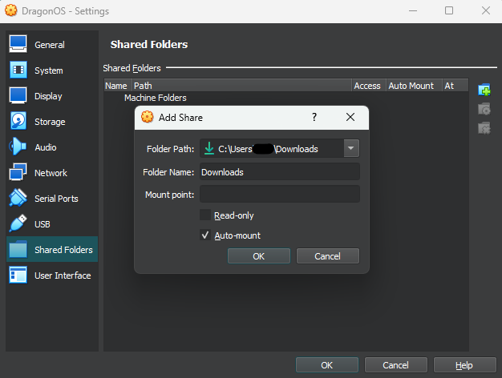

La distribution [DragonOS](https://cemaxecuter.com/) est un fork de [Lubuntu](https://lubuntu.fr/) mais spécialisé pour la [SDR]({{ site.data.links.sdr }}). Elle possède déjà un grand nombre d'outils installés bien pratiques comme par exemple [GNURadio](https://www.gnuradio.org/). C'est super cool pour gagner du temps car nombre de ces tools en radio sont vieux et peuvent être compliqués à mettre en place. 

# Installation
Pour récupérer l'**iso**, on se rend juste [ici](https://sourceforge.net/projects/dragonos-focal/files/latest/download). Ensuite, il nous faut un **hyperviseur** comme **VirtualBox** ou **VMWare**, peu importe. Dans mon cas, comme je suis sur **Windows**, je vais rester au plus simple avec **VirtualBox** que l'on peut télécharger directement [ici](https://www.virtualbox.org/wiki/Downloads). Pour les **Mac ARM**, il faudra utiliser **VMWare** :) 
On peut lancer **VirtualBox** et cliquer sur le bouton **New** afin d'y importer notre **iso**.

On clique sur **Next** pour allouer nos ressources matérielles. Pour la **mémoire vive**, **4Go** devrait faire l'affaire. Dans le doute, comme il y a des logiciels qui peuvent être très gourmands, je mets **8Go** (8192Mb). Pour le **CPU**, pareil, ça dépend de votre configuration, je le monte à **6** mais **2** ou **4** devraient suffire. 

Puis, on reclique sur **Next** pour allouer l'espace disque. Il faut le mettre à **30Go** minimum puisque vous rencontrerez plus tard une étape pour laquelle les **30Go** minimum seront nécessaires.

Et re **Next** puis **Finish**.

# Premier lancement
A présent, on double clique pour lancer **DragonOS**. Il est possible que vous ayez une page comme ça : 

Vous pouvez faire **entrer** et après quelques instants, on arrive sur le bureau qui se présente ainsi : 

L'installation n'est pas encore finie, on remarque sur le bureau le **Install DragonOS FocalX**. Il faut l'installer car sinon, à chaque fois que l'on va éteindre la **VM**, tout ce qu'on aura fait dessus sera perdu. 
Du coup, on  double clique, et on suit l'installation. Pour ce qu'il faut cocher, on peut laisser par défaut, c'est très bien. 
Après un long moment, ça nous propose de redémarrer la VM et on sera fin prêts à s'en servir ! 

# Découverte 
Sur **DragonOS**, on va retrouver une multitude de logiciels préinstallés donc on va pas tous les voir. Je vous laisserai les découvrir par vous même en fonction de vos usages, mais sachez qu'il y en a pour tous les goûts niveau radios.
Bref, testons tout ça et sortons notre récepteur **SDR**. Dans mon cas, j'utilise la clé **RTL-SDR V4** et un logiciel comme par exemple le super **SDR++**.
Avant de continuer, il va falloir dire à **Virtual Box** de prendre en compte notre clé **SDR** branchée sur le port **USB** de notre hôte. Pour ça, en haut, on fait **Devices -> USB** et on clique sur notre récepteur **SDR**.

À présent, on est prêts à écouter. Sur **SDR++**, dans **Source**, on sélectionne **RTL-SDR** et juste en dessous on choisit notre récepteur, on clique sur le bouton **Play** en haut et tout fonctionne nickel !

# Dossier partagé
Lorsque vous voudrez travailler avec des fichiers de la **machine hôte** sur votre **VM**, vous aurez besoin d'un moyen de les faire passer. Une manière simple de le faire est de mettre en place un **dossier partagé**.
Pour cela, dans un premier temps, il faut que les **Additions Invité** soient installées. C'est des pilotes qui permettent une meilleure interaction entre la **VM** et l'**hôte**.
Donc, depuis la **VM**, en haut, on va dans **Devices -> Insert Guest Additions CD Image...**. Puis, on **Execute** le fichier `autorun.sh`.

Ensuite, on peut éteindre la **VM**, on clique sur **Settings** (l'engrenage jaune) puis **Shared Folders**. Clic droit et **Add Shared Folder**. 
Enfin, on choisit quel dossier de notre machine hôte on veut partager et on coche **Auto-Mount**.

À présent, depuis la **VM**, dans l'explorateur de fichiers, on peut y voir notre dossier partagé sous le nom `sf_Downloads`.
Si jamais vous avez une erreur comme quoi vous n'avez pas les permissions, ouvrez un **terminal** et tapez `sudo adduser [your-user] vboxsf` puis redémarrez la **VM** et ça devrait être bon.

Et voilà, **DragonOS** est prêt à être utilisé !
