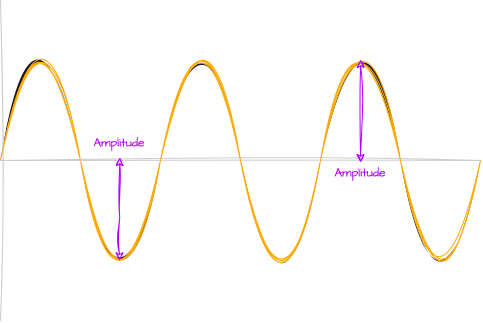
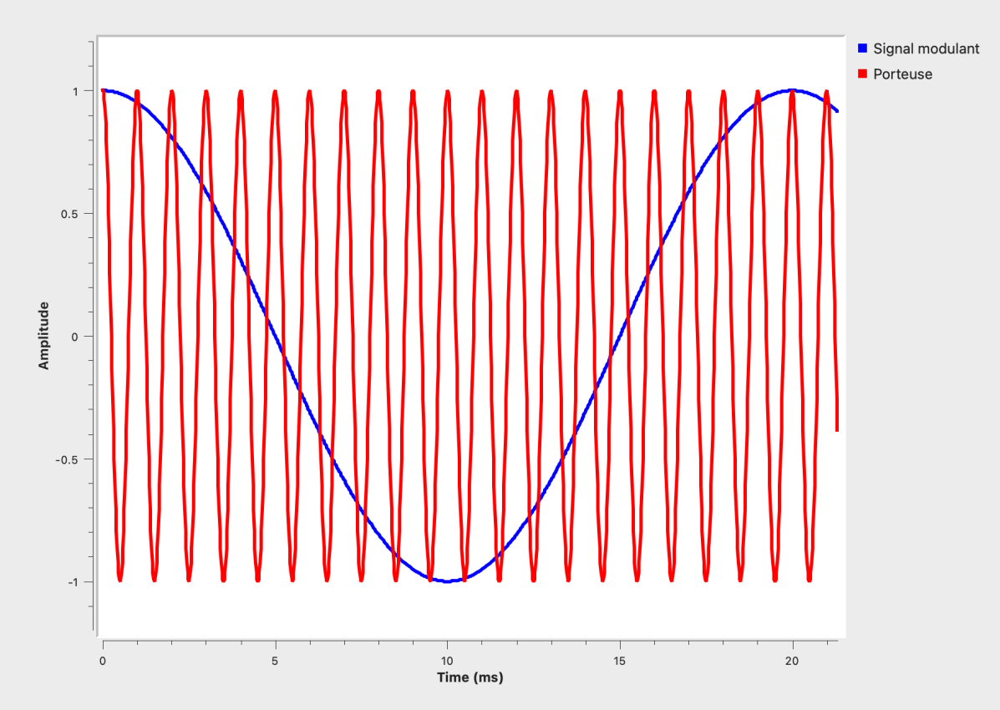
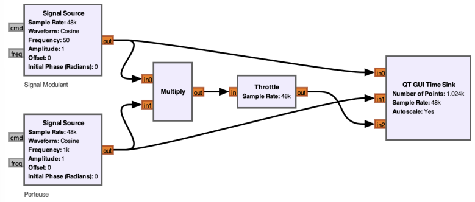

Les signaux bruts qu'on veut émettre sont souvent **faibles** et peuvent grandement s'atténuer sur de longues distances. En modulant notre signal, on va pouvoir **porter** l'information sur une onde beaucoup plus **puissante**. 
Et, bien que les sources d'émission se mettent plus ou moins d'accord pour utiliser des fréquences différentes, la **modulation** permet d'éviter les **interférences** en évitant que les signaux se mélangent. 
De plus, avec toutes les perturbations et tout qu'on retrouve dans l'air (et dans l'eau), la **modulation** aide à rendre les signaux plus résistants à ces derniers. 

# ⚪️ Et comment on module alors ? 
Imaginons qu'on ait un signal à transporter, du son par exemple. On l'apellera **signal modulant**. Ce type de signal a une fréquence **basse** et est très **faible**. 

Pour le transporter et qu'il serve à quelque chose, il nous faut un autre signal qu'on apellera **onde porteuse** qui sera une onde avec une fréquence **élevée** et donc **puissante**. C'est elle qui transportera notre signal faible. 

Avec nos deux signaux réunis, on va venir les **superposer** (c'est des maths derrière), et on obtient notre signal modulé. 

# ⚪️ C'est quoi l'amplitude 
L'**amplitude** d'un signal est en gros sa **hauteur maximal** par rapport à sa position au repos. C'est en quelque sorte la puissance du signal radio. 

Cette valeur est importante pour déterminer la qualité du signal reçue. plus l'amplitude sera élevée, meilleure sera la qualité. Mais trop élevée par contre, ça pourrait abimer le récepteur. 
En **modulation d'amplitude** (AM), on va venir faire varier l'**amplitude** de l'**onde porteuse** en fonction de l'**amplitude** du **signal modulant**. 
Pour mieux comprendre, on va utiliser **GNURadio**.

On place 2 blocs `Signal Source`, un pour notre **Signal Modulant** qui a une fréquence de `20Hz` puis un second bloc qui sera notre onde porteuse avec une fréquence de `1000Hz` donc bien plus élevée que le signal modulant.
Le bloc `Throttle`, on s'en fiche pour ce cours mais sachez qu'il est là pour éviter de faire crash le PC en réduisant la cadence à laquelle le CPU voudrait éxecuter le programme. Un seul placé quelque part suffit, c'est pour ça que y en a un juste un. Bref, revenons à ce qui nous intéresse.
Le bloc `QT GUI TIME SINK` va nous permettre de visualiser nos deux signaux dans le temps. 
Voilà ce qui nous affiche lorsque l'on lance notre programme : 

On voit nos 2 jolies sinusoides. 

# ⚪️ Modulation d'Amplitude
À present, superposant nos deux signaux en les **multipliant**. On va pas rentrer dans les maths qui se cachent derrière (peut-être un jour). 

Donc ici, on a juste rajouté le bloc `Multiply` et on renvoit le signal modulé dans notre `Time Sink`. J'ai aussi laissé les 2 autres signaux reliés au `Time Sink` pour qu'on puisse mieux comprendre. 
Lançons le programme et laissons aparraître uniquement le **signal modulé** pour voir à quoi il ressemble. 

On peut voir cette forme caractéristique de l'**AM**. 
Et maintenant, affichons nos 3 signaux (modulant, porteuse et modulé)

On comprends déjà mieux, lorsque que l'**amplitude** de notre **signal modulant** diminue, ça diminue en conséquence l'**amplitude** de la **porteuse**. 

Il existe bien d'autres types de modulation ([FM](https://fr.wikipedia.org/wiki/Modulation_de_fr%C3%A9quence#:~:text=En%20modulation%20de%20fr%C3%A9quence%2C%20l,(att%C3%A9nuation%20et%20bruit%20importants).), [PM](https://fr.wikipedia.org/wiki/Modulation_de_phase#:~:text=La%20modulation%20de%20phase%20ou,Cette%20modulation%20est%20non%20lin%C3%A9aire.), ...) qu'on choisit en fonction de ce que l'on veut transmettre, de notre bande passante, du bruit environnant, etc, ... mais on garde ça pour une prochaine fois :) 

