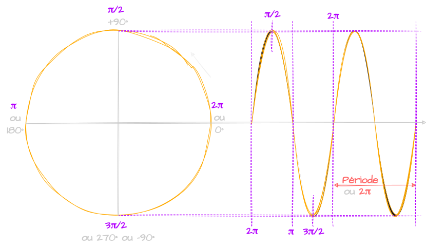

Les signaux ne se comportent pas tous de la même manière dans le temps entre eux. On va voir dans ce cours, la notion de **phase** et comment le **déphasage** peut modifier l'alignement des ondes.
# La phase 
La **phase** d'un signal est une mesure qui permet de représenter la forme d'une **onde sinusoïdale** à un **instant donné**. On la note en **degrés** (de **0°** à **360°**) ou bien en **radians** (de **0** à **2π**).
Mais alors, qu'est-ce que le nombre **π** à avoir avec nos **ondes radio** ? Replongeons dans la **trigonométrie** pour comprendre avec ce schéma :

Peu importe la fréquence d'un signal, la **période** de ce dernier (donc son cycle) correspondra à une rotation complète sur un cercle soit **360°** ou **2π**. 

Deux signaux sont en **phase** lorsque leurs amplitudes coincident, les signaux oscillent ensemble. On parle de **déphasage nul**.

# Le déphasage
Un **déphasage**, c'est une différence dans le temps ou dans la position d'une onde. En gros, si on a deux ondes qui commencent à des moments différents ou atteignent leur maximum à des moments différents, on dira qu'elles sont déphasées.
Par exemple, si le **déphasage** est à **180°** donc qu'un signal est en avance de **π radians** par rapport à l'autre, on dit que les signaux sont en **opposition de phase**. Ça donne que les amplitudes max d’un signal correspondent aux amplitudes min de l’autre signal, les signaux oscillent en opposition.

Ou si le **déphasage** est à **90°** donc qu'un signal est en avance de **π/2 radians** par rapport à l'autre, on dit que les signaux sont en **quadrature de phase**. C'est à dire que les amplitudes d’un signal coïncident avec les passages par **zéro** de l’autre signal.

Et voilà pour ce mini cours sur les notions de **phase** sans trop rentrer dans les détails. Ça permettra de mieux comprendre les notions de **polarité** d'une onde que l'on verra plus tard.