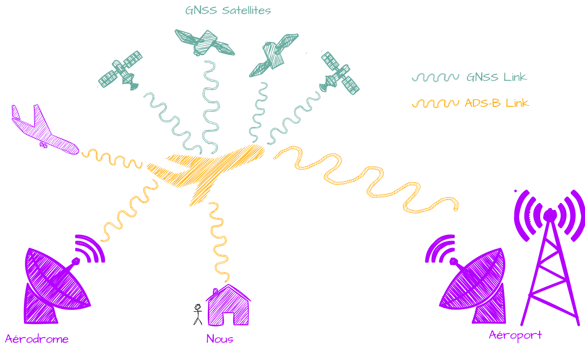
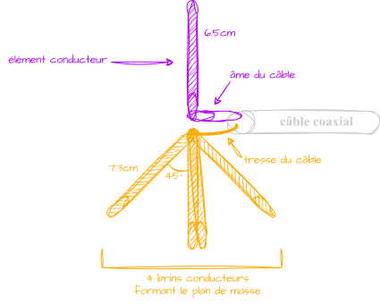
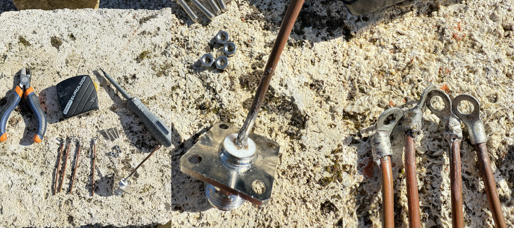
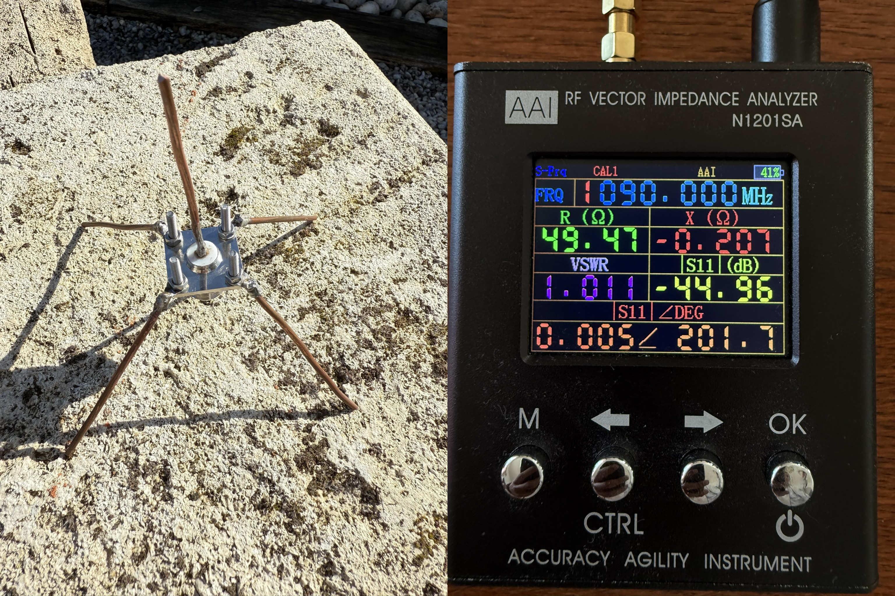
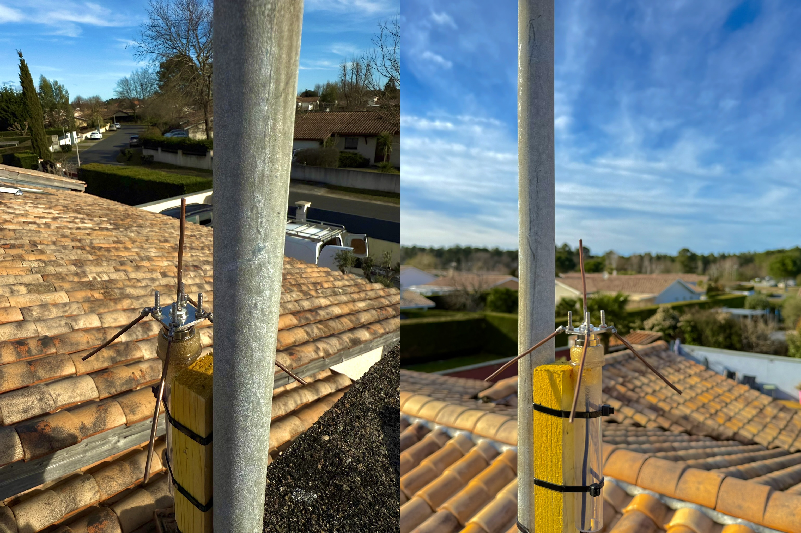
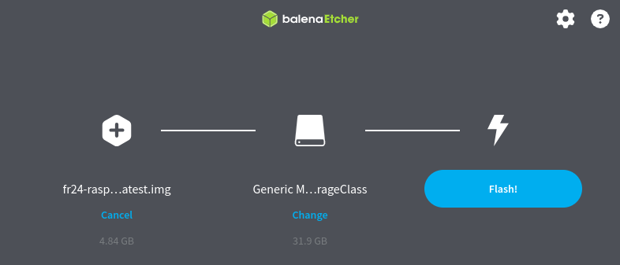

L'avion est à ce jour l'un des moyens de transport les plus populaires. Au vu de l'augmentation importante du nombre de vols, il est primordial pour la trafic aérien de se soucier des risques de collision. Ainsi est née une norme internationale que l'on appelle **ADS-B**. C'est cette même norme qui permet également à n'importe qui de suivre le trafic aérien sur des applications et sites comme [FlightRadar](https://www.flightradar24.com/).

# Comment fonctionne l'ADS-B
L'**ADS-B** pour **A**utomatic **D**ependent **S**urveillance-**B**roadcast permet à un avion d'envoyer **2 fois par seconde** sa position (obtenu via [GNSS]({{ site.data.links.gnss }})) ainsi que d'autres informations à tous récepteurs pouvant décoder l'**ADSB** comme les aéroports, les autres aéronefs et bientôt, nous :)
Ces informations sont envoyées sur la fréquence `1090MHz`.


Il ne faut pas confondre l'**ADSB-B** avec son prédécesseur, le [radar primaire](https://fr.wikipedia.org/wiki/Radar_primaire). En effet, ce dernier envoie un signal qui va rebondir sur l'aéronef, révélant ainsi sa position mais sans aucune autre indication. Ce système fonctionne donc même si l'aéronef ne possède pas de transpondeur.
L'**ADS-B** quant à lui, qui est moins cher et fonctionne sur une plus grande couverture envoie une liste bien plus garnie de données sur l'appareil. Maintenant, le **radar primaire** reste toujours utilisé, déjà dans le cas où l'**ADS-B** ne fonctionnerait plus mais surtout pour repérer les engins pas très coopératifs 🏴‍☠️.


# Fabrication de sa station ADSB-B
L'idée va être d'installer [Pi24](https://www.flightradar24.com/build-your-own), un **Linux** basé sur **Raspberry Pi OS Lite** qui permet d'automatiser la réception de données **ADS-B**, le traitement de ces dernières et l'envoie vers les serveurs de [FlightRadar](https://www.flightradar24.com/). Ça nous permettra de voir les aéronefs que l'on détecte depuis soit le **Raspberry**, soit **FlightRadar** directement. En partageant les données que l'on reçoit, on contribue au suivi mondial des vols. En échange, **FlightRadar24** vous offre un [abonnement Business](https://www.flightradar24.com/premium) d'une valeur de **500$/an** !

## Partie matérielle
Pour avoir notre station **ADSB-B**, il va nous falloir 3 éléments principaux : 
- Un **Raspberry** avec une carte **SD** d'au moins `8Go`
- Un récepteur [SDR]({{ site.data.links.sdr }})
- Une antenne pour la fréquence `1090MHz`

Côté **Raspberry**, vous avez une [liste ici](https://rpilocator.com/) qui recence tous les modèles compatibles avec [Pi24](https://www.flightradar24.com/build-your-own). J'ai opté pour un [Raspberry Pi Zero 2 W](https://www.raspberrypi.com/products/raspberry-pi-zero-2-w/) pour sa petite taille :)
Pour le récepteur, une clé [SDR]({{ site.data.links.sdr }}) suffira. Dans mon cas, ce sera le [RTL-SDR V4](https://www.passion-radio.fr/cles-rtl-sdr/r828d-v4-2402.html).
Enfin, pour la partie antenne, vous pouvez en acheter des toutes faites comme [celle-ci](https://www.passion-radio.fr/adsb/ant-1090-1042.html) mais dans notre cas, on va fabriquer une antenne **ground plane** d'**un quart-d'onde** dont on a déjà parlé dans [ce cours]({{ site.data.links.antenna }}).
Pour connaître ces dimensions, on va utiliser ce [calculateur](https://m0ukd.com/calculators/quarter-wave-ground-plane-antenna-calculator/) qui nous indique qu'on aura besoin d'une tige de `6.5cm` et 4 autres de `7.3cm`. On obtiendra quelque chose comme ça :



Donc, pour la fabrication de cette antenne, j'utilise des [cosses rondes](https://www.amazon.fr/Electriques-Femelles-Connecteur-%C3%A9lectrique-Embouts/dp/B0B3TW8QDW/ref=sr_1_5?sr=8-5) pour lesquelles j'ai enlevé le plastique puis je viens en souder une sur chacune des 4 tiges de cuivre. Pour le morceau central, il est aussi soudé directement sur une pièce [de ce style là](https://fr.aliexpress.com/item/1005003799744884.html?spm=a2g0o.detail.pcDetailTopMoreOtherSeller.4.6ff0wGDvwGDvW2&gps-id=pcDetailTopMoreOtherSeller&scm=1007.40050.354490.0&scm_id=1007.40050.354490.0&scm-url=1007.40050.354490.0&pvid=67151563-91eb-49ab-8ad8-f6e934053bce&_t=gps-id:pcDetailTopMoreOtherSeller,scm-url:1007.40050.354490.0,pvid:67151563-91eb-49ab-8ad8-f6e934053bce,tpp_buckets:668%232846%238108%231977&pdp_ext_f=%7B%22order%22%3A%22340%22%2C%22eval%22%3A%221%22%2C%22sceneId%22%3A%2230050%22%7D&utparam-url=scene%3ApcDetailTopMoreOtherSeller%7Cquery_from%3A).



Je visse le tout et j'obtiens cette super antenne avec des résultats vraiment excellents. Pour rappel, le [SWR](https://fr.wikipedia.org/wiki/Rapport_d%27ondes_stationnaires) doit être au plus proche de `1` et l'**impédance** doit être aux alentours des `50Ω`.



Plus qu'à la placer au mieux sur son toit. Donc à éviter comme ce que j'ai fais mais c'est temporaire le temps que je trouve une meilleure solution.


On peut à présent passer à la partie informatique :)
## Partie logicielle
Dans un premier temps, il faut télécharger l'[image PI24](https://repo-feed.flightradar24.com/rpi_images/fr24-raspberry-pi-latest.img.zip) et un logiciel pour l'installer sur votre carte **SD** comme [Etcher](https://etcher.balena.io/). 
Une fois la carte SD insérée et formatée sur votre ordi, l'image **Pi24** dézippée (il doit juste rester un fichier `fr24-raspberry-pi-latest.img`), on peut lancer **Etcher**. On sélectionne notre image, on choisit notre carte **SD** comme target et on peut cliquer sur *Flash*.



Une fois finie, n'éjectez pas encore la carte **SD** si vous n'avez pas la possibilité de brancher un câble **Ethernet** sur votre **Pi**. Il va d'abord falloir configurer le **Wi-Fi**. Pour cela, on accède à la carte **SD** sur son ordi pour rechercher un fichier tout en bas qui s'appelle `wpa_supplicant.conf.template`. Il faut le renommer en `wpa_supplicant.conf`, l'ouvrir et le remplir avec les données de son **Wi-Fi** : 
```bash
#Remember to rename this file to wpa_supplicant.conf (remove the .template part!)
ctrl_interface=DIR=/var/run/wpa_supplicant GROUP=netdev
network={
    ssid="YOUR_SSID" # Remplissez ici avec le nom de votre Wi-Fi
    psk="YOUR_WIFI_PASSWORD" # Remplissez ici avec le mot de passe de votre Wi-Fi
    key_mgmt=WPA-PSK
}
```
A présent, on peut éjecter la carte **SD** pour l'insérer dans le **Pi**. Après avoir relié son antenne au récepteur **SDR**, qui lui même est relié au **Raspberry**, on peut mettre en marche ce dernier.
Une fois que c'est bien démarré, il faut se créer un compte sur **FlightRadar** et accéder à [ce lien](https://www.flightradar24.com/build-your-own) qui va automatiquement détecter **Pi24** et vous demander de l'enregistrer. Si tout a bien été configuré, vous devriez arriver sur cette page : 


On clique sur `Activate`, on remplit la **latitude** et **longitude** de notre station, puis on la vérifie et on reçoit un joli message comme quoi tout est bon. Vous devriez recevoir un mail avec votre **sharing key** et le **radar code**. 
Votre compte qui par défaut à un abonnement gratuit de type `Basic` sera automatiquement promu sur un abonnement `Business` dès que les données de votre station arriveront sur les serveurs de **FlightRadar**. 
Et maintenant, la partie qu'on attend tous, voir les aéronefs actuellement détectés par **NOTRE** station. Depuis FlightRadar, on va dans la section `Filters` -> `Custom` puis on sélectionne son `Receivers`, dans mon cas `T-LFBD111` : 

 
On peut voir une couverture plus que correcte pour antenne faite à la main et pas placée de la manière la plus optimale (sachant que j'habite à peu près là où c'est écrit **Gujan-Mestras** au milieu). 
Vous pouvez augmenter sa portée en utilisant un filtre **LNA** pour la fréquence `1090MHz` ou même acheter une vraie antenne mais dans mon cas ça me convient comme ça. 
Sachez que vous pouvez aussi accéder à ses données depuis l'application mobile de **FlightRadar**.


