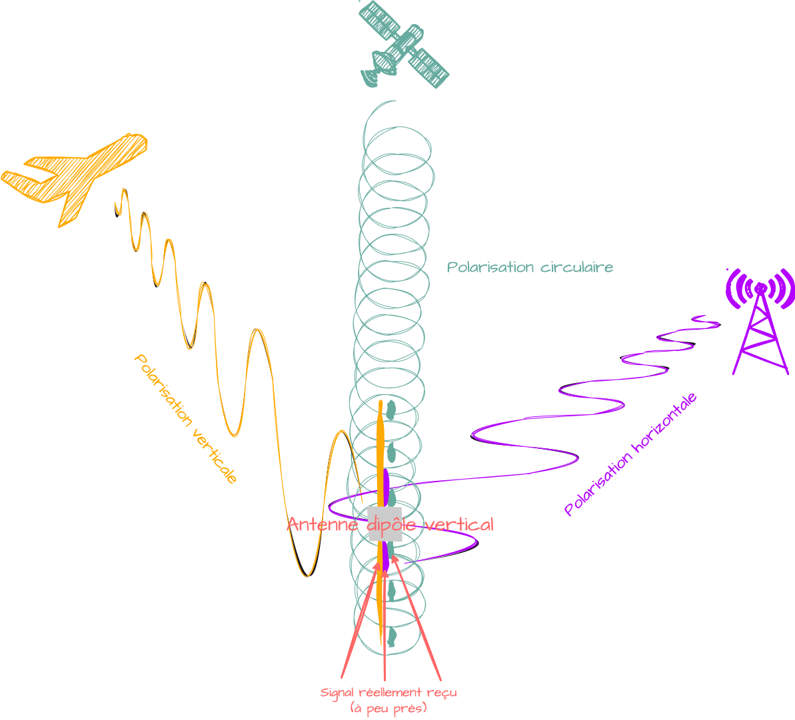
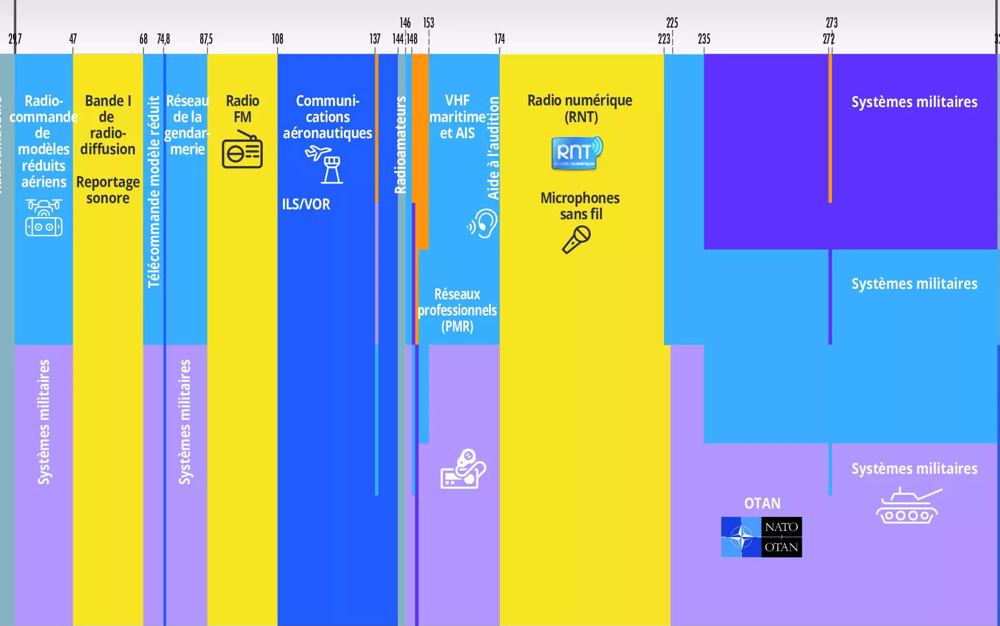
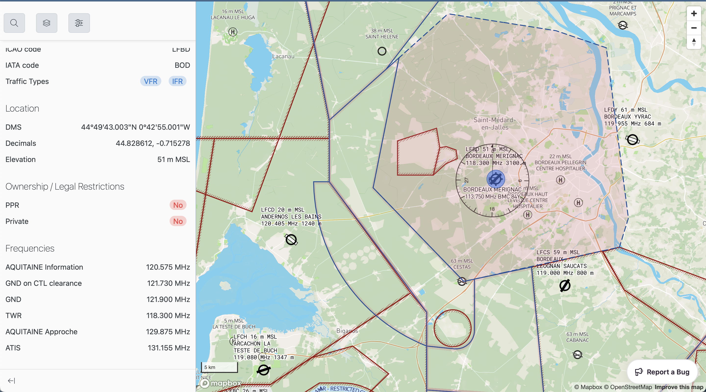
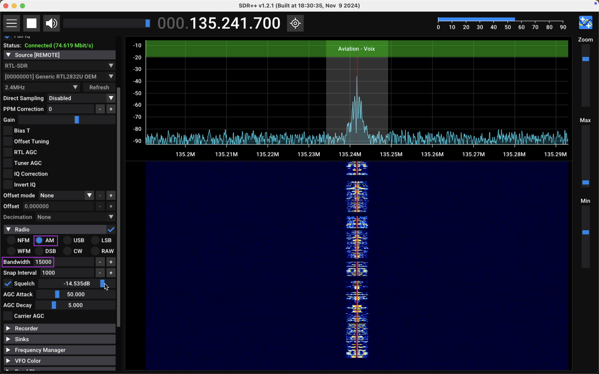

Si vous vous rendez sur [FlightRadar](https://www.flightradar24.com), il y a des chances qu'un avion se situe pas loin de vous. Peut-être même que vous êtes à moins d'une **dizaine de kilomètres** d'un aéroport. Dans ces cas, avec un simple récepteur [SDR]({{ site.data.links.sdr }}) et une [antenne]({{ site.data.links.antenna }}), vous allez pouvoir écouter toutes les communications 🥷🏽.
# Comment les pilotes communiquent ?
## Modulation 
Les communications aéronautiques utilisent la [modulation d'amplitude]({{ site.data.links.am }}) bien que la majorité des communications radio d'aujourd'hui utilisent la [modulation de fréquence](https://fr.wikipedia.org/wiki/Modulation_de_fréquence#:~:text=En%20modulation%20de%20fréquence%2C%20l,(atténuation%20et%20bruit%20importants).).
En effet, bien que la [FM](https://fr.wikipedia.org/wiki/Modulation_de_fréquence#:~:text=En%20modulation%20de%20fréquence%2C%20l,(atténuation%20et%20bruit%20importants).) possède une meilleure qualité de signal, elle est plus complexe à mettre en oeuvre, le matériel nécessaire est de fait plus énergivore et plus lourd ce qui représente une contrainte dans l'aviation 🛩️.
De plus, l'[AM]({{ site.data.links.am }}) est bien plus robuste que la [FM](https://fr.wikipedia.org/wiki/Modulation_de_fréquence#:~:text=En%20modulation%20de%20fréquence%2C%20l,(atténuation%20et%20bruit%20importants).), ce qui permet au signal d'être plus résistant face aux obstacles comme les conditions méteos, les montagnes, les gros bâtiments et j'en passe. Le signal peut alors porter sur de plus grandes distances. 

## Polarisation
Les communications aéronautiques utilisent une **polarisation verticale**, il s'agit de la direction du champ **électrique** de notre **onde électromagnétique**. [Ce site](https://culturesciencesphysique.ens-lyon.fr/ressource/simu-polarisation.xml) explique très bien les différents types de polarisation. 

Comprenez juste qu'une onde polarisée **verticalement** devra être reçue par une antenne placée **veritcalement**. Autrement, on risque de perdre une bonne partie du signal .

## Quelles Fréquences ?
Avez-vous déjà vu le **spectre de répartition des fréquences** de l'[ANFR](https://www.anfr.fr) ?

Ouais, dur d'y voir sans l'ouvrir en grand, mais zoomons sur la partie qui nous intéresse, la bande allouée aux communications en aéronatique qui se situe dans les [VHF](https://fr.wikipedia.org/wiki/Très_haute_fréquence).

On les retrouve entre `108` et `137MHz`. Maintenant, il va falloir savoir quelles fréquences entre `108` et `137MHz` sont utilisées autour de nous afin de les écouter.

# Récupérer les bonnes informations
Il existe un super site permettant de nous afficher les fréquences utilisées pour l'aéronautique, le tout avec même une carte, il s'agit de [Openaip](https://www.openaip.net). On peut accéder à la map en cliquant [ici](https://www.openaip.net/map).
On va s'intéresser a l'aéroport de Bordeaux-Merignac **BOD** pour l'exemple.

On peut voir sur le côté tout un tas de fréquences utilisées par l'aéroport dont nottament celle de la tour de contrôle indiqué par **TWR** . 

# Passons à l'écoute
Dans mon cas, je vais utiliser [SDR++](https://www.sdrpp.org) car j'aime bien ce logiciel mais ça fonctionnera pareil avec n'importe lequel. On sélectionne son récepteur **SDR** relié à notre antenne. On choisit un niveau de gain qui nous convient, on change le type de modulation avec `AM` et aussi la **bande passante** qu'on met à `15000`. 
Une fois ceci fait, on peut sélectionner manuellement une fréquence trouvée sur [Openaip](https://www.openaip.net) mais on peut aussi profiter du fait d'avoir un spectrogramme et observer si des pics apparaissent. 

Voici un morceau de ce que j'ai pu écouter par exemple :  <audio controls><source src="{{ '/assets/audio/pilots.wav' | relative_url }}" type="audio/mpeg"></audio>

Les communications ne sont pas en continues donc patienter jusqu'à trouver un pic, placez-vous dessus, et bonne écoute :)
À noter que l'on peut aussi mettre du [squelch](https://en.wikipedia.org/wiki/Squelch) pour définir un certain niveau à partir duquel le signal devienne audible. Ça permet d'éviter d'avoir le bruit de fond en continu et écouter uniquement quand une communication a lieu.