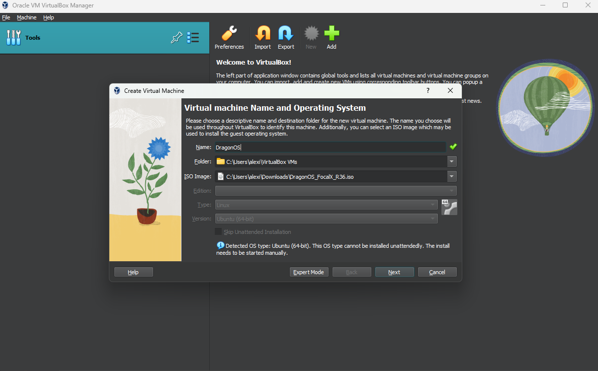
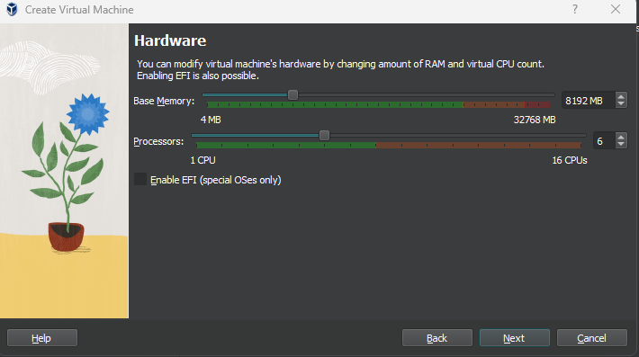
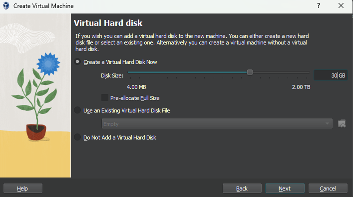
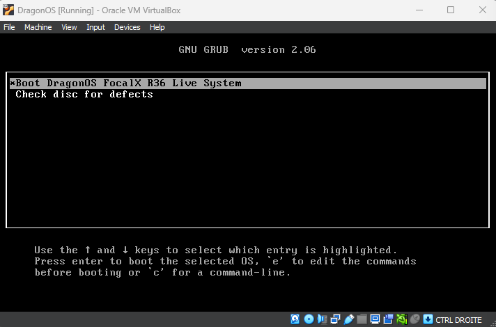
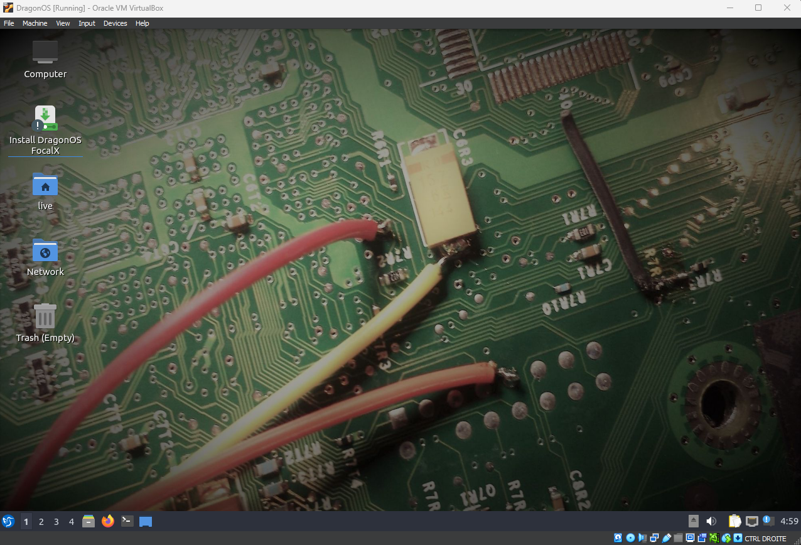
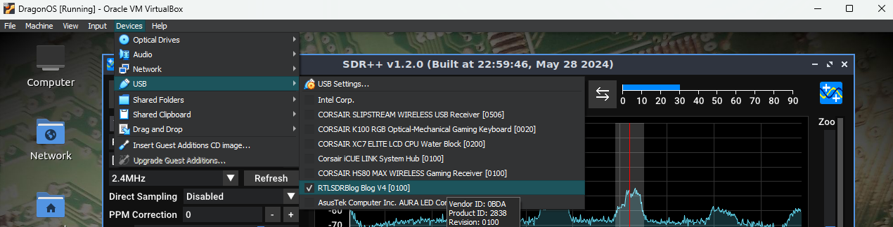
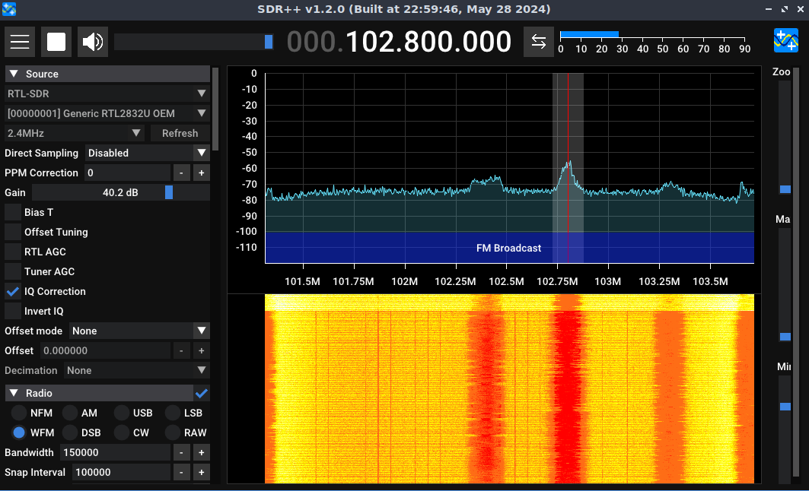

La distribution [DragonOS](https://cemaxecuter.com/) est un fork de [Lubuntu](https://lubuntu.fr/) mais spécialisé pour la [SDR](sdr.html). Elle possède déjà un grand nombre d'outils installés bien pratiques comme par exemple [GNURadio](https://www.gnuradio.org/). C'est super cool pour gagner du temps car nombre de ces tools en radio sont vieux et peuvent être compliqués à mettre en place. 
Malgré ces gros avantages, en fin d'article, j'expliquerai pourquoi je ne pense pas que ce soit la meilleure option, même pour les débutants.

# Installation
Pour récupérer l'**iso**, on se rend juste [ici](https://sourceforge.net/projects/dragonos-focal/files/latest/download). Ensuite, il nous faut un **hyperviseur** comme **VirtualBox** ou **VMWare**, peu importe. Dans mon cas, comme je suis sur **Windows**, je vais rester au plus simple avec **VirtualBox** que l'on peut télécharger directement [ici](https://www.virtualbox.org/wiki/Downloads). Pour les **Mac ARM**, il faudra utiliser **VMWare** :) 
On peut lancer **VirtualBox** et cliquer sur le bouton **New** afin d'y importer notre **iso**.

On peut cliquer sur **Next** pour allouer nos ressources matérielles. Je ne sais pas trop ce qui est le mieux, mais pour la **mémoire vive**, **4Go** devrait faire l'affaire. Dans le doute, comme il y a des logiciels qui peuvent être très gourmands, je mets **8Go** (8192Mb). Pour le **CPU**, pareil, ça dépend de votre configuration, je le monte à **6** mais **2** ou **4** devraient suffire. 

Puis, on reclique sur **Next** pour allouer l'espace disque. Il faut le mettre à **30Go** minimum puisque vous rencontrerez plus tard une étape pour laquelle les **30Go** minimum seront nécessaires.

Et re **Next** puis **Finish**.

# Premier lancement
A présent, on double clique pour lancer **DragonOS**. Il est possible que vous ayez une page comme ça : 

Vous pouvez faire **entrer** et après quelques instants, on arrive sur le bureau qui se présente ainsi : 

L'installation n'est pas encore finie, on remarque sur le bureau le **Install DragonOS FocalX**. Il faut l'installer car sinon, à chaque fois que l'on va éteindre la **VM**, tout ce qu'on aura fait dessus sera perdu. 
Du coup, on  double clique, et on suit l'installation. Pour ce qu'il faut cocher, on peut laisser par défaut, c'est très bien. 
Après un long moment, ça nous propose de redémarrer la VM et on sera fin prêts à s'en servir ! 

# Découverte 
Sur **DragonOS**, on va retrouver une multitude de logiciels préinstallés donc on va pas tous les voir. Je vous laisserai les découvrir par vous même en fonction de vos usages, mais sachez qu'il y en a pour tous les goûts niveau radios.
Bref, testons tout ça et sortons notre récepteur **SDR**. Dans mon cas, j'utilise la clé **RTL-SDR V4** et un logiciel comme par exemple le super **SDR++**.
Avant de continuer, il va falloir dire à **Virtual Box** de prendre en compte notre clé **SDR** branchée sur le port **USB** de notre hôte. Pour ça, en haut, on fait **Devices -> USB** et on clique sur notre récepteur **SDR**.

À présent, on est prêts à écouter. Sur **SDR++**, dans **Source**, on sélectionne **RTL-SDR** et juste en dessous on choisit notre récepteur, on clique sur le bouton **Play** en haut et tout fonctionne nickel !

Et voilà, **DragonOS** est prêt à être utilisé !

# Mon avis
Alors, cette distribution est une solution très pratique pour gagner du temps, bien qu'on puisse s'en passer et installer nos tools directement en local sur notre machine hôte. Je préfère d'ailleurs cette option pour des questions de rapidité, car faire de la **SDR** sur une **VM** peut être très gourmand ce qui peut rendre de nombreuses tâches plus longues. On peut évidemment allouer de plus grosses ressources, mais avec un ordinateur portable classique, on en a pas toujours l'occasion. Après, en tant que hôte principal comme sur un **Raspberry**, je n'ai pas essayé mais ça doit être plus rapide déjà.
De plus, apprendre à configurer soi-même les logiciels, installer les bonnes librairies, etc... permet de mieux comprendre ce que l'on fait et surtout d'être plus efficace pour debugger. 
C'est pour cela que même pour un débutant, je ne recommande pas d'installer directement **DragonOS** afin d'y aller étape par étape. 
Au final, c'est un peu comme être intéressé par la cybersécurité et se jeter sur **Kali Linux**, car il y a tout de déjà configuré. Ce n'est pas une mauvaise chose en soit, mais on risque de passer à côté de certains détails qui font parti de l'apprentissage. Car oui, même passer une après-midi à faire marcher un tool est très bénéfique même si on ne s'en rend pas compte sur le moment 😄.
D'autre part, au fil de mon apprentissage, je reviendrai sur cet avis si je me rends compte que certains tools bien spécifiques sont vraiment une horreur à configurer :)
