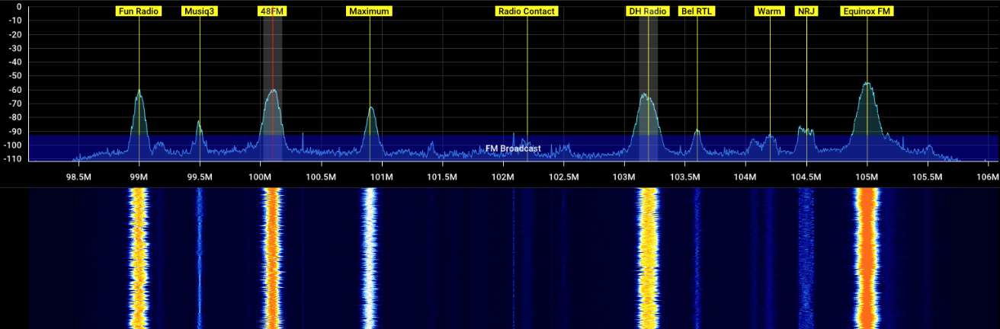
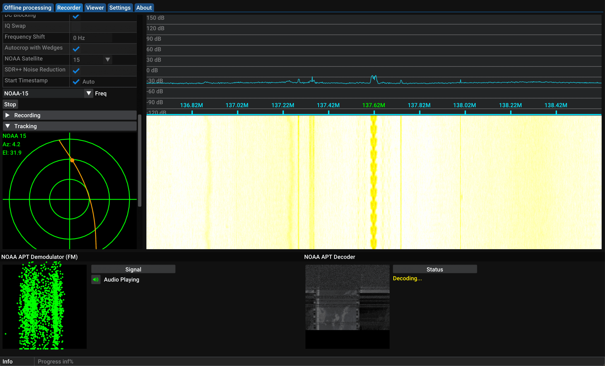

Dans le monde des ondes radio, on utilise traditionnellement des composants qui peuvent faire peur comme des résistances, des condensateurs, des bobines afin de réaliser des systèmes permettant de traiter du signal. 
L'inconvéniant, pour nous qui voulions juste **découvrir** la radio, c'est que chaque composant est une entité physique, qui peut être coûteuse, encombrante, et modifier ses caractéristiques demande des compétences techniques en électronique 🔧. 
Heuresement pour nous, grâce au numérique, on va pouvoir simplifier tout ça et avoir la possibilité de plonger dans le monde des radiofréquences pour trois fois rien 🎉.

#  Récepteur numérique 
L'idée va être de numériser le signal le plus tôt possible pour l'envoyer à un **CPU** (processeur) où l'on pourra commencer notre traitement du signal. L'avantage est que l'on pourra utiliser des algorithmes beaucoup plus complexes, notamment à l'aide des **nombres complexes** qui sont très difficiles à mettre en place avec des résistances ou autres. 
Et oui, ces fameux nombres qu'on pensait inutiles au lycée ont une réelle utilité pour numériser les signaux. 
- La partie **réelle** du nombre sert à représenter l'[amplitude](../Basics/am.html) (sa hauteur en quelque sorte) du signal.
- La partie **imaginaire**, pour représenter sa [phase](../Basics/phase.html) (sa position dans le temps). 

Ainsi, on va pouvoir simplifier des opérations mathématiques. 
Pas convaincu ? Prenons par exemple la multiplication de deux signaux (inutile de comprendre ce que ça signifie). 
Sans nombres complexes, il faudrait utiliser des calculs **trigonométriques** assez tordus. 
Alors qu'avec les nombres complexes, il "suffirait" de multiplier les [amplitudes](../Basics/am.html) et ajouter leur [phase](../Basics/phase.html), ce qui se fait simplement avec des opérations algébriques sur les nombres complexes (si si 😄). 

De plus, le numérique se met simplement à jour, ce qui est pratique, notamment pour les logiciels ou autres algorithmes. 
Un autre gros avantage du numérique est de visualiser le **spectre de fréquence** ainsi qu'un **spectrogramme** (qu'on appelle **cascade** ou **waterfall** en anglais) ce qui est très pratique pour comprendre ce qui se passe. 

C'est comme utiliser [WireShark](https://www.wireshark.org/) pour analyser les paquets sur un réseau🦈. 

#  Fréquence d'échantillonnage
Les signaux radios sont dit **analogiques** et comportent une infinité de valeurs, et ça nos **CPU** n'aiment pas, donc on vient capturer plusieurs points sur le signal à **intervalle régulier** afin de le transformer en un nombre fini. En fait, c'est plus précis de dire qu'on vient mesurer l'amplitude du signal à intervalle régulier puis qu'on vient stocker tout ça sous forme de nombres. C'est ça qu'on appelle la **fréquence d'échantillonnage** ! 
Elle est rendue possible grâce à un [convertisseur analogique-numérique](https://fr.wikipedia.org/wiki/Convertisseur_analogique-num%C3%A9rique) (CAN). 
Plus on prendra d'échantillons, plus on aura un signal numérique fidèle à la réalité mais plus il sera lourd et long à traiter.

Il existe d'ailleurs un théorème, celui de [Nyquist–Shannon](https://fr.wikipedia.org/wiki/Th%C3%A9or%C3%A8me_d%27%C3%A9chantillonnage) qui dit que pour reconstruire à l'identique un signal analogique,  il doit être échantillonné à une fréquence au moins deux fois supérieure à sa fréquence maximale. En prenant une valeur 2 fois supérieure, on s'assure de reconstruire un signal analogique très précis. 
#  Récepteurs SDR 
Numériser le signal et le traiter par logiciel a un nom, c'est la **SDR** (**S**oftware **D**efined **R**adio). Elle est rendue possible par des récepteurs comme par exemple celui-ci : 

Ces récepteurs bon marché ([lien vers un super kit pour débuter](https://fr.aliexpress.com/item/1005005952566458.html?spm=a2g0o.productlist.main.5.73d9dbXPdbXPEG&algo_pvid=525e2d1d-0980-4b25-9e4f-38905fefd577&algo_exp_id=525e2d1d-0980-4b25-9e4f-38905fefd577-2&pdp_npi=4%40dis%21EUR%2148.30%2148.30%21%21%2151.30%2151.30%21%4021059dbe17169245427093658e3802%2112000035000699472%21sea%21FR%214844539949%21&curPageLogUid=JaGxsn71xaP6&utparam-url=scene%3Asearch%7Cquery_from%3A)), se branchent en **USB** à un ordinateur équipé d'un logiciel **SDR** (il en existe plusieurs). On retrouve un port **MCX** (**M**icro **C**oaxial e**X**tended), c'est un connecteur **coaxial** plus petit que l'on relie à notre antenne. Ce dernier ne permet que la réception des signaux mais pas la transmission. Pour bénéficier des deux, il faudrait par exemple utiliser un [HackRF](../HackRF/presentation-hackrf-portapack.html). 

# Logiciels SDR 
Une fois en possession d'un récepteur **SDR**, on a plus qu'à s'équiper d'un logiciel **SDR**. À titre personnel, mon favori est [SDR++](https://www.sdrpp.org/) pour tout ce qui va être "écoute". 

[SatDump](../../Space/Satellite/satdump.html) qui est une copie de **SDR++** mais spécialisée pour l'écoute et le décodage des signaux **satellites**.

Et mention honorable aussi pour [SDRAngel](https://www.sdrangel.org/) bien pratique avec ses plugins permettant par exemple d'afficher des cartes interactives comme dans le cas de réception [ADS-B](https://fr.wikipedia.org/wiki/Automatic_dependent_surveillance-broadcast).  

À noter qu'il existe une distribution **Linux** du nom de [DragonOS](./dragonos.html) qui permet d'avoir tous ces logiciels directement installés et configurés tout seul :)
