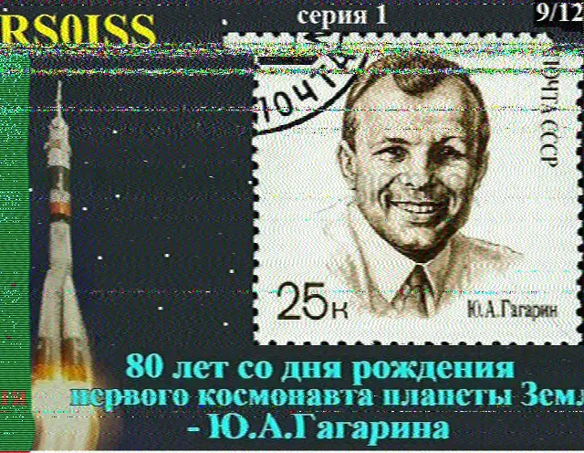
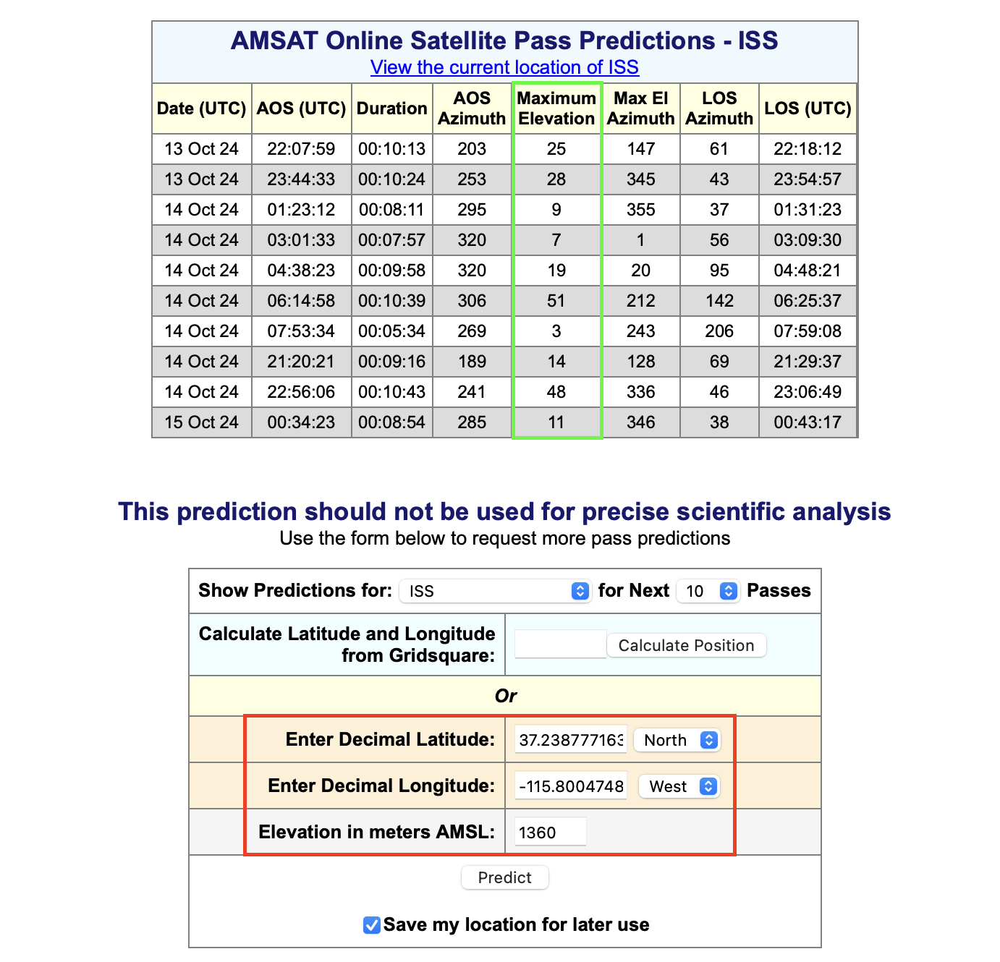
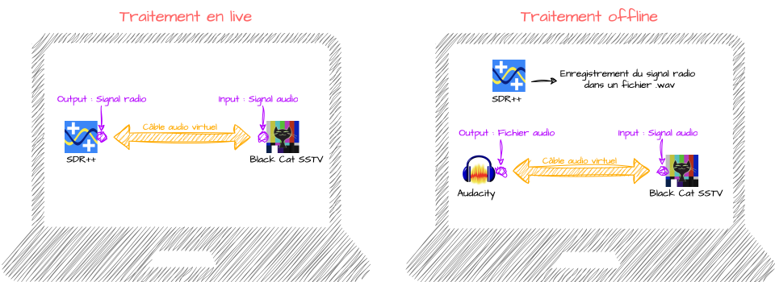
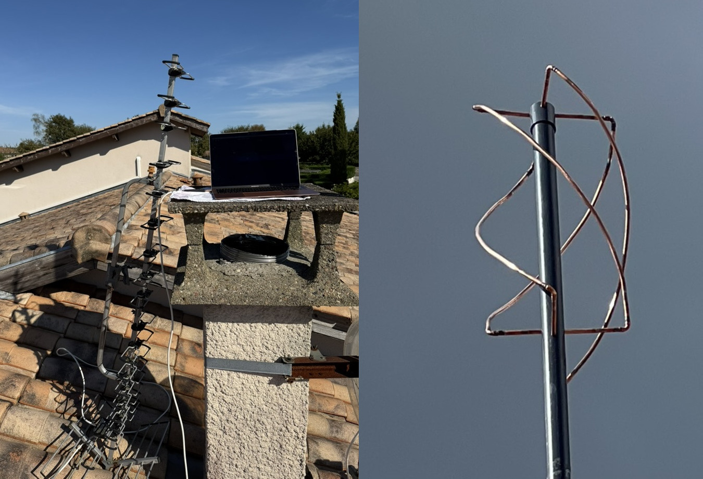
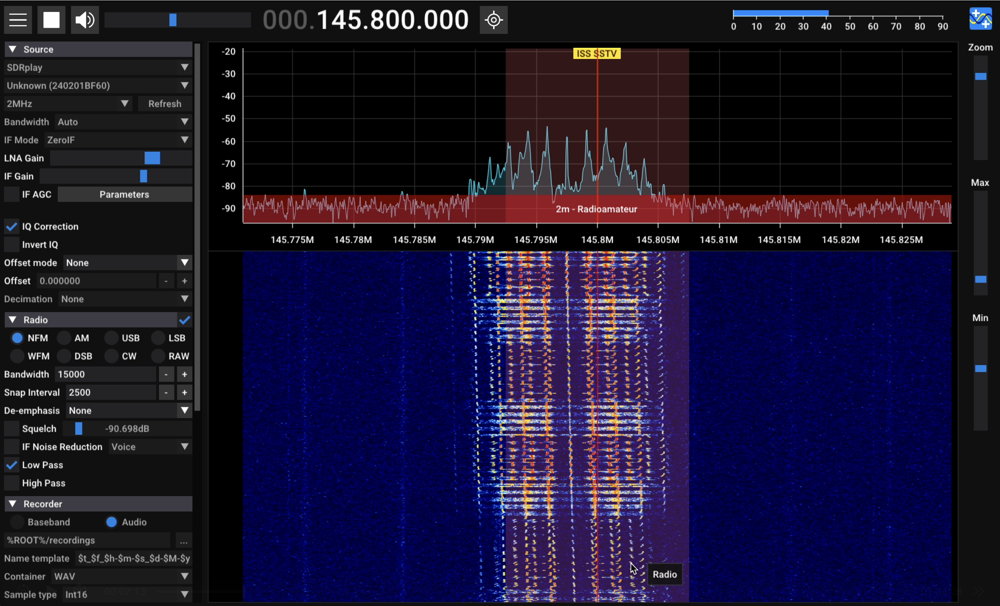
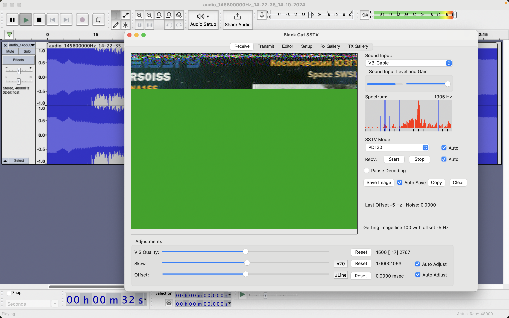
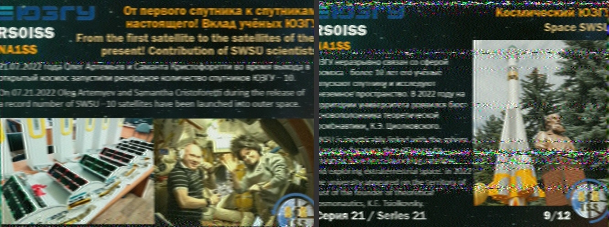

Connaissez-vous le programme [ARISS](https://fr.wikipedia.org/wiki/ARISS) (Amateur Radio on the International Space Station) ? Il permet aux radioamateurs du monde entier de communiquer avec les astronautes à bord de la [ISS](https://fr.wikipedia.org/wiki/Station_spatiale_internationale). Dans le cadre de ce programme, **ARISS** diffuse parfois des images en utilisant un protocole du nom de **SSTV**, permettant ainsi aux passionnés comme nous de recevoir des photos directement depuis l'espace.

# SSTV
La **SSTV** (**S**low **S**can **T**elevision) est une méthode de transmission d'images avec des ondes radios. Ça existe depuis 1950 et ce n'est plus trop utilisé aujourd'hui parce qu'envoyer une image, c'est quand même plus facile avec **Internet**. Le signal est facilement reconnaissable grâce à une tonalité bien particulière dont voici [un exemple](https://www.youtube.com/watch?v=XALkHpdii2A). Ce son va ensuite être décodé grâce à des logiciels spécifiques pour être converti en une image de ce type : 

Pour rentrer en détail dans son mode de fonctionnement, il y a ce [pdf](https://www.radioamateurs-france.fr/wp-content/uploads/2015/07/G-8-8-SSTV.pdf) qui est pas mal. 

# Préparation
## Programme ARISS
Vouloir recevoir des images de l'ISS c'est bien, encore faut-il qu'elle soit en train d'en émettre. Et pour le coup, c'est assez rare, 1 à 2 fois par an seulement. Sur le site d'[ARISS France](https://www.ariss-f.org/actualites/), vous pourrez consulter l'actualité afin de voir si une transmission **SSTV** est prévue. Lorsqu'il y en a, ça dure environ 1 semaine durant laquelle on a plusieurs occasions de recevoir des images.

## Passage de l'ISS
Si une transmission **SSTV** est prévue, alors il va falloir prédire les horaires de passage de l'**ISS**. Pour cela, plusieurs méthodes, dans mon cas, j'utilise le site [AMSAT](https://www.amsat.org/track/).
Dans le rectangle rouge, on entre nos coordonnées géographiques puis on clique sur **Predict**. On peut voir la liste des prochains passages de l'**ISS** au dessus de nous. On va préférer se concentrer sur les passages avec une **élévation** élevée (rectangle vert) donc minimum **20** sauf si vous êtes dans une zone avec un horizon super dégagé.

## Logiciel
On peut faire de la **SSTV** avec un simple **talkie-walkie** permettant d'écouter le signal et en même temps, depuis un logiciel le décoder. C'est la méthode la plus simple, mais le décodage du signal se fait avec un micro (téléphone ou ordinateur), ce qui n'est pas optimal.  
Dans mon cas, je vais procéder avec la [SDR](./sdr.html) en utilisant le logiciel [SDR++](https://www.sdrpp.org) pour recevoir le signal et [Black Cat SSTV](https://www.blackcatsystems.com/software/sstv.html) pour le décoder car étant sur **Mac** c'est le seul fiable que j'ai trouvé. Si vous êtes sur **Linux**, prenez [QSSTV](https://doc.ubuntu-fr.org/qsstv) et si vous êtes sur **Windows**, utilisez [MMSTV](https://hamsoft.ca/pages/mmsstv.php). 

Pour décoder une image, le logiciel **SSTV** attend en entrée le signal audio. Or, notre signal audio étant présent sur notre logiciel **SDR**, il va falloir trouver un moyen de relier les deux logiciels. Pour cela, la solution la plus simple à mettre en oeuvre est l'utilisation d'un **câble audio virtuel**. Voici un schéma de comment ça fonctionne : 

Pour réaliser ce câble virtuel, le plus simple est d'installer [VB-cable](https://vb-audio.com/Cable/).

## Matériel
L'idéal pour recevoir un bon signal serait de se faire une antenne spécialement calibrée pour la fréquence à laquelle l'**ISS** envoie son signal. Comme j'avais la flemme, j'ai utilisé ce que j'avais déjà à savoir une antenne [QFH 137MHz](../../Projects/qfh.html) et une antenne **Yagi** pour la télévision terrestre. 
L'antenne **Yagi** étant **directive**, il va falloir suivre la position de l'**ISS** à la main, y a pleins d'applis pour la tracker. Pour l'antenne [QFH](../../Projects/qfh.html), elle est **omnidirectionnelle** donc rien de spécial à faire. 
Côté **SDR**, n'importe quel récepteur fera l'affaire, j'ai eu des résultats correctes avec la clé [RTL-SDR V4](https://www.passion-radio.fr/cles-rtl-sdr/r828d-v4-2402.html) et le [SDRPlay RSP1B](https://www.passion-radio.fr/recepteurs-sdr/rsp1-b-2669.html).

#  Réception
Comme ces transmissions sont rares, je ne vais pas prendre le risque de décoder en live mais je vais d'abord enregistrer le signal et le décoder hors ligne, comme sur le schéma *Traitement offline* un peu plus haut. Voici mes setups :

Depuis [SDR++](https://www.sdrpp.org), on règle la fréquence à laquelle le contact **ARISS** est prévue, dans mon cas `145.800MHz`. On sélectionne [NFM](https://fr.wikipedia.org/wiki/Bande_étroite) comme **modulation**. 
Dans la section `Record`, on lance l'enregistrement en appuyant sur **Record**.
Si tout se passe bien, vous devriez voir clairement le signal apparaître. N'hésitez à régler le `Max` et le `Min` à droite pour bien refaire ressortir le signal sur la cascade.
La station n'émet pas en continue donc si vous recevez rien au début c'est normal, soyez patient. Une tonalité bien précise marquera le début de la transmission. 

Une autre tonalité marquera la fin de la transmission, vous pouvez stopper l'enregistrement, noter où le fichier `.wav` est enregistré et passer au décodage de notre signal.

# Décodage
On ouvre notre enregistrement avec [Audacity](https://www.audacityteam.org) et on change l'**output** en allant au milieu dans `Audio Setup` -> `Playback Device` et on sélectionnes `VB-Cable`. 
Depuis le logiciel **SSTV**, on modifie l'**input** en sélectionnant aussi `VB-Cable`. On peut choisir le mode **SSTV** car il est donné par **ARISS** donc `PD120`. En `auto`, ça devrait trouver tout seul. 
On a plus qu'à lancer l'audio depuis **Audacity** et automatiquement, le logiciel **SSTV** va commencer à former l'image.

Voici quelques exemples d'images que j'ai reçue, à gauche avec l'antenne **QFH** et à droite avec la **Yagi**  : 

Si vous voulez vous entraîner à décoder des signaux **SSTV**, vous avez des challenges comme [celui-ci](https://www.root-me.org/fr/Challenges/Reseau/RF-Transmission-satellite) sur **Root-me** ou [celui-là](https://app.hackthebox.com/challenges/Signals) sur **HackTheBox**.