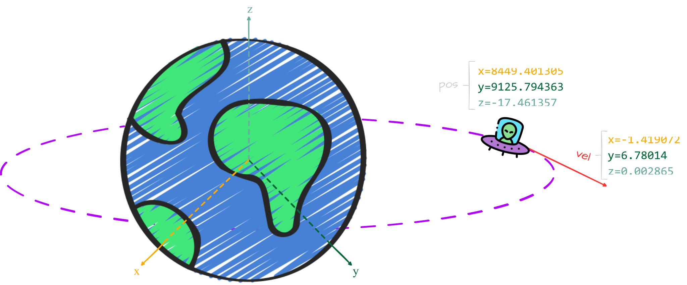

Description du challenge : *Your spacecraft has provided its Cartesian ICRF position (km) and velocity (km/s). What is its orbit (expressed as Keplerian elements)?*

Le challenge est disponible à [cette adresse](https://github.com/cromulencellc/hackasat-qualifier-2021/tree/main/kepler)

Connectons-nous à l'instance du challenge : 
```bash
> docker run --rm -i -e FLAG=pouet kepler:challenge
         KEPLER
        CHALLANGE
       a e i Ω ω υ
            .  .
        ,'   ,=,  .
      ,    /     \  .
     .    |       | .
    .      \     / .
    +        '='  .
     .          .'
      .     . '
         '
Your spacecraft reports that its Cartesian ICRF position (km) and velocity (km/s) are:
Pos (km):   [8449.401305, 9125.794363, -17.461357]
Vel (km/s): [-1.419072, 6.780149, 0.002865]
Time:       2021-06-26-19:20:00.000-UTC

What is its orbit (expressed as Keplerian elements a, e, i, Ω, ω, and υ)?
Semimajor axis, a (km):
```
On va devoir à partir d'une **position cartésienne** et d'une **vitesse** retrouver les **paramètres d'orbite** de notre vaisseau spatial. 
Il est important  de comprendre de quoi on parle quand on évoque les **paramètrs d'orbite**. Heuresement pour toi, j'ai fais un petit cours que tu peux consuler [juste ici](../Satellite/orbits.html) :) 

Voici un p'tit schema de ce que représente les différentes données qu'on a (le placement du vaisseau est arbitraire, il ne correspond pas à ses coordonnées réelles, flemme de faire un truc en 3D) : 


Bon, en vrai, les calculs pour trouver les **paramètres d'orbite** sont plutôt relous, donc on va juste apprendre à utiliser la bibliothèque **Python** [poliastro](https://github.com/poliastro/poliastro) pour arriver à nos fins. 

Dans un premier temps, on va convertir nos listes qui contiennent les coordonnées de **position** et de **vitesse** en objets avec des unités physiques appropriées pour faire des calculs avec.
```python
from poliastro.twobody.orbit import u

pos = [8449.401305, 9125.794363, -17.461357]
vel = [-1.419072, 6.780149, 0.002865]

pos_km = [*pos] * u.km
vel_kms = [*vel] * u.km / u.s
```

Le `u.km`, c'est une unité de mesure qui provient de la bibilothèque [astropy](https://github.com/astropy/astropy). En multipliant notre liste avec, on convertit chaque coordonnée en objet `Quantity`. Ainsi, les coordonnées `x`, `y` et `z` sont désormais traitées commes ayant pour unité le `km` ce qui va nous permettre de faire des calculs physiques avec. 
Pareil pour le `u.s` qui représente des **secondes** et donc `u.km / u.s` "transforme" notre liste de vitesse avec comme unité le `km/s`.
Ensuite, et c'est là que la magie se fait, on a juste à appeler la méthode `Orbit.from_vectors` qui va s'occuper de faire tous les calculs pour nous afin qu'on puisse récupérer tout ce dont on a besoin. 
```python
from poliastro.bodies import Earth
from poliastro.twobody import Orbit

time = "2021-06-26 19:20:00.000"
orb = Orbit.from_vectors(Earth, pos_km, vel_kms, time)
```
`Earth`, c'est juste un objet qui contient des paramètres gravitationnels et géométriques de la **Terre**. Ces derniers sont indispensables pour le calcul mais pas la peine de rentrer dans les détails. 
On oublie pas aussi de lui spécifier notre temps exacte qui représente le moment dans le temps où la position et la vitesse ont été mesurés. Et oui, les paramètrse oribtaux peuvent être amenés à changer avec le temps en raison de divers perturbations gravitaionnelles donc faut le spécifier ce temps.
Une fois, l'appel à `Orbit.from_vectors` fait, on a plus qu'à récupérer nos **6 paramètrse d'orbites** : 
```python
a = orb.a # Demi-grand axe en km
e = orb.ecc # Excentricité
i = orb.inc.to_value(u.deg) # Inclinaison
Omega = orb.raan.to_value(u.deg) # Longitude du nœud ascendant
omega = orb.argp.to_value(u.deg) # Argument du Périastre
nu = orb.nu.to_value(u.deg) # Anomalie vraie
```
Avec la méthode `to_value` d'**astropy**, on peut convertir directement une valeur avec l'unité de son choix. En l'occurrence, comme les angles sortent en `radians`, on s'en sert pour les convertir en `degrés`
On `print` tout ça, et y a plus qu'à remplir avec les bonnes valeurs : 
```bash
> docker run --rm -i -e FLAG=pouet kepler:challenge
         KEPLER
        CHALLANGE
       a e i Ω ω υ
            .  .
        ,'   ,=,  .
      ,    /     \  .
     .    |       | .
    .      \     / .
    +        '='  .
     .          .'
      .     . '
         '
Your spacecraft reports that its Cartesian ICRF position (km) and velocity (km/s) are:
Pos (km):   [8449.401305, 9125.794363, -17.461357]
Vel (km/s): [-1.419072, 6.780149, 0.002865]
Time:       2021-06-26-19:20:00.000-UTC

What is its orbit (expressed as Keplerian elements a, e, i, Ω, ω, and υ)?
Semimajor axis, a (km): 24732.885760723184
Eccentricity, e: 0.7068070220620631
Inclination, i (deg): 0.11790360842507447
Right ascension of the ascending node, Ω (deg): 90.22650379956278
Argument of perigee, ω (deg): 226.58745900876278
True anomaly, υ (deg): 90.389955034578

You got it! Here's your flag:
pouet
```
Et on a notre flag :) 

