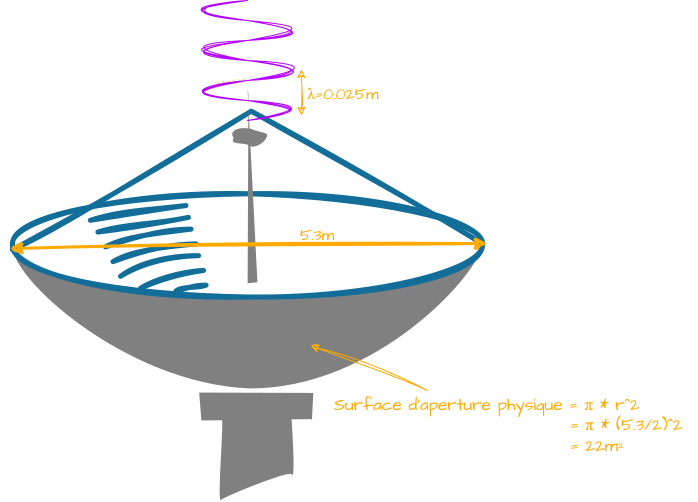
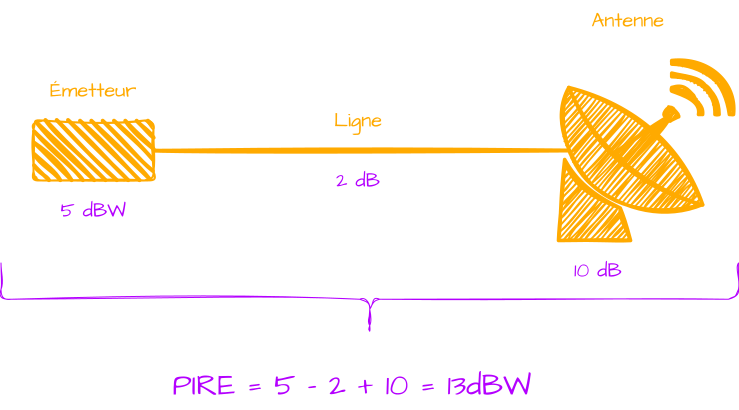
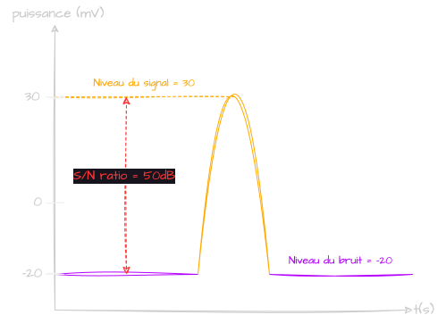
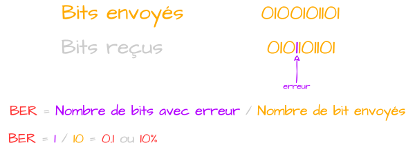

Description du challenge : *Years have passed since our satellite was designed, and the Systems Engineers didn't do a great job with the documentation. Partial information was left behind in the user documentation and we don't know what power level we should configure the Telemetry transmitter to ensure we have 10 dB of Eb/No margin over the minimum required for BER (4.4 dB)*.

Le challenge est disponible à [cette adresse](https://github.com/cromulencellc/hackasat-qualifier-2021/tree/main/linky).

Le but est de compléter un [bilan de liaison](https://fr.wikipedia.org/wiki/Bilan_de_liaison) (**budget link**) afin de terminer une documentation pour aider des ingénieurs. 
Un bilan de liaison compte l'entiereté des **gains** et **pertes** d'un **émetteur** jusqu'à un **récepteur** dans un système de communication. En pratique, on en fait un pour la **liaison montante** et un autre pour la **liaison descendante**. Ce bilan permet ainsi d'évaluer la performance de son système.

Lançons le challenge : 
```bash
> docker run --rm -i -e FLAG=pouet linky:challenge
...
Here's the information we have captured

************** Global Parameters *****************
Frequency (Hz): 12100000000.0
Wavelength (m): 0.025
Data Rate (bps): 10000000.0
************* Transmit Parameters ****************
Transmit Line Losses (dB): -1
Transmit Half-power Beamwidth (deg): 26.30
Transmit Antenna Gain (dBi): 16.23
Transmit Pointing Error (deg): 10.00
Transmit Pointing Loss (dB): -1.74
*************** Path Parameters ******************
Path Length (km): 2831
Polarization Loss (dB): -0.5
Atmospheric Loss (dB): -2.1
Ionospheric Loss (dB): -0.1
************** Receive Parameters ****************
Receive Antenna Diameter (m): 5.3
Receive Antenna Efficiency: 0.55
Receive Pointing Error (deg): 0.2
Receive System Noise Temperature (K): 522
Receive Line Loss (antenna to LNA) (dB): -2
Receive Demodulator Implementation Loss (dB): -2
Required Eb/No for BER (dB): 4.4

Calculate and provide the receive antenna gain in dBi:
```
Ok, ça fait pas mal d'informations. Première question, on doit calculer le gain de l'**antenne réceptrice**. 

#  1. Calcul du gain 
Pour calculer le gain, on va utiliser la formule `G = 10log(n4πa/λ^2)` ([lien formule](https://calculator.academy/antenna-gain-calculator-2/)).
- `n` -> l'**efficacité** de réception de l'antenne. Ça correspond au rapport entre l’énergie électromagnétique captée et l’énergie réellement transmise au récepteur. Ça dépend nottament des matériaux utilisés pour fabriquer la parabole, son design et d'autres trucs. Dans notre cas, elle nous est donnée, elle vaut `0.55`.
- `λ` -> la **longueur d'onde**. On l'a aussi, elle vaut `0.025m`. 
- `a` -> la surface d'**aperture physique** de la parabole. Alors, ça on l'a pas mais on peut le calculer facilement. C'est juste la surface réelle qui capte les ondes. On nous donne le diamètre de notre parabole donc au final, sa surface physique, c'est juste son aire qui se calcule avec la formule `π*r^2` avec `r` le rayon. 


On peut à présent faire les calculs en `Python` par exemple.
```bash
>>> import np as np
>>> r = 5.3/2 #m
>>> a = np.pi * r**2 #m²
>>> λ = 0.025 #m
>>> n = 0.55
>>> gain = 10 * np.log10((n * 4 * np.pi * a) / (λ**2)) # dB
>>> print(gain)
53.873341567400146
```
Entrons cette valeur arrondi pour passer à l'étape suivante : 
```bash
> docker run --rm -i -e FLAG=pouet linky:challenge
...
Calculate and provide the receive antenna gain in dBi: 53.9
Good job.  You get to continue
Receive Antenna Gain (dBi): 54.00
Receive Half-power Beamwidth (deg): 0.33
Receive Pointing Error (deg): 0.2
Receive Pointing Loss (dB): -4.48

Okay, now we know the receive antenna gain.
Calculate and provide the ground terminal G/T (dB/K):
```
Prochaine tâche, on doit calculer le [rapport gain sur température de bruit](https://en.wikipedia.org/wiki/Antenna_gain-to-noise-temperature) (**G/T**) de la **station de sol**.

#  2. Calcul du G/T (Gain-To-Noise Temperature)
Le **G/T** est une mesure de performance d’une antenne, exprimant le **gain de l’antenne** par rapport au **bruit thermique** générée par les composants internes d'un système.
Cette fois-ci, on peut utiliser la formule `G/T = G - 10log(N)` ([lien formule](https://www.rfwireless-world.com/calculators/Antenna-G-T-ratio.html)).
- `G` -> l'**antenna gain**, on l'a calculé avant, mais **attention**, on veut le **G/T** de la **station de sol** (ground terminal), pas juste de l'**antenne** donc il faut aussi prendre en compte les pertes de transmission qui nous sont donnés `Receive Line Loss (antenna to LNA) (dB): -2`.
- `N` -> le **system noise temperature** nous est donné à `522K`. 
  
On calcule tout ça : 
```bash
>>> g = 54
>>> rx_line_loss = -2 #dB
>>> temp = 522 #K
>>> g_t = g + rx_line_loss - 10 * np.log10(temp)
>>> print(g_t)
24.696636537377525
```
Entrons-la valeur pour passer à la suite :
```bash
> docker run --rm -i -e FLAG=pouet linky:challenge
...
Calculate and provide the ground terminal G/T (dB/K): 24.7

Nicely done.  Let's keep going.
Determine the transmit power (in W) to achieve 10dB of Eb/No margin (above minimum for BER):
```
SUPER ! On peut passer à la dernière étape. 

#  3. Calcul du Transit Power
À présent, on doit calculer la **puissance d'émission** (transit power) en `W` pour atteindre une marge de `10dB` de **Eb/No** au-dessus du minimum requis pour le taux d’erreur binaire (**BER**). 
Pour la calculer, on va se servir la formule de la [PIRE](https://fr.wikipedia.org/wiki/Puissance_isotrope_rayonn%C3%A9e_%C3%A9quivalente) (**P**uissance **I**sotrope **R**ayonnée **É**quivalente) : `PIRE = P - L + G` avec : 
- `PIRE` -> en `dBW` (**EIRP** en anglais). Ça sert globalement à calculer l'efficacité d'un **système d'émission** en prenant en compte la puissance de l'**émetteur**, l'**antenne**, et la **ligne** qui relie les deux. 
- `P` -> la puissance d'émission en `dBW`. (C'est ce que l'on cherche)
- `L` -> les pertes de ligne en `dB`.
- `G` -> le gain de l'antenne **émettrice** en `dB`.

Voici un exemple de calcul de **PIRE** : 


Retournons la formule pour isoler la **puissance d'émission** : `PIRE = P - L + G <=> P = PIRE + L - G`.
Malheuresement, la **PIRE** ne nous ai pas donné mais on peut la calculer avec le [RSSI](https://fr.wikipedia.org/wiki/Received_Signal_Strength_Indicator) qui représente le niveau de **puissance en réception** d'un signal. Ce dernier est définit par la formule suivante : `RSSI = PIRE - L` avec `L` les pertes de propagation.
Donc `PIRE = RSSI + L`.

## 3.1 Calculer le RSSI
Le **RSSI** tient compte du **SNR**, des **pertes de pointages**, du **G/T** et de la [constante de  Boltzmann](https://fr.wikipedia.org/wiki/Constante_de_Boltzmann). On va chacun les étudier séparément.

### 3.1.1 SNR
Dans un premier temps, il nous faut calculer le `S/N` ou `SNR` qui mesure le rapport entre la puissance du **signal** et le **bruit**. 

C'est lui qui détermine la qualité du signal et on peut le calculer avec la formule `S/N = Eb/No * 10log(Rb/B)` ([lien formule](https://www.rfwireless-world.com/calculators/Eb-N0-and-BER-calculator.html)).
Le **BER** (**B**it **E**rror **R**ate) c'est le rapport de bits reçus avec des erreurs par rapport au nombre total de bits transmis. Par exemple :


Le **Eb/No** quant à lui permet de mesurer la qualité d'un **signal numérique**. C'est aussi un rapport mais entre l'énergie nécessaire à envoyé pour `1 bit` et le **bruit**. Donc plus le **Eb/No** est élevée, plus le **BER** diminue et plus la transmission est fiable.
- Le **Eb/No** pour le **BER**, on nous le donne, c'est `4.4dB`. D'après la question, on sait qu'on a une marge de `10dB` donc le **Eb/No** vaudra `14.4dB`.
- Pour le **débit binaire**, pareil, on nous le donne, c'est `10000000.0bps` donc `10Mbps`.
- Aussi, il faut penser à enlever dès maintenant les pertes de démodulation dues aux imperfections de l’implémentation de la démodulation. Elles nous sont données par `Receive Demodulator Implementation Loss (dB): -2`.

On peut à présent faire le calcul :
```bash
>>> import np as np
>>> eb_no = 14.4 #dB
>>> bitrate = 10e6 #bps
>>> demodulator_loss = -2 #dB
>>> s_n = eb_no + 10 * np.log10(bitrate) - demodulator_loss #dB
>>> print(s_n)
86.4
```
Ce qui nous donne un `S/N` de `86.4dB`.

### 3.1.2 Pertes de pointage de l'antenne réceptrice
Lorsque l’antenne n’est pas parfaitement alignée avec la source du signal, une partie de l’énergie est perdue. Cette perte doit être prise en compte pour ajuster le calcul de la puissance reçue. Ces pertes peuvent se calculer ainsi : `pertes de pointages = -12 * (erreur de pointage/largeur de faisceau)^2` ([lien formule](https://www.microwavejournal.com/articles/3371-antenna-selection-to-minimize-pointing-requirements)). 
Pour récupérer la **largeur de faisceau** de la parabole réceptrice ([beam width](https://en.wikipedia.org/wiki/Beam_diameter)) on aura besoin de  cette formule : `BW=(λ/D)*70` avec `λ` la longueur d'onde en `m` et `D` le diamètre de la parabole en `m` ([lien formule](https://www.calculatorultra.com/fr/tool/antenna-beamwidth-calculator.html?utm_source=chatgpt.com#gsc.tab=0)).
Enfin, on peut calculer les pertes de pointages :
```bash
>>> λ = 0.025 #m
>>> d = 5.3 #m
>>> beamwidth = (λ/d)*70 #m
>>> rx_pointing_error = 0.2
>>> rx_pointing_loss = -12*(rx_pointing_error/rx_beamwidth)**2 #dB
>>> print(rx_pointing_loss)
-4.402677551020408
```
Ce qui nous donne des pertes de pointage d'à peu près `-4.4dB`.

### 3.1.3 Calcul final du RSSI
À présent, on peut passer au calcul de notre **RSSI** définit par `RSSI = s_n - pointing_loss + boltzmann - G/T` : 
```bash
>>> import np as np
>>> rx_pointing_loss = -4.4 #dB
>>> boltzmann_j_k = 1.38065e-23 # J/K
>>> boltzmann = 10*np.log10(boltzmann_j_k) #dBW_K
>>> rssi = s_n - rx_pointing_loss + boltzmann - g_t #dBW
>>> print(rssi)
-162.49580056501418
```
Notre **RSSI** vaut donc environ `-162.5dBW`.

## 3.2 Calculer les pertes de propagation
On a plusieurs pertes déjà données, il faut juste calculer en plus les **pertes de parcours**. Elles représentent l'atténuation naturelle d'un signal lorsqu'il se propage due à la dispersion de l'énergie sur une surface de plus en plus grande avec la distance.
La formule est la suivante : `Pertes de parcours = -20*log10(λ/(4*π*D)` avec `λ` la longueur d'onde en `m` et `D` la distance du parcours en `m` ([lien formule](https://fr.wikipedia.org/wiki/Équation_des_télécommunications#Expression_logarithmique)). 
Calculons tout ça : 
```bash
>>> import np as np
>>> λ = 0.025 #m
>>> d = 2831*1E3 #m
>>> path_loss = 20*np.log10(λ/(4*np.pi*d)) #dB
>>> print(path_loss)
-183.06419449430322
```
Les pertes à prendre en compte sont donc : 
```
Path Loss (dB) : -183 <- qu'on vient de calculer
Polarization Loss (dB): -0.5
Atmospheric Loss (dB): -2.1
Ionospheric Loss (dB): -0.1
Transmit Pointing Loss (dB): -1.74 <- à ne pas confondre avec le Receive Poiting Loss qu'on a calculé plus tôt pour le RSSI
```

## 3.3 Calcul final de la PIRE
Rappellons la formule `PIRE = RSSI - toutes les pertes de propagation` et passons aux calculs : 
```bash
>>> polarization_loss = -0.5 #dB
>>> atmospheric_loss = -2.1 #dB
>>> ionospheric_loss = -0.1 #dB
>>> tx_pointing_loss = -1.74 #dB
>>> tx_eirp = rssi - path_loss - polarization_loss - atmospheric_loss - ionospheric_loss - tx_pointing_loss #dbW
>>> print(tx_eirp)
25.008393929289046
```
Super, notre **PIRE** vaut `25dBW`.

## 3.4 Calcul final du Transit Power
Allez, on y est presque, on rappelle que pour calculer la **puissance d'émission**, on doit appliquer cette formule : `P = PIRE + L - G`. `tx_line_loss` nous est donné égal à `-1`. Sa valeur étant déjà négative puisque c'est une perte, il faut la soustraire dans notre formule au lieu de l'additioner. Elle devient donc `P = PIRE - L - G`. 
```bash
>>> tx_line_loss = -1 #dB
>>> tx_antenna_gain = 16.23 #dB
>>> transit_power_dbW = tx_eirp - tx_line_loss - tx_antenna_gain #dBW
>>> transit_power_W = 10**(transit_power_dbW/10) #W
>>> print(transit_power_W)
9.502533141159013
```

Entrons la valeur :
```bash
> docker run --rm -i -e FLAG=pouet linky:challenge
...
Determine the transmit power (in W) to achieve 10dB of Eb/No margin (above minimum for BER): 9.7

Winner Winner Chicken Dinner
...
You got it! Here's your flag:
pouet
```
Et ça marche, on obtient le flag ! 
Alors, oui, si vous observez bien, j'ai mis `9.7` alors que j'avais trouvé `9.5`. En fait, cette valeur ne fonctionnait pas et je ne trouvais pas où était l'erreur. J'ai donc essayé des valeurs voisines et `9.7` a fonctionné 😄. 
En réalité, si on observe le code [source du challenge](https://github.com/cromulencellc/hackasat-qualifier-2021/blob/main/linky/challenge/challenge.py), on voit qu'en fonction de ce que l'on entre comme valeur, les réponses peuvent être différentes. Par exemple, la [solution officielle](https://github.com/cromulencellc/hackasat-qualifier-2021/blob/main/linky/solver/solver.py) utilise comme **gain** `54`, `24.8` comme **G/T** et `9.5` comme **transmit power**. Mais bref, on s'en fiche, l'essentiel, c'est d'avoir bien compris comment jouer avec toutes ces valeurs :) 