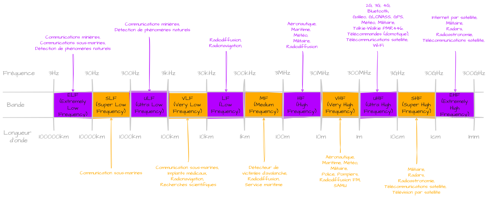
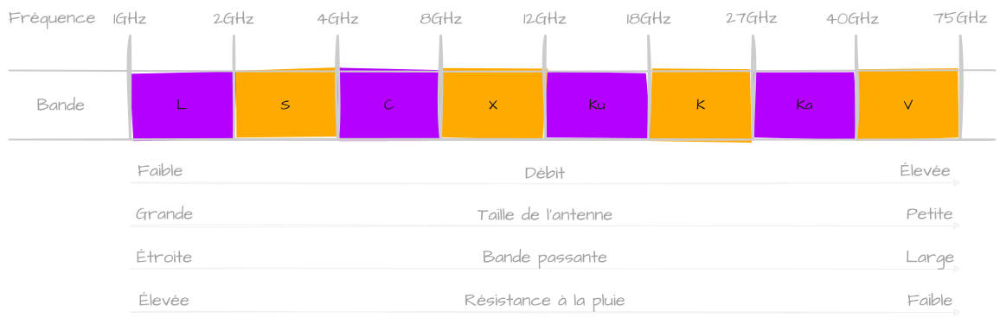

Après avoir découvert les différents [types d'orbites]({{ site.data.links.orbits }}) sur lesquels sont placés les satellites, nous allons nous pencher sur les différentes bandes de fréquences utilisées par ces derniers. Rappelons avant comment est répartie le **spectre radioélectrique** (à ouvrir en grand pour mieux y voir). 

J'ai mis quelques exemples d'utilisation pour mieux s'y retrouver. 
Pour répondre à des besoins plus spécifiques d'ingénierie, ont été mis en place des **sous-bandes** qui sont très utilisées pour les **communications satellites**. C'est sûr ces dernières que l'on va se pencher dans ce cours. 

# Bandes spécialisées
Voici comment ont été réparties ces fameuses bandes qui commencent dans les ondes [UHF](https://fr.wikipedia.org/wiki/Ultra_haute_fr%C3%A9quence) jusque dans les [EHF](https://fr.wikipedia.org/wiki/Extr%C3%AAmement_haute_fr%C3%A9quence#:~:text=On%20appelle%20extr%C3%AAmement%20haute%20fr%C3%A9quence,font%20partie%20des%20micro%2Dondes.). 

## Bande L 
La **bande L** est comprise entre `1GHZ` et `2GHz` dans les ondes [UHF](https://fr.wikipedia.org/wiki/Ultra_haute_fr%C3%A9quence). Elle est très utilisée pour les systèmes de positionnement par satellites ([GNSS]({{ site.data.links.gps }})) comme le célèbre **GPS** américain ou encore le **Galileo** européen. On va aussi retrouver des satellites météorologiques comme les [NOAA]({{ site.data.links.noaa }}), [METEOR]({{ site.data.links.meteor }}), [GOES](https://fr.wikipedia.org/wiki/Geostationary_Operational_Environmental_Satellite) et bien d'autres ! Oui les **NOAA** et **METEOR** émettent aussi dans les [VHF](https://fr.wikipedia.org/wiki/Tr%C3%A8s_haute_fr%C3%A9quence) sur les fréquences `137MHz` mais pas que, tout dépend du type d'information qu'ils envoient.
Ces ondes ont l'avantage d'être très résistantes aux conditions atmosphériques comme la pluie. En contrepartie, elles ne sont pas faites pour transporter de grandes quantités de données du à leur faible bande passante.

## Bande S 
La **bande S** est comprise en `2GHZ` et `4GHz` à moitié dans les ondes [UHF](https://fr.wikipedia.org/wiki/Ultra_haute_fr%C3%A9quence) et [SHF](https://fr.wikipedia.org/wiki/Supra-haute_fr%C3%A9quence). On y retrouve à nouveau des satellites météorologiques comme les [NOAA]({{ site.data.links.noaa }}), ou les [DMSP](https://fr.wikipedia.org/wiki/Defense_Meteorological_Satellite_Program) (**D**efense **M**eterorological **S**atellite **P**rogram). On aussi des satellites d'observation du **Soleil** comme [Hinode (Solar-B)](https://fr.wikipedia.org/wiki/Hinode_(satellite)). Ou encore, les communications audios avec la [Station Spatiale Internationale](https://fr.wikipedia.org/wiki/Station_spatiale_internationale) (ISS).
Bref, cette bande est aussi résistante aux conditions météos mais reste adapatée pour des communications ne nécessitant pas trop de bande passante.

## Bande C 
La **bande C** est comprise entre `4GHZ` et `8GHz` dans les ondes [SHF](https://fr.wikipedia.org/wiki/Ultra_haute_fr%C3%A9quence). Cette bande est très utilisée pour la télévision par satellite, surtout dans les climats pluvieux. On peut citer le premier satellite de télécommunications [Early Bird](https://fr.wikipedia.org/wiki/Intelsat_I) d'[Intelsat](https://fr.wikipedia.org/wiki/Intelsat) ou certains anciens [Hot Bird](https://fr.wikipedia.org/wiki/Hot_Bird#:~:text=Hot%20Bird%20est%20le%20principal,de%20120%20millions%20de%20foyers.) d'[Eutelsat](https://fr.wikipedia.org/wiki/Eutelsat) qui l'utilise. 
Ces satellites sont souvent placés en [orbite géostationnaire]({{ site.data.links.orbits }}) couvrant ainsi de très grande zone. La bande passante de la **bande C** reste correcte mais nécessite des antennes paraboliques assez grandes (`2`/`3m`) pour recevoir le TV. Aussi, elle devient de plus en plus encombrée dans le monde ce qui pousse les entreprises à migrer vers des bandes plus hautes. D'autant plus que c'est une bande touchée par les intérférences des réseaux **5G** situé vers `3.5GHz`.

## Bande X 
La **bande X** est comprise entre `8GHZ` et `12GHz` aussi dans les ondes [SHF](https://fr.wikipedia.org/wiki/Ultra_haute_fr%C3%A9quence). Très utilisée dans les armées du monde entier, comme les satellites français du programme [Syracuse](https://fr.wikipedia.org/wiki/Syracuse_(satellite)) ou les américains [WGS](https://fr.wikipedia.org/wiki/Wideband_Global_SATCOM) (**W**ideband **G**lobal **S**ATCOM). Sa bande passante élevée permet de transmettre des images hautes résolutions tout en ayant des communications chiffrées. Les conditions météorologiques commencent à l'impacter, obligant de placer les satellites sur des orbites plus proches réduisant ainsi leur couverture.

## Bande Ku 
La **bande Ku** (**K**urz-**u**nder) avec le **K** pour *Kurz* qui signifie *court* en allemand, le *u* pour *under* (sous). Elle  est comprise entre `12GHZ` et `18GHz` toujours dans les ondes [SHF](https://fr.wikipedia.org/wiki/Ultra_haute_fr%C3%A9quence). Bande très populaire, c'est la plus utilisée pour la télévision par satellite, qui remplace progressivement la **bande C**. En effet, cette bande peut faire passer plus de données avec des paraboles bien plus petites (`60cm`/`1m`). Bien que la pluie l'affecte, les avancées technologiques comme des modulations robustes ou des systèmes de correction automatique permettent de minimiser au mieux ces atténuations. Comme exemple de satellites, on retrouve à nouveau ceux d'[Eutelsat](https://fr.wikipedia.org/wiki/Eutelsat) comme les [Hot Bird](https://fr.wikipedia.org/wiki/Hot_Bird) ou les [EuroBird](https://fr.wikipedia.org/wiki/Eutelsat_31A). On a aussi ceux d'[Intelsat](https://fr.wikipedia.org/wiki/Intelsat) comme les [Galaxy](https://fr.wikipedia.org/wiki/Galaxy_(satellite)). Et encore les communications pour l'audio, la vidéo et les données avec l'**ISS** à l'inverse de la **Bande S** qui est utilisé uniquement pour l'audio. [Starlink](https://fr.wikipedia.org/wiki/Starlink) utilisent aussi une partie de cette bande pour les communications montantes et descendantes entre le **satellite** et l'**antenne** de l'utilisateur (terminal).

## Bande K
La **bande K** (**K**urz) est comprise entre `18GHZ` et `27GHz`, dernière des ondes [SHF](https://fr.wikipedia.org/wiki/Ultra_haute_fr%C3%A9quence). À une fréquence de `22.235GHz`, les molécules de vapeur d'eau dans l'atmosphère ont une **résonance naturelle**. Ce qui veut dire que cette eau absorbe très efficacement les **ondes éléctromagnétique** à cette même fréquence et provoque une **atténuation** du signal. On va pas rentrer dans les détails chimiques mais cette bande n'est pas faite pour de la longue portée à cause de cette fréquence critique. Bref, pas grand monde ici si ce n'est quelques radars et radiotélescopes. On peut noter tout de même les morceaux `17.80-18.60GHz` et `18.80-19.30GHz` utilisés par [Starlink](https://fr.wikipedia.org/wiki/Starlink) pour les communications entre les **satellites** et les **stations terrestres** qui conectent le réseau satelliaire à Internet (**gateways**).

## Bande Ka 
On arrive enfin dans les ondes [EHF](https://fr.wikipedia.org/wiki/Extr%C3%AAmement_haute_fr%C3%A9quence) avec la bande **Ka** (**K**urz **a**bove) donc *au-dessus* comprise entre `27GHz` et `40GHz` (Oui, y a `3GHz` encore en **SHF**). Les fréquences étant très élevées, on a une atténuation très importante dues aux conditions atmoshpériques, donc peu adaptée au climat pluvieux sans de bonnes techniques de modulation. Par contre, on a une énorme bande passante à disposition permettant des communications bidirectionnels pouvant transportait de grosses quantités de données avec de petites antennes. De plus, en **Ka**, on a plus de fréquences qu'en **Ku**, donc qui dit plus de capacité, dit plus d'offres et donc des services à des prix inférieurs. Ainsi, cette bande est très appréciée pour les satellites qui offrent des services d'Internet à des prix équivalents de l'**ADSL**. On retrouve ici énormément d'acteurs que l'on a déjà vu précdemment comme [Intelsat](https://fr.wikipedia.org/wiki/Intelsat), [Eutelsat](https://fr.wikipedia.org/wiki/Eutelsat) ou [Starlink](https://fr.wikipedia.org/wiki/Starlink) pour les communications entre le **satellite** et les **gateways**.

## Bande V
La **bande V** est comprise entre `40GHZ` et `75GHz` dans les ondes [EHF](https://fr.wikipedia.org/wiki/Extr%C3%AAmement_haute_fr%C3%A9quence). On est là sur une bande encore expérimentale qui certes bat des records en bande passante mais est énormément imapctée par les conditions atmosphériques. [Starlink](https://fr.wikipedia.org/wiki/Starlink) commence à l'utiliser, mais ça demande de relever de gros défis pour être pleinement utilisable. À noter une norme **WiFi** qui se nomme [WiGig](https://fr.wikipedia.org/wiki/IEEE_802.11ad) qui exploite les `60GHz`, ne dépassant pas une portée de `10m` mais un débit théorique pouvant aller jusqu'à `6.75GHz` ! Bref, pas grand-chose à dire sur cette bande si ce n'est qu'elle risque de devenir très populaire à son tour, mais dans des **décennies** :)

Et voilà pour ce cours avec beaucoup de lecture, c'est important de connaître ses bandes car elles apparaissent régulièrement lorsque l'on fait du radioamateurisme par satellite.
Courte aparté pour dire que ces ondes, malgré leurs fréquences très élevées, ne sont pas dangereuses pour la santé ! Elles sont toujours dans le domaine des rayonnements **non ionisants** et ne peuvent donc PAS altérer l'[ADN](https://fr.wikipedia.org/wiki/ADN) 🧬.