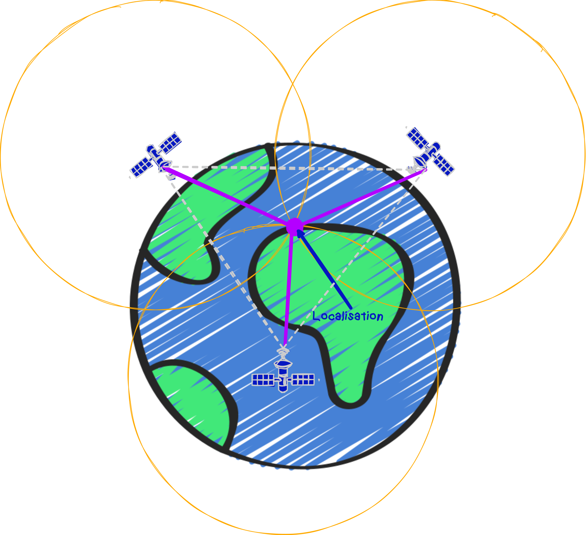
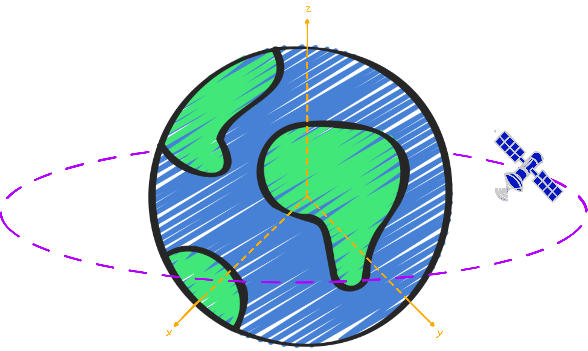
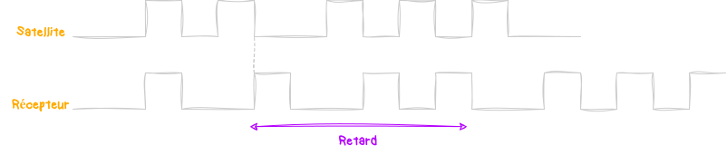
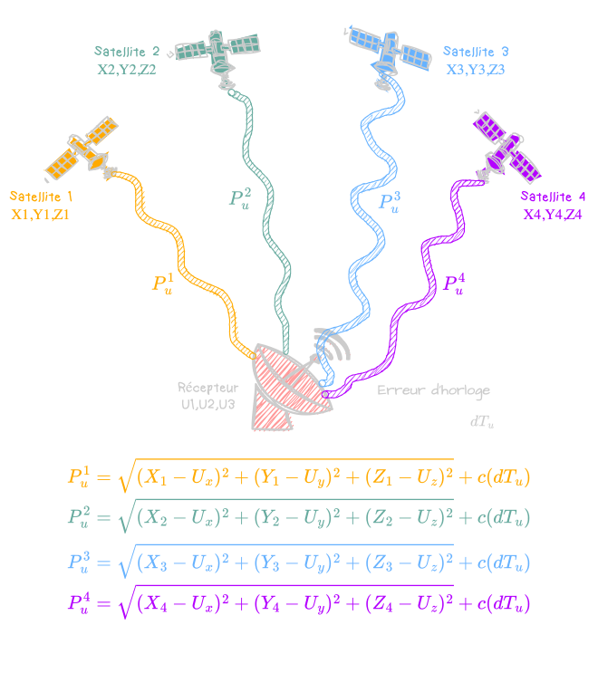

Le système de positionnement par satellites que l'on désigne par **GNSS** (**G**éolocalisation et **N**avigation par un **S**ystème de **S**atellites) nous permet de déterminer des positions géographiques précises n'importe où sur **Terre** 🌍. 
On va aujourd'hui comprendre comment fonctionne tout ça, dans les grandes lignes parce que ça peut vite devenir compliqué :) 

# Introduction
Ce qu'on appelle **GPS** (**G**lobal **P**ositioning **S**ystem) n'est qu'un type de **GNSS** opéré par les **États-Unis** depuis les années 70. Mais il en existe d'autres, comme le [Galileo](https://fr.wikipedia.org/wiki/Galileo_(syst%C3%A8me_de_positionnement)) en **Europe**, le [GLONASS](https://fr.wikipedia.org/wiki/GLONASS) en **Russie** ou encore le [BeiDou](https://fr.wikipedia.org/wiki/Beidou) en **Chine**. 
Donc, quand on parle de *"GPS"*, on entend par là le terme générique **GNSS** quel qu'il soit.
Pour former une constellation **GNSS**, il faut une vingtaine de satellites qui orbitent autour de **la Terre** à une altitude d'environ `20000km` sur l'[orbite terrestre moyenne]({{ site.data.links.orbits }}). 
 

Ces derniers émettent en permanence des **ondes radios** et comme on connaît leur **position**, on peut grâce à de la **triangulation** déterminer la distance entre le satellite et le récepteur sur **Terre**. 
En principe, **3 satellites** pourraient suffire pour récupérer une **latitude** et une **longitude**. En pratique, il en faut plutôt au minimum 4. Ce dernier permettant de corriger le **décalage d'horloge**. Mais on va voir tout ça après.

#  Référentiel géocentrique
Un référentiel, c'est simplement un point de vue. Le lieu d'où on observe les choses. Et quand il s'agit de faire des calculs liés au **GNSS**, on se base sur le référentiel **géocentrique** 🌐 (ou **ECEF** en anglais).
Ce référentiel utilise le **centre de la Terre** comme point de référence.  

Ce dernier se base sur un système dit **cartésien**, ça veut dire qu'il utilise **3 axes perpendiculaires** entre eux, nommés **X**, **Y** et **Z** pour définir la position des points. 
Ces coordonnées **(x,y,z)** permettant ainsi de localiser précisément des points dans l'espace en fonction de leur distance par rapport au centre de **la Terre**.
Mais comme des positions **x,y,z** c'est pas trop parlant pour nous, on devra convertir ses données en **latitude** et **longitude** bien plus simple à lire. 

#  Triangulation
Les horloges des satellites sont synchronisées sur la même source qu'on appelle [le temps GPS](https://fr.wikipedia.org/wiki/Synchronisation_GPS). Quand notre récepteur **GNSS**, (un téléphone portable pour l'exemple) reçoit les signaux d'au moins **4 satellites**, il peut calculer sa position. Pour cela, il doit mesurer **4 pseudo-distances**. 

## Pseudo-distances
On parle de *"pseudo"*, car cette distance n'inclut pas uniquement la vraie distance mais aussi des erreurs dues à divers facteurs :
- Les **décalages d'horloge** car à l'inverse d'une horloge embarquée sur un satellite qui est très précise, celle d'un téléphone l'est beaucoup moins.
- Les **effets atmosphériques**, car le signal doit traverser différentes couches de l'atmosphère ce qui le ralentit.
- Les **multipaths**, car le signal peut rebondir sur différents obstacles comme des bâtiments avant d'atteindre le téléphone.

Bref, pour corriger tout ça, chaque satellite génère un code aléatoire afin d'être identifié par le téléphone. Ce dernier génère à son tour un code identique au même rythme que celui du satellite et compare ainsi le **décalage temporel** entre l'émission et la réception du signal. Ce **décalage** est ainsi utilisé dans la formule suivante : `P = c * Δt` avec `P` la **pseudo-distance** en `m`, `c` la **vitesse de la lumière** en `m/s` et `Δt` le **décalage** en `s`.

## Coordonnées (x,y,z)
En résolvant une équation à **4 inconnues**, on peut alors récupérer les **coordonnées (x,y,z)** du téléphone sur **Terre** ainsi que le décalage de son horloge par rapport à celles des satellites.

Alors, c'est quoi ces belles équations. En fait, elles représentent la distance réelle entre les satellites et le téléphone en appliquant le théorème de **Pythagore** en **3 dimensions** avec `X`, `Y` et `Z` les coordonnées du **satellite** et `U` les coordonnées du téléphone que l'on recherche donc. 
Puis on additionne l'erreur dû au décalage de l'horloge notée `c` qui est donc la différence de temps entre les 2 horloges. 
On va pas rentrer dans les détails de comment résoudre ces équations, c'est trop complexe pour moi, mais il y a 2 méthodes principales pour le faire ([La méthode des moindres carrés](https://fr.wikipedia.org/wiki/M%C3%A9thode_des_moindres_carr%C3%A9s) et [le filtre de Kalman](https://fr.wikipedia.org/wiki/Filtre_de_Kalman)). Si vous êtes curieux, vous pouvez y jeter un oeil ;) 
Bref, une fois qu'on a résolut tout ça, on obtient les coordonnées **(x,y,z)** de `U`. 

## Latitude et Longitude
Bon, nous, on veut savoir exactement où on est sur **Terre** pour trouver notre route, et les **x,y,z**, ça nous arrange pas. Heureusement pour nous, on peut les convertir en **latitude** et **longitude**. 
Déjà, faut comprendre que les coordonnées à base de **latitude** et **longitude** se base sur une **approximation ellipsoïdale** de **la Terre**. En soit c'est logique, on veut convertir des trucs **3D** en des trucs en **2D**, sur une carte quoi. Et le meilleur moyen de représenter notre planète bleue qui est plus ou moins une boule, c'est en utilisant une **ellipsoïde de référence** qui est définie par le modèle mathématique [WGS 84](https://en.wikipedia.org/wiki/World_Geodetic_System#WGS_84).
Pareil, on va pas rentrer dans les détails, j'ai mis la page [Wikipédia](https://en.wikipedia.org/wiki/World_Geodetic_System#WGS_84) pour les curieux mais c'est avec un peu de **trigonométrie** que la conversion se passe. 
Et voilà, on est capable de se positionner sur une carte 🗺️ ! On pourrait même aller plus loin pour connaître notre **altitude** mais ça se complexifie encore plus donc on laisse ça de côté pour le moment :)