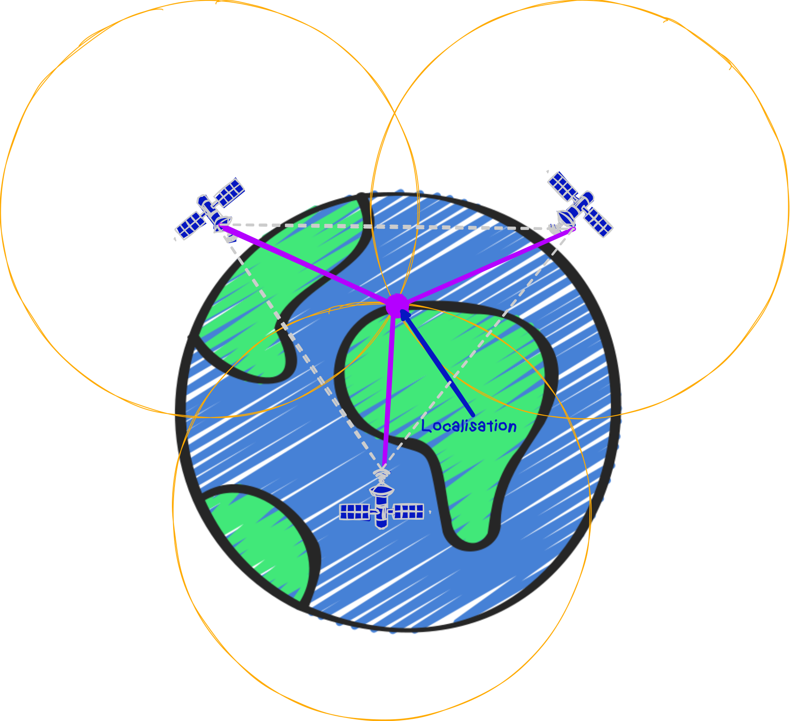

Le système de positionnement par satellites que l'on désigne par **GNSS** (**G**éolocalisation et **N**avigation par un **S**ystème de **S**atellites) nous permet de déterminer des positions géographiques précises n'importe où sur **Terre**. 
On va aujourd'hui comprendre comment fonctionne tout ça, dans les grandes lignes parce que ça peut vite devenir compliqué :) 

# Introduction
Ce qu'on appelle **GPS** (**G**lobal **P**ositionning **S**ystem) n'est qu'un type de **GNSS** opéré par les **Etats-Unis** depuis les années 70. Mais il en existe d'autres, comme le **Galileo** en **Europe** (opérationnel en 2024 et plus précis que le **GPS**), le **GLONASS** en **Russie** ou encore le **BeiDou** en **Chine**. 
Donc, dans le vie courante, lorsque l'on parle de **"GPS"**, on entend par là le terme générique **GNSS** quel qu'il soit.
Dans le cas de la constellation **GPS**, c'est 24 satellites qui orbitent autour de **La Terre** à une altitude d'environ **20000km** de sorte à ce qu'il est toujours au moins **4 satellites** visiblent en même temps. 

Ces derniers émettent en permancence des **ondes radios** et comme on connaît leur **position**, on peut grâce à de la **triangulation** déterminer la distance entre le satellite et le récepteur sur **Terre**. 
Même si **3 satellites** pourraient suffir pour récupérer une **latitude** et une **longitude**, en pratique, il en faut plutôt au minimum 4. Ce dernier permettant de corriger le **décalage d'horloge**. Mais on va voir tout ça après.

# ⚪️ Réferentiel géocentrique
Un réferentiel, c'est simplement un point de vue. Le lieu d'où on observe les choses. Et quand il s'agit de faire des calculs liés au **GNSS**, on se base sur le réferentiel **géocentrique** (ou **ECEF** en anglais).
Ce réferentiel utilise le **centre de la Terre** comme point de réference.  

Ce dernier se base sur un système dit **cartésien**, ça veut dire qu'il utilise **3 axes perpendiculaires** entre eux, nommés **X**, **Y** et **Z** pour définir la position des points. 
Ces coordonnées **(x,y,z)** permettant ainsi de localiser précisément des points dans l'espace en fonction de leur distance par rapport au centre de **La Terre**.
Mais comme des positions **x,y,z** c'est pas trop parlant pour nous, on convertit ses données en **latitude** et **longitude** bien plus simple à lire. 

# ⚪️ Pseudo-distance
On parle de **pseudo-distance** pour parler de la distance apparente entre un récepteur et un satellite. 
Elle se mesure avec la formule qu'on apprenait au lycée `D=V.Δt` avec `D` la distance, `V` la vitesse moyenne de propgation du signal et `Δt` le temps mis pour recevoir le signal. 
Si l'on utilise le mot **"pseudo"**, c'est qu'en réalité, cette distance inclut non seulement la vraie distance mais aussi des erreurs dues à divers facteurs comme les **déclagaes d'horloges** entre le récepteur et l'émetteur ou encore les effets atmosphériques. 

Le satellite et le récepteur génèrent tous les deux un même code afin de bien identifier le satellite. En comparant les deux, le récepteur peut mesurer le retard entre l'émission et la réception du signal. Retard du au temps que met à parcourir le signal. 
Pour calculer la **pseudo-distance**, on mulitplie ce retard par la vitese de l'onde (vitesse de la lumière).

# ⚪️ Triangulation
Les horloges des satellites sont synchronisées sur la même source qu'on appelle [le temps GPS](https://fr.wikipedia.org/wiki/Synchronisation_GPS). Si l'on reçoit **4 signaux** de **4 satellites différents**, on aura alors **4 pseudo-distances**.
En résolvant une équation à **4 inconnues**, on peut alors récupérer les **coordonées (x,y,z)** du récepteur sur **Terre** ainsi que le déclage de son horloge par rapport à celles des satellites.

Alors, c'est quoi ces belles équations. En fait, elles représentent la distance réelle entre les satellites et le récepteur en appliquant le théorème de **Pythagore** en **3 dimensions** avec `X`, `Y` et `Z` les coordonées du **satellite** et `U` les coordonées du récepteur que l'on recherche donc. 
Puis on additionne l'erreur dû au décalage de l'horloge notée `c` qui est donc la différence de temps entre les 2 horloges. 
On va pas rentrer dans les détails de comment résoudre ces équations, c'est trop complexe mais il y a 2 méthodes principales pour le faire ([La méthode des moindres carrés](https://fr.wikipedia.org/wiki/M%C3%A9thode_des_moindres_carr%C3%A9s) et [le filtre de Kalman](https://fr.wikipedia.org/wiki/M%C3%A9thode_des_moindres_carr%C3%A9s)). Si vous êtes curieux, vous pouvez y jeter un oeil ;) 
Bref, une fois qu'on a résolut tout ça, on obtient les coordonées **(x,y,z)** de `U`. 

# ⚪️ Latitude et Longitude
Bon, nous, on veut savoir exactement où on est sur **Terre** pour trouver un **Mcdo**, et les **x,y,z**, ça nous arrange pas. Heuresement pour nous, on peut les convertir en **latitude** et **longitude**. 
Déjà, faut comprendre que les coordonnées à base de **latitude** et **longitude** se base sur une **approximation ellipoïdale** de **La Terre**. En soit c'est logique, on veut convertir des trucs **3D** en des trucs en **2D**, sur une carte quoi. Et le meilleur moyen de représenter notre planète bleue qui est plus ou moins une boule, c'est en utilisant une **ellipsoïde de réference** qui est définit par le modèle mathématique [WGS 84](https://en.wikipedia.org/wiki/World_Geodetic_System#WGS_84).

Pareil, on va pas rentrer dans les détails, j'ai mis la page **Wikipedia** pour les curieux mais c'est avec un peu de **trigonométrie** que la conversion se passe. 
Et voilà, on est capable de se positionner sur une carte ! On pourrait même aller plus loins pour connaître notre **altitude** mais ça se complexifie encore plus donc on laisse ça de côté pour le moment. 
Merci d'avoir suivi ce cours :)
On pourra prochainement découvrir une attaque très populaire, le **GPS Spoofing**

[Lien vers un article qui m'a aidé pour ce cours](https://medium.com/@mikeg888/position-velocity-and-time-pvt-51f4cc738b75)