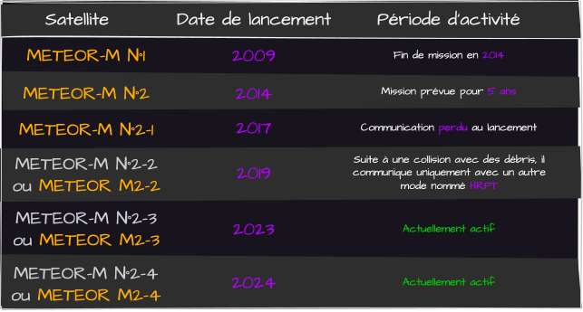
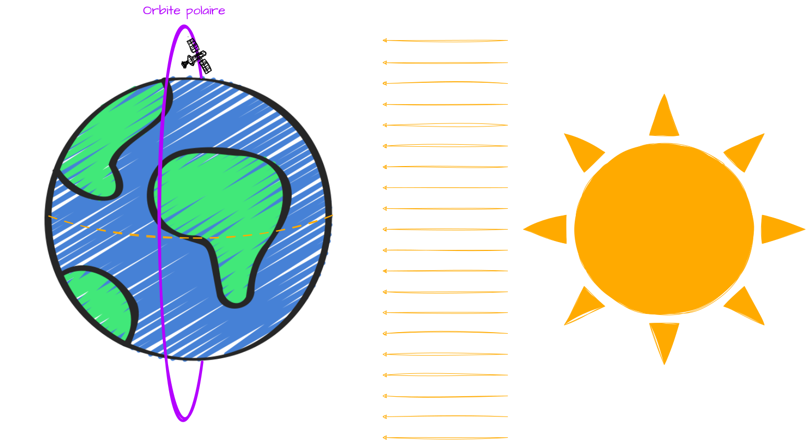
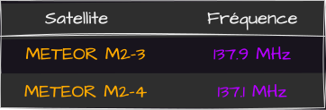
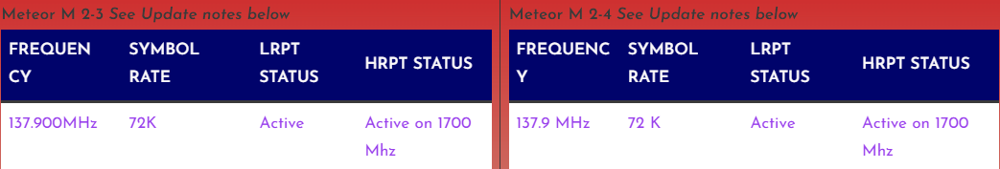
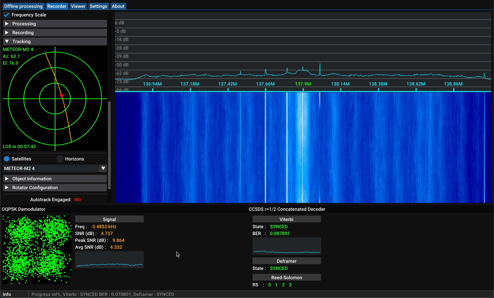
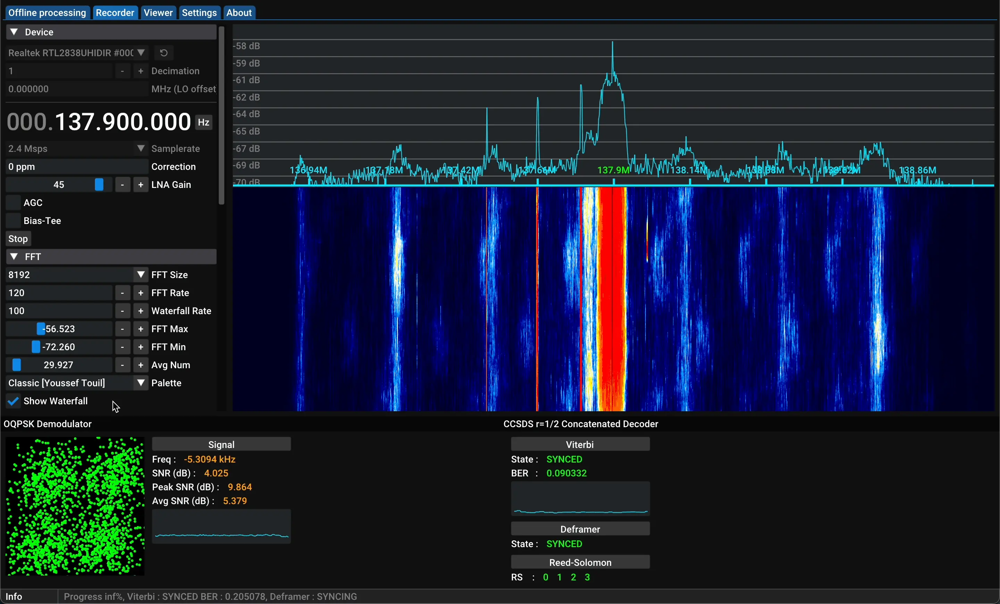
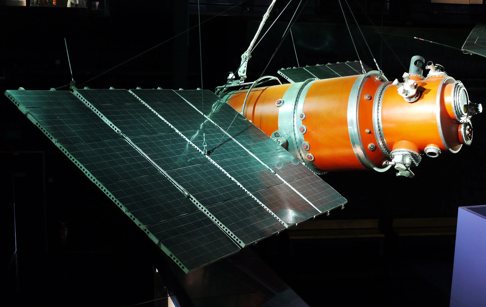

Les satellites américains **NOAA** que l'on a vu durant [mon premier projet](../../Projects/NOAA.html) sont comme le `Hello World` en programmation. Mais, il existe d'autres satellites très similaires, qui produisent de meilleures images avec plus ou moins le même matériel que pour les **NOAA**, ce sont les satellites russes **METEOR** 🇷🇺. 

# Qui sont les METEOR ?
Les **METEOR** sont des satellites météorologiques soviétiques, puis russes. Depuis **1964**, **70** modèles ont été lancés. Pour cet article, on va s'intéresser uniquement au dernier, ceux de la série **METEOR-M** dont voici l'historique :

Comme leurs homologues NOAA, la série de satellites **METEOR-M** se situe à une altitude d'environ **800km** et possèdent une orbite **polaire** et plus précisément **héliosynchrone**. Ainsi, ils font constamment face au **Soleil** 🌞. Plus d'infos sur les types d'orbites [juste ici](./type-orbits.html).

L'orbite **héliosynchrone** va leur permettre de passer par les mêmes endroits à la même [heure solaire](https://fr.wikipedia.org/wiki/Temps_solaire) **2 fois par jour**. 
La principale différence avec les **NOAA** est leur mode de transmission qui se nomme [LRPT](https://www.sigidwiki.com/wiki/Low_Rate_Picture_Transmission_(LRPT)). Pour les **NOAA**, c'était le mode [APT](https://www.sigidwiki.com/wiki/Automatic_Picture_Transmission_(APT)).
Pour cet article, 2 **METEOR-M** vont nous intéresser :

À noter que le **METEOR M2-4** est toujours en phase de test. Du coup, sa fréquence varie des fois entre **137.1** et **137.9MHz** et pareil pour le [débit de symbole](https://fr.wikipedia.org/wiki/Rapidit%C3%A9_de_modulation) qui varie entre **72** et **80Kbit/s**. 
Pour vérifier, on peut utiliser [ce site](https://usradioguy.com/meteor-satellite/) qui permet de savoir l'état actuel du **satellite**. Voici l'état actuel le **02/09/2024** : 

# Place à l'écoute
Concernant l'antenne, je vais utiliser exactement la même que durant [ce projet](../../Projects/NOAA.html).
Pour la réception, va utiliser [SatDump](./satdump.html) pour récupérer les signaux satellites. Je ne vais pas rentrer dans tous les détails de configuration, j'ai déjà fait un cours sur **SatDump** [ici](./satdump.html) :) 
Dans un premier temps, il faut savoir quand est-ce que va passer le satellite. Pour ceux qui vivent en **France**, les passages sont tous répertoriées sur [ma station](https://station.radionugget.com). Mais on peut aussi directement les voir avec la section `Tracking` de **SatDump** ou utiliser des sites web.

Bref, quand un satellite est là, dans la section `Device`, on a juste à sélectionner notre récepteur **SDR** et choisir un **gain**, dans mon cas, **40**, puis **Start**.
Dans la section `Processing`, on sélectionne **METEOR M2-x LRPT 72k**. On peut aussi cocher la case **DC Blocking** et à nouveau, on lance en cliquant sur **Start**.

Super, on voit le signal envoyé par **METEOR M2-4** 🛰️ !
On peut depuis la section `Tracking` sélectionner le satellite de notre choix et voir "où il en est". Là, sur la capture, il a une élevation de **76°** et le passage prendra fin dans **7 minutes 42 secondes**.
D'ailleurs, on peut mieux faire ressortir le signal en modifiant quelques valeurs dans la section `FFT`.

⚠️ Une fois le satellite passé, on clique depuis la section `Processing` sur le bouton **Stop** et uniquement après, on peut arrêter l'écoute avec le bouton **Stop** de la section `Device`. Attention de ne pas inverser cet ordre car ça risque de perdre l'enregistrement que vous venez de faire.

L'écoute étant terminée, on peut après quelques instants décaler sur l'onglet `Viewer` pour voir nos images et appliquer du post-traitement. Après colorisation, voici l'image que j'ai reçue : 

Les bandes noires sont des interférences, probablement dû à mon antenne qui n'est pas parfaite mais on peut voir que la qualité de l'image est vraiment pas mal par rapport au **NOAA**.