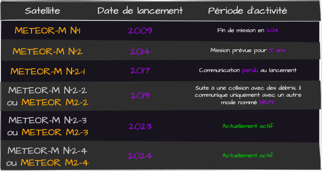
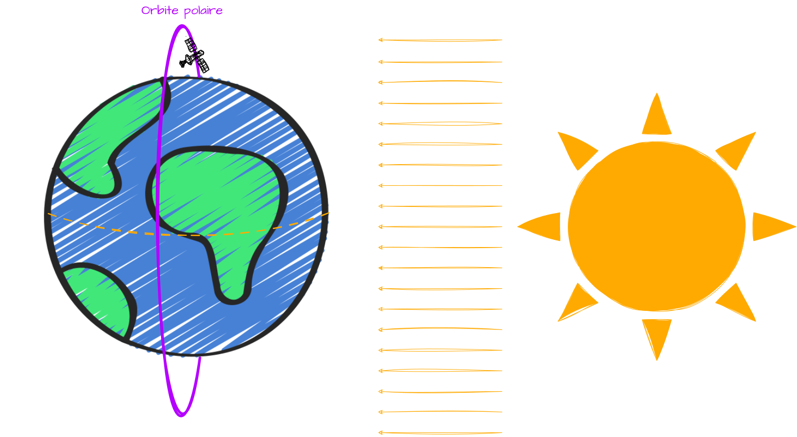
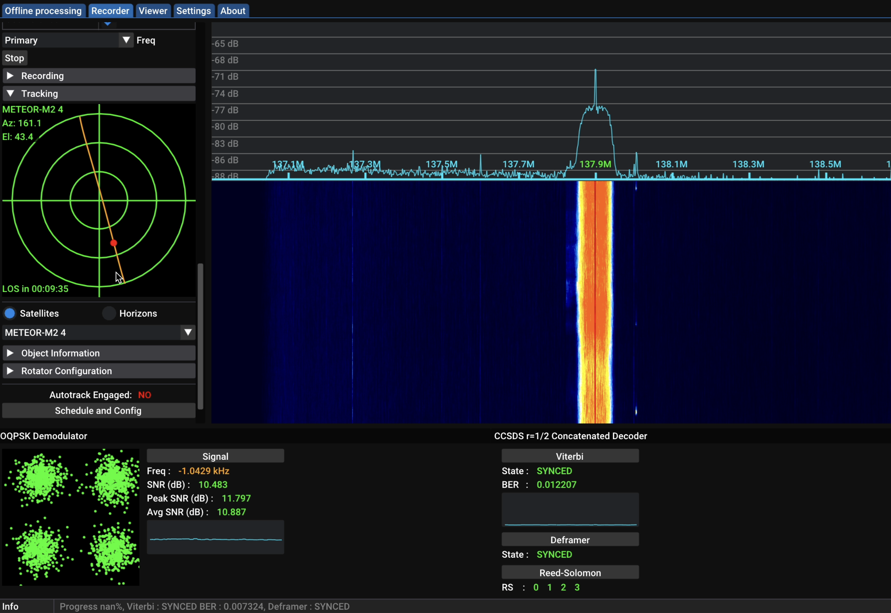
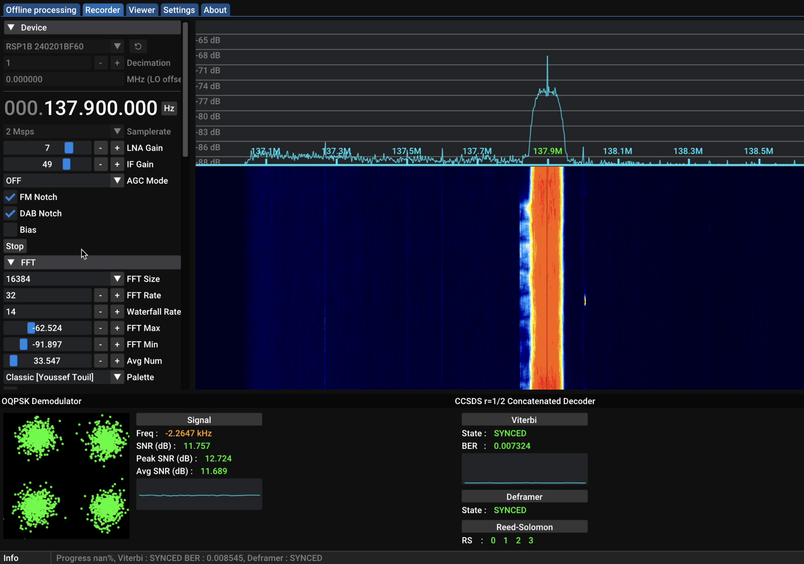
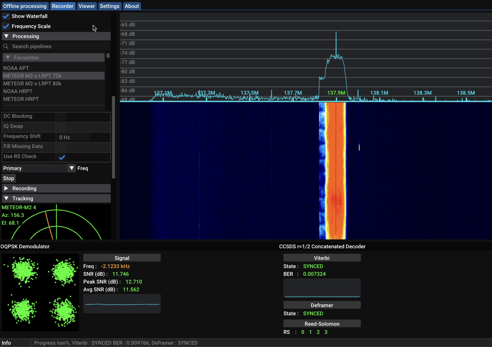
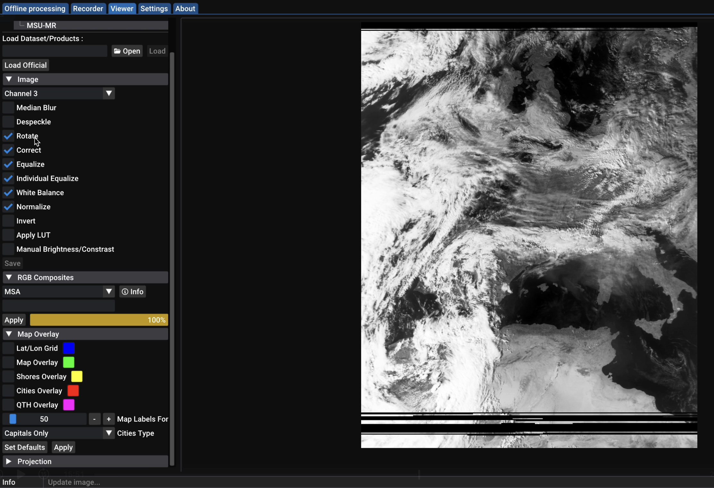
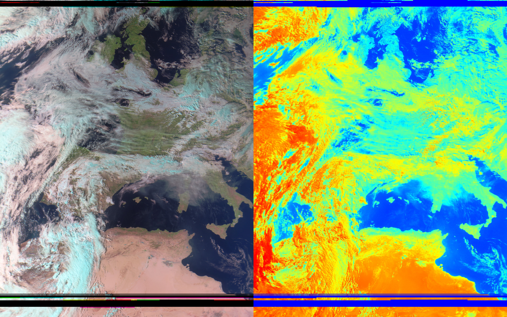

Les satellites américains **NOAA** que l'on a vu durant [mon premier projet](../../Projects/NOAA.html) sont un peu le point de départ de tout amateur radio satellite. Mais, il existe d'autres satellites très similaires, qui produisent de meilleures images avec plus ou moins le même matériel que pour les **NOAA**, ce sont les satellites russes **METEOR** 🇷🇺. 

# Qui sont les METEOR ?
Les **METEOR** sont des satellites météorologiques soviétiques, puis russes. Depuis **1964**, **70** modèles ont été lancés. Pour cet article, on va s'intéresser uniquement au dernier, ceux de la série **METEOR-M** dont voici l'historique :

Comme leurs homologues NOAA, la série de satellites **METEOR-M** se situe à une altitude d'environ **800km** et possèdent une orbite **polaire** et plus précisément **héliosynchrone**. Ainsi, ils font constamment face au **Soleil** 🌞. Plus d'infos sur les types d'orbites [juste ici](./type-orbits.html).

L'orbite **héliosynchrone** va leur permettre de passer par les mêmes endroits à la même [heure solaire](https://fr.wikipedia.org/wiki/Temps_solaire) **2 fois par jour**. 
La principale différence avec les **NOAA** est leur mode de transmission qui se nomme [LRPT](https://www.sigidwiki.com/wiki/Low_Rate_Picture_Transmission_(LRPT)). Pour les **NOAA**, c'était le mode [APT](https://www.sigidwiki.com/wiki/Automatic_Picture_Transmission_(APT)).
Pour cet article, 2 **METEOR-M** vont nous intéresser :

À noter que le **METEOR M2-4** est toujours en phase de test. Du coup, sa fréquence varie des fois entre `137.1` et `137.9MHz` et pareil pour le [débit de symbole](https://fr.wikipedia.org/wiki/Rapidit%C3%A9_de_modulation) qui varie entre **72** et **80Kbit/s**. 
Pour vérifier, on peut utiliser [ce site](https://usradioguy.com/meteor-satellite/) qui permet de savoir l'état actuel du **satellite**. Voici l'état actuel le **02/09/2024** : 

# Place à l'écoute
Côté antenne, j'utilise une [QFH](../../Projects/qfh.html) pour les `137MHz`. Elle possède une **polarisation circulaire gauche** ce qui est parfait pour les **METEOR** puisqu'ils émettent avec une **polarisation circulaire droite**.
Pour la réception, on va utiliser [SatDump](./satdump.html). Je ne vais pas rentrer dans tous les détails de configuration, j'ai déjà fait un cours sur **SatDump** [ici](./satdump.html) :) 
D'abord, à l'aide de la section `Tracking` de **SatDump** ou en utilisant [un site web](https://www.n2yo.com/?s=33591), on va check quand est-ce que le satellite va passer. Cette section nous permet aussi de savoir "où en est" le satellite nottament en observant son **élevation**.

Dans la section `Device`, on sélectionne notre récepteur **SDR**, dans mon cas un [SDRPlay RSP1B](https://www.passion-radio.fr/recepteurs-sdr/rsp1-b-2669.html) puis on lance l'enregistrement en cliquant sur **Start**.
Je vous conseil de régler le `FFT Max` et le `FFT Min` dans la section `FFT` pour bien faire ressortir le signal. De manière général, régler d'abord le `FFT Min` histoire que le bruit soit à peine visible puis pour le `FFT Max`, mettez la valeur du `FFT Min + 30`.

Dans la section `Processing`, on sélectionne **METEOR M2-x LRPT 72k**. On sélectionne `Primary` pour `137.900MHz` et `Backup` pour `137.100MHz`.
Le décodage se lance en cliquant à nouveau sur **Start**. Si tout est bien réglé, vous devriez voir le signal envoyé par **METEOR M2-4** 🛰️ ! 
Et pour s'assurer que le décodage se déroule bien, en bas, on peut regarder de un le [SNR]() qui idéalement devrait être à **10** minimum mais tant qu'il est **>2**, vous devirez quand même avoir quelque chose. Et de deux, la partie en bas à droite `Viterbi` où si tout est vert, c'est que c'est bon. 😄

⚠️ Une fois le satellite passé, on clique depuis la section `Processing` sur le bouton **Stop** et uniquement après, on peut arrêter l'écoute avec le bouton **Stop** de la section `Device`. Attention de ne pas inverser cet ordre car ça risque de perdre l'enregistrement que vous venez de faire.

L'écoute étant terminée, on attend quelques instants que **SatDump** est bien finit de tout décoder et on peut  décaler sur l'onglet `Viewer` pour voir nos images et appliquer du post-traitement. 

On peut ainsi jouer avec les différents réglages pour obtenir des images en fausse couleur ou en infrarouge :

La qualité de l'image est vraiment pas mal par rapport au **NOAA**.
À vous de jouer à présent !