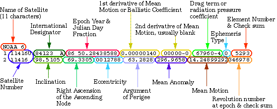

Pour prédire le passage d'un satellite, il faut comprendre comment on décrit une orbite. Et pour ça, on a besoin de **6 paramètres**. Ils nous permettront d'avoir une réprésentation standardisée que l'on nomme **TLE**.
Dans ce cours, on va explorer chacun de ces paramètres qui ont des noms barbares mais je vais tenter de les expliquer à ma manière avec une approche simpliste en utilisant le super site [Orbital Mechanics](https://orbitalmechanics.info/) alors tenez bon et ne fuyez pas :) 
Je vous invite grandement pour chaque paramètre d'aller les tester sur le site.

# ⚪️ Le demi-grand axe

Noté `a`, il réprésente la moitié du grand axe d'une ellipse.
Voilà ce que ça donne quand on modifie cette valeur : 

# ⚪️ L'excentricité
Noté `e`, ça représente l'aplatissement d'une ellipse. Elle se calcule à partir des longueurs du **demi-grand axe** `a` et du **demi-petit axe** `b` avec cette formule : 

Pour `e=0`, on a un cercle parfait (orbite & chemin fermé).
Pour `0<e<1`, on a une ellipse (orbite & chemin fermé). C'est ce type d'**excentricité** qu'on aura affaire pour les **satellites**.
Pour `e=1`, on a une **parabole** (trajectoire ouverte).
Pour `e>1`, on a une **hyperbole** (trajectoire ouverte).

Changement de `e` :

# ⚪️ L'inclinaison
Noté `i`, c'est l'angle d'inclinaison du **plan de l'obite** par rapport au **plan equatorial**. 
On comprend mieux comme ça : 
En **bleu**, c'est le plan de l'**orbite terreste**.
En **orange**, c'est le plan de l'**orbite du satellite**.

On distingue **3** types d'**inclinaison** : 
- `0°≤i≤90°` : **Prograde**, le sens de l'orbite est le **même** que le sens de rotation de **La Terre** (ouest vers l'est).
- `90°<i≤180°` : **Rétrograde**, le sens de l'orbite est à l'**inverse** du sens de rotation de **La Terre** (est vers l'ouest).
- `i=90°` : **Orbite polaire**, cas particulier qui couvre toutes les latitudes. 
  
# ⚪️ Longitude du nœud ascendant
Oui, toujours plus compliqué. Noté `Ω`, c'est l'angle entre le **nœud ascendant** et le **point vernal**.  
D'abord, la notion de **nœud ascendant** et tant qu'on y est de **nœud descendant** avec ce schéma explicite :

Donc, le **noeud ascendant**, c'est le croisement entre le plan de l'orbite terrestre et celle du satellite lorsque ce dernier "remonte".
Le **nœud descendant**, c'est pareil mais inversement. 
Ok, et maintenant le **point vernal**. En gros, c'est le **nœud ascendant** de l'orbite du **Soleil** avec celle de **La Terre**.
L'**écliptique**, c'est l'orbite que décrit le **Soleil** autour de **La Terre**. 
L'**équateur céleste**, c'est le plan défini par l'**équateur terrestre**.

Et donc, pour en revenir à nos ~~aliens~~ moutons, je répète que la **longitude du nœud ascendant**,  c'est l'angle entre le **nœud ascendant** et le **point vernal**. 

Bon, j'avoue, c'est le plus dur de tous à assimiler mais voyons ce que si passe quand on change cet angle : 

# ⚪️ L'argument du Périastre
Noté `ω`, c'est l'angle entre le **nœud ascendant** et le **périastre**. 

Donc le **périastre**, c'est le point sur l'orbite où le satellite est au plus proche de l'astre autour duquel il tourne. 
Si l'astre c'est **La Terre**, on parle de **périgée** et d'**apogée** (**périhélie** et **aphélie** pour le **Soleil**).
Voyons ce qui se passe quand on change cet valeur : 

# ⚪️ L'anomalie vraie
Noté `𝜈`, c'est l'angle entre le **périastre** d'une orbite et la position actuelle du satellite. En fait, c'est ce paramètre qui nous permet de situer le satellite sur notre orbite. Sur le schéma ci-dessous, en fonction de l'angle, le satellite sera à différents endroits sur l'orbite.

Donc voilà, on a : 
- La **taille** et la **forme** de notre orbite grâce au **demi-grand axe** et l'**excentricité**.
- L'**orientation** de l'orbite grâce à l'**inclinaison**, la **longitude du nœud ascendant** et l'**argument du périastre**.
- La **position** du satellite grâce à l'**anomalie vraie**.
  
# ⚪️ TLE (Paramètres orbitaux à deux lignes)
Il existe un standard pour représenter les paramètres d'une orbite, c'est les **TLE** (**T**wo **L**ines **E**lements). 

On y retrouve sur la **deuxième ligne** les paramètres qu'on a appris. 
Sur la première ligne, on a des informations concernant le satellite comme son **NORAD ID**. 

Et c'est bon, on a réussi à arriver jusqu'au bout, **BRAVO** 😎.
Le but n'est pas de tout connaître par cœur mais d'avoir une idée de ce qu'on abordera par la suite. 
Retenez surtout qu'on va souvent utiliser les **TLE** car c'est grâce à eux qu'on pourra prédire le passage d'un satellite à un endroit bien précis. 
Pour ceux qui auraient besoin d'une autre représentation visuelle, y a [cette super vidéo](https://www.youtube.com/watch?v=QZrYaKwZwhI)

Merci à [Angelina Tsuboi](https://www.angelinatsuboi.net) qui m'a énormément inspiré pour ce cours. 