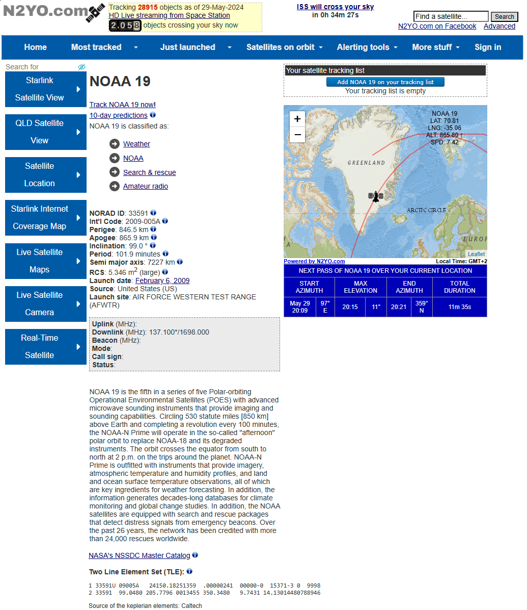
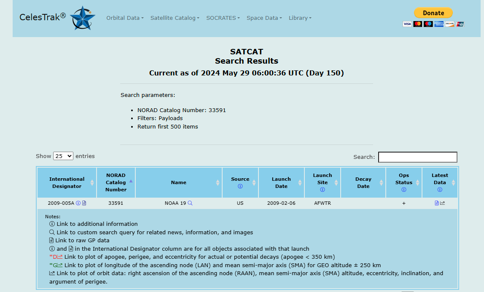
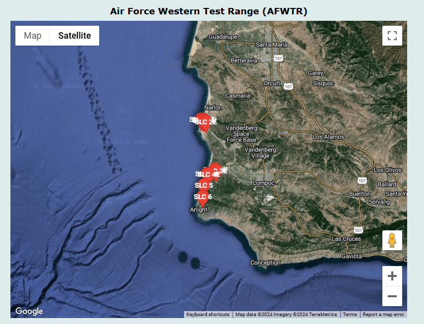
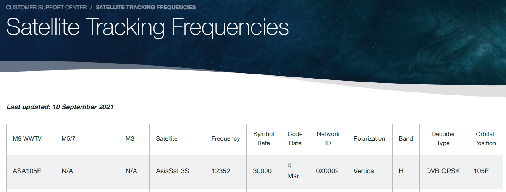
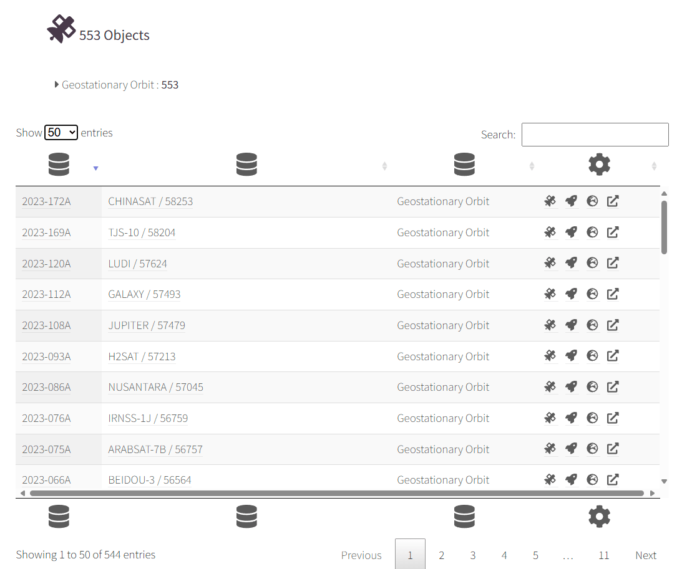
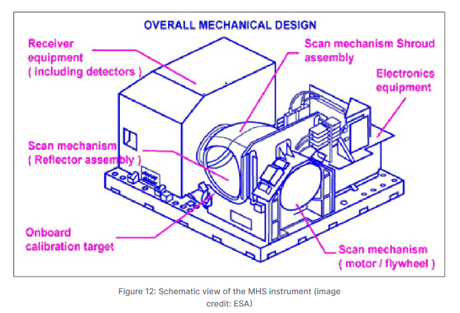
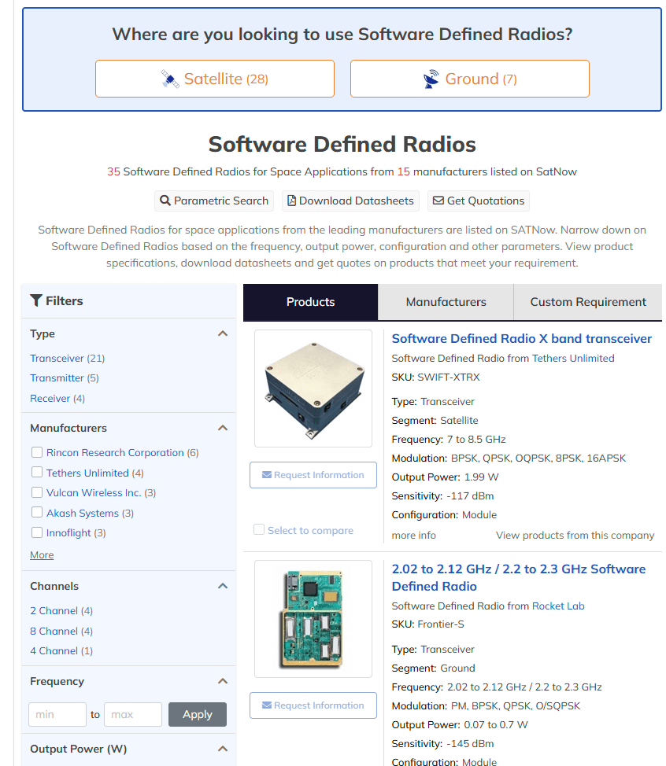
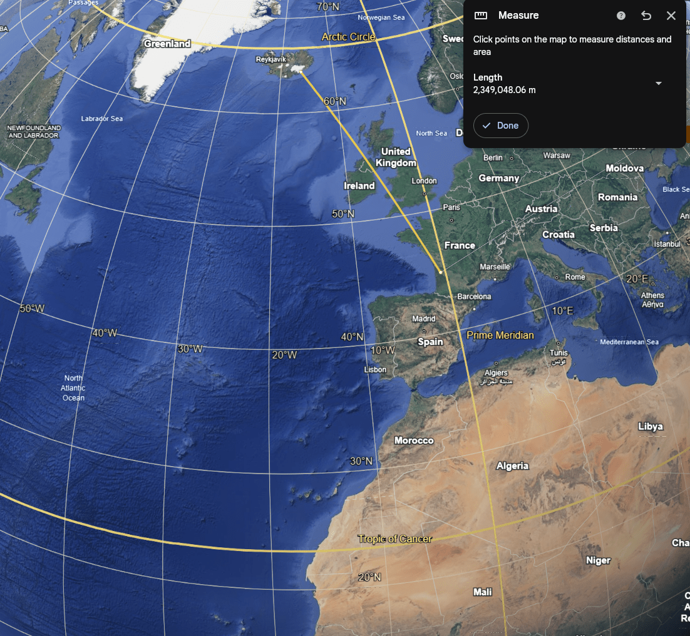
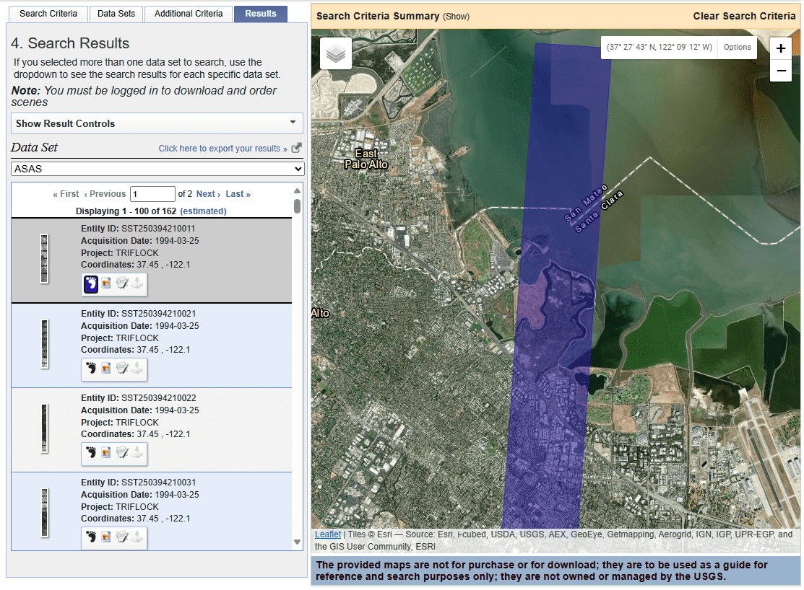
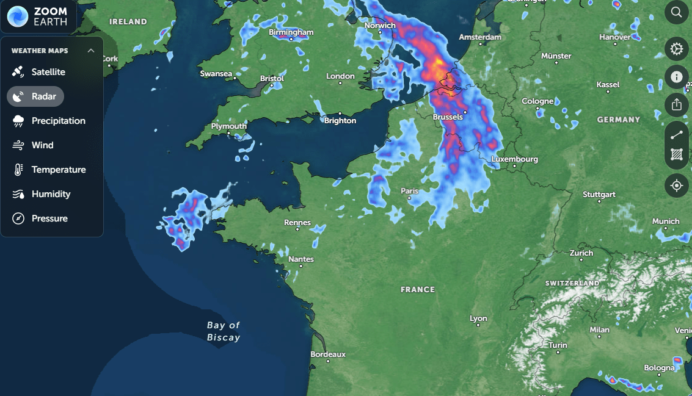

L'**OSINT** (**O**pen **S**ource **INT**elligence) est une "technique" pour récupérer des informations qui proviennent de sources public. Cette méthode passive va nous permettre de récupérer de précieuses informations sur les satellites comme le lancement de ce dernier, ses composants, à quoi il sert, etc...
Toujours faire attention de bien vérifier ses sources, de pas croire n'importe quelle informations et d'utiliser des sites fiables comme ceux des bases de données gouvernementales. 

# ⚪️ N2YO : Trace au sol 
[N2YO](https://www.n2yo.com/) est un site web qui va nous permettre de récupérer des informations génériques sur les satellites. 
On peut directement rechercher un satellite par son nom ou naviguer dans les différentes catégories pour en retrouver un selon certains critères. Par exemple, pour le satellite **NOAA 19** : 

Ça nous donne accès à pleins d'infos, déjà on peut suivre sa position. Mais aussi avoir des infos comme le **NORAD ID** ou encore les fréquences (**uplink** et **downlink**) dans certains cas. Bref, vraiment tout pleins d'infos comme le montre l'image ci-dessus. 
Une information importante qu'il ne faut pas oublier de mentionner c'est les [TLE](orbits.html) qui sont affichés en bas de la page. 

# ⚪️ CelesTrack : Catalogue des Satellites
Le catalogue [CelesTrack](https://celestrak.org/satcat/search.php) est bien utile pour rechercher des satellites si on connait leur nom ou leur **NORAD ID**. Essayons une recherche avec le **NORAD ID** du **NOAA 19** : 

Même principe, on a pas mal d'informations sur le satellite. En cliquant sur les petits **i**, on peut avoir plus de détails sur chaque catégorie.

# ⚪️ CelesTrack : Sites de lancement
On retrouve ce catalogue des sites de lancement à [cette adresse](https://celestrak.org/satcat/launchsites.php). Prenons par exemple le **AFWTR** : 

C'est très pratique, en zoomant sur les zones, on peut retrouver l'emplacement exacte d'où est parti un satellite.  

# ⚪️ KVH : Traqueur de fréquences 
**KVH** est une entreprise qui a une [base de données](https://www.kvh.com/support/satellite-tracking-frequencies) avec de nombreuses infos de communication sur les satellites. On y retrouve nottament leur fréquence. 

# ⚪️ Orbiting Now : Données télémétriques
Ce [site](https://orbit.ing-now.com/) est vraiment super bien fait. En arrivant sur la page d'accueil, on peut scroll vers le bas et sélectionner une orbite, par exemple, la **GEO** (l'orbite géostationnaire).

Ça nous sort une liste de tous les satellites présents sur cet orbite. On peut sélectionner un **satellite** et avoir encore plus d'infos. Par exemple, essayez avec un et vous verrez tout un tas d'informations concernant sa position, sa vitesse, et même un historique ! Y a vraiment pleins de trucs. 

# ⚪️ eoPortal  : Missions Satellites
En ce qui concerne les informations détaillées de missions, [eoPortal](https://www.eoportal.org/satellite-missions?Mission+type=EO) est vraiment pas mal. Mais genre vraiment pas mal. Y a tellement d'informations à ne plus savoir quoi en faire. Genre par exemple, vous voulez un schéma du sondeur d'humidité micro-ondes embarqué sur **NOAA 19** ?? Et bien pas de soucis : 

Bref, c'est vraiment une mine d'or d'informations pour en savoir plus sur un satellite. 

# ⚪️ SATNow : Composants des satellites
Ce [site](https://www.satnow.com/) va nous permettre de retrouver des informations intéressantes sur de nombreux composants d'un satellite.
Par exemple, on peut aller dans **Product Categories -> Satellite Products -> Communication Systems -> Software Defined Radio** et nous voilà avec des infos très précieuses sur le type d'appareils **SDR** embarqués sur un satellite.   

# ⚪️ Google Earth
Inutile de le présenter, mais [Google Earth](https://www.google.com/intl/fr_fr/earth/) est très pratique pour obtenir des coordonées géographiques, calculer des distances, ...

# ⚪️ USGS Earth Explorer : Images détaillées
Ce [site](https://earthexplorer.usgs.gov/) propose une vue satellite avec une super qualité, du moins pour les States. On peut cliquer sur **Data Sets**, sélectionner par exemple **ASAS** puis **Results** et obtenir des détails sur une partie scannée : 

# ⚪️ Zoom.Earth : Images météos
Ce [site](https://zoom.earth/maps/satellite/) fournit des cartes et des images météos. 
Sur la barre d'outils à gauche, on peut sélectionner différentes cartes et faut dire que c'est super propre ! 

C'est surtout pratique pour récupérer des données météorologiques mais il vallait le coup d'être présenter. 

# ⚪️ Mentions honorables 
[Satmap](https://satmap.space/) -> Une carte de tous les satellites en direct. 
[World Imagery Wayback](https://livingatlas.arcgis.com/wayback/#active=37890&mapCenter=-115.29850%2C36.06398%2C13) -> Un historique de prises de vues satellites dans le monde. 
[Space Bandits](https://www.spacebandits.io/) -> Rescense des informations sur les petites entreprises du secteur spatial à travers le monde. 
[ NASA Space Science Data Archive](https://nssdc.gsfc.nasa.gov/nmc/spacecraft/query) -> Contient des informations concernant les lancements, des descriptions détaillées de satellites ainsi que ses objectifs de mission.
[NASA EarthData](https://www.earthdata.nasa.gov/learn/find-data) -> Pour tout ce qui est **télédétection**.
[OrbitalMapper](https://orbitalmechanics.info/) -> On en a déjà parlé dans ce [cours](orbits.html) mais je le mentionne quand même. C'est trop bien pour comprendre la mécanique des orbites. 

On a fait un tour d'horizon de la plupart des sites très utiles pour faire de l'**OSINT** autour des satellites. 
Si vous en connaissez d'autres, n'hésitez pas à les partager et merci pour votre lecture :) 

Merci à [Angelina Tsuboi](https://www.angelinatsuboi.net) qui m'a énormément inspiré pour ce cours. 