Pour prédire le passage d'un satellite à un endroit donné, on a besoin de connaître comment est décrit son orbite. Pour cela, on va utiliser un standard qui se nomme **TLE** se basant sur **6 paramètres** physiques. 

# TLE (paramètres orbitaux à deux lignes)
Pour savoir quand est-ce que va passer un satellite au dessus de nous, on peut utiliser [SatDump](https://www.satdump.org/download/), [N2YO](https://www.n2yo.com/) ou bien d'autres. Mais tous ont en commun de se baser sur les mêmes données, à savoir les **TLE** (**T**wo **L**ines **E**lements) qui sont propre à chaque objet en orbite autour de la **Terre**. La [NASA](https://fr.wikipedia.org/wiki/National_Aeronautics_and_Space_Administration) et la [NORAD](https://fr.wikipedia.org/wiki/Commandement_de_la_d%C3%A9fense_a%C3%A9rospatiale_de_l%27Am%C3%A9rique_du_Nord) les calculent régulièrement (car les orbites des objets changent) puis les publient sur des bases de données comme [CelesTrak](https://celestrak.org/Norad/elements/table.php?GROUP=weather&FORMAT=tle) sur lesquelles se base nos fameux outils de prédiction.
Prenons le **TLE** de **NOAA 19** à date où j'écris l'article en guise d'exemple : 
````
NOAA 19
1 33591U 09005A   24285.49466946  .00000972  00000-0  54355-3 0  9997
2 33591  99.0340 342.4576 0013141 327.7681  32.2687 14.13153634808053
```
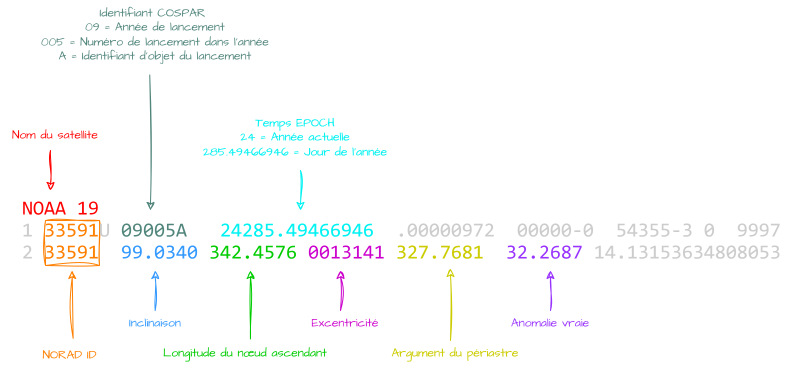
La deuxième ligne est celle qui nous intéresse car c'est grâce à elle qu'on détermine à quoi ressemble l'orbite de l'objet en question. Et pour les plus courageux, c'est sur ces mots barbares qu'on va poursuivre le cours en s'aidant du super site [Orbital Mechanics](https://orbitalmechanics.info/).

# L'inclinaison
Noté `i`, c'est l'angle d'inclinaison en `°` du **plan de l'orbite** par rapport au **plan équatorial**. 
En **bleu**, c'est le plan de l'**orbite terrestre**. En **orange**, c'est le plan de l'**orbite du satellite**.

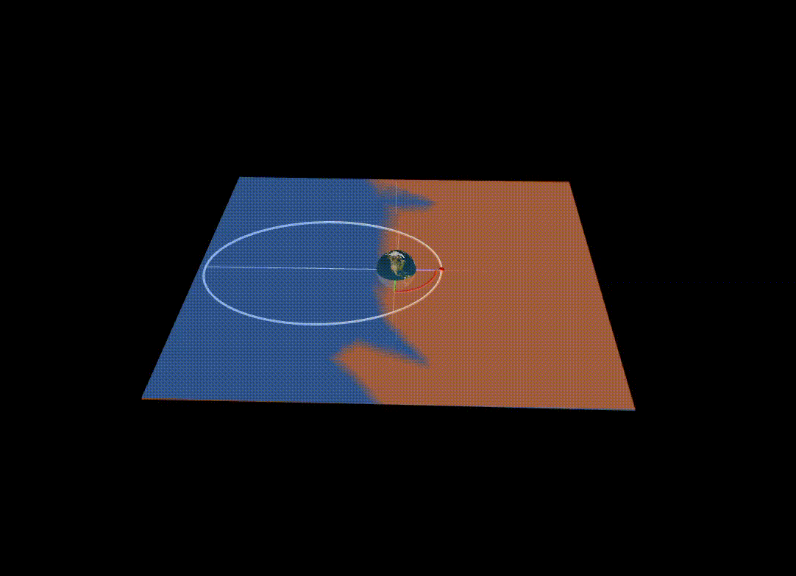
On distingue **3** types d'**inclinaison** : 
- `0°≤i≤90°` : **Prograde**, le sens de l'orbite est le **même** que le sens de rotation de la **Terre** (ouest vers l'est).
- `90°<i≤180°` : **Rétrograde**, le sens de l'orbite est à l'**inverse** du sens de rotation de la **Terre** (est vers l'ouest).
- `i=90°` : **Orbite polaire**, cas particulier qui couvre toutes les latitudes. 

# Longitude du nœud ascendant
Noté `Ω`, c'est l'angle entre le **nœud ascendant** et le **point vernal**.  J'avoue, ça n'aide pas 😄.
## Nœud ascendant
D'abord, la notion de **nœud ascendant** et tant qu'on y est de **nœud descendant** :
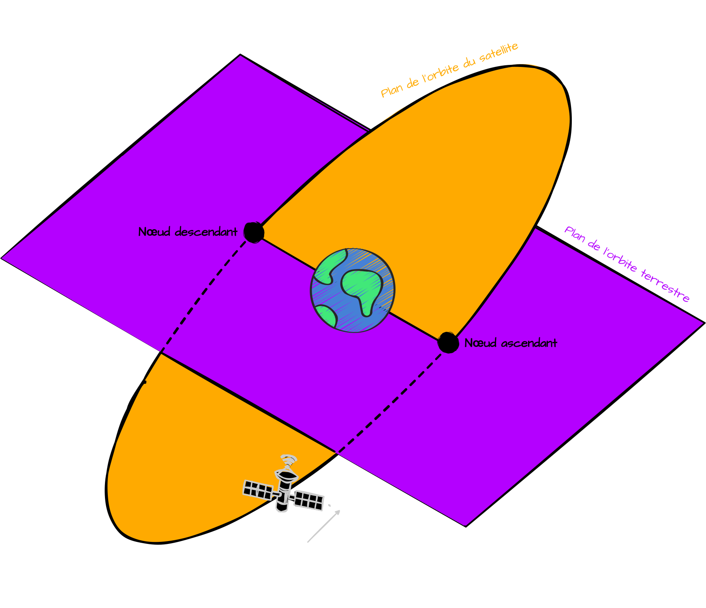
Le **nœud ascendant**, c'est le croisement entre le plan de l'orbite terrestre et celle du satellite lorsque ce dernier "remonte". Le **nœud descendant**, c'est pareil mais inversement. 

## Point Vernal
Le **point vernal**, c'est en gros le **nœud ascendant** de l'orbite du **Soleil** avec celle de la **Terre**.
L'**écliptique**, c'est l'orbite que décrit le **Soleil** autour de la **Terre**. L'**équateur céleste**, c'est le plan défini par l'**équateur terrestre**.
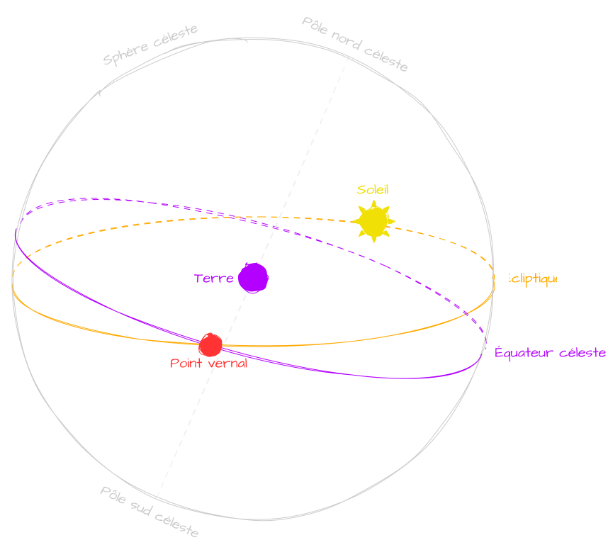

## Longitude du nœud ascendant
On comprend (à peu près) mieux la première phrase : La **longitude du nœud ascendant**,  c'est l'angle entre le **nœud ascendant** et le **point vernal**. 
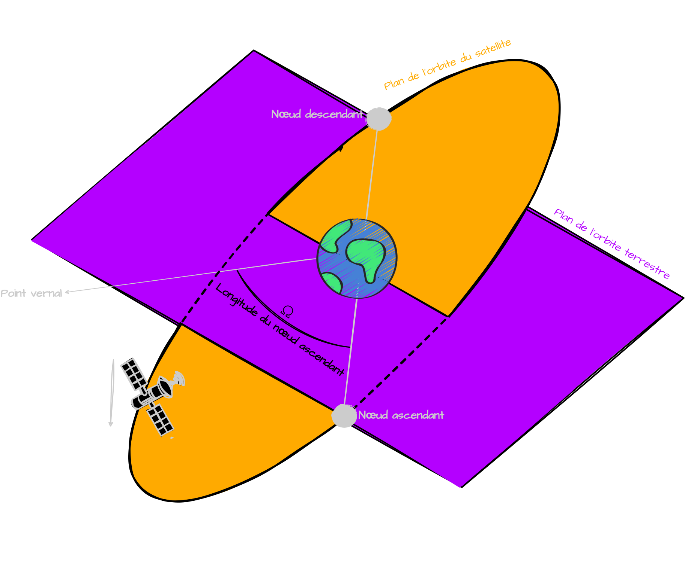
Bon, j'avoue, c'est le plus dur de tous à assimiler mais voyons ce que si passe quand on change cet angle avec **orbital Mechanics** : 

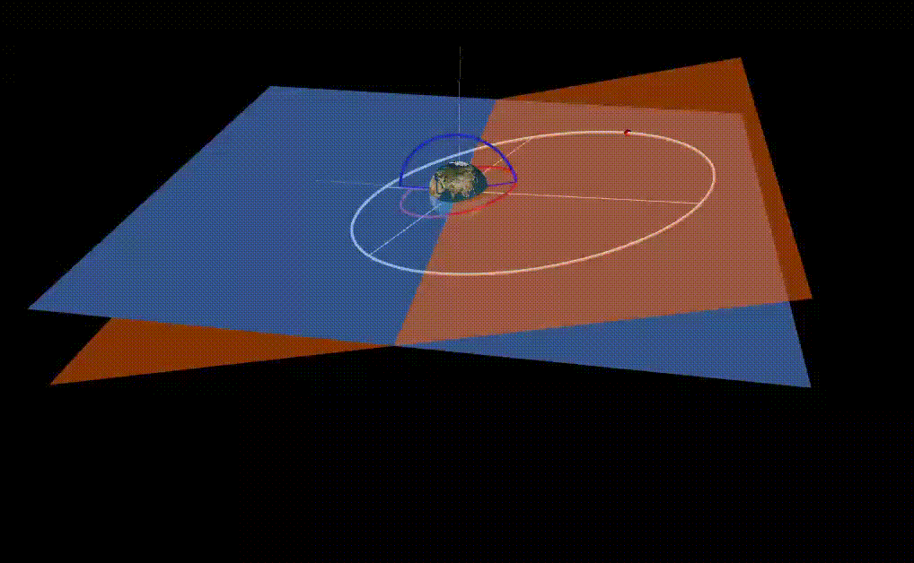

# Le demi-grand axe
Bien que non présent dans les **TLE**, ce paramètre est à prendre en compte pour la représentation d'une orbite.

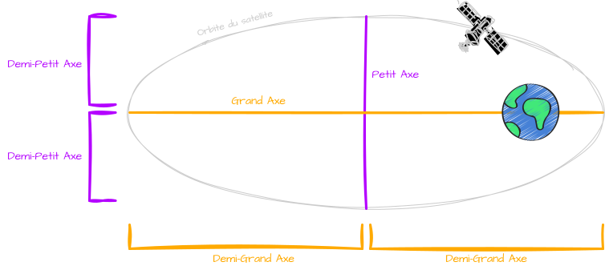
Noté `a`, il représente la moitié du **grand axe** d'une ellipse.
Voilà comment se modifie notre orbite lorsque que l'on modifie cette valeur : 

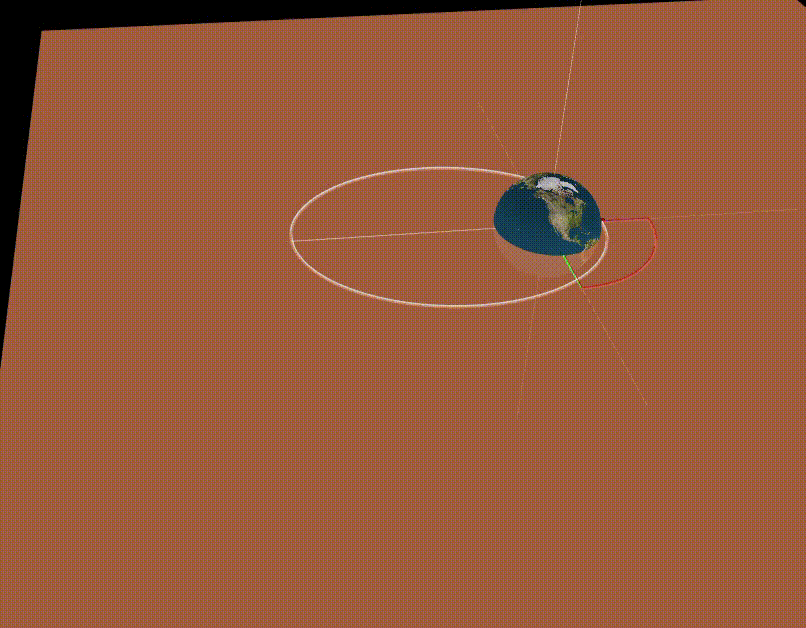

# L'excentricité
Noté `e`, ça représente l'aplatissement d'une ellipse. Elle se calcule à partir des longueurs du **demi-grand axe** `a` et du **demi-petit axe** `b` avec cette [formule](https://fr.wikipedia.org/wiki/Excentricité_orbitale#Calcul_de_l'excentricité_d'une_orbite).
Pour `e=0`, on a un cercle parfait (orbite & chemin fermé).
Pour `0<e<1`, on a une ellipse (orbite & chemin fermé). C'est ce type d'**excentricité** qu'on aura affaire pour les **satellites**.
Pour `e=1`, on a une **parabole** (trajectoire ouverte).
Pour `e>1`, on a une **hyperbole** (trajectoire ouverte).

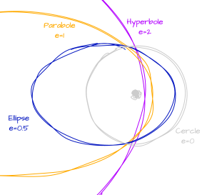
Changement de `e` :

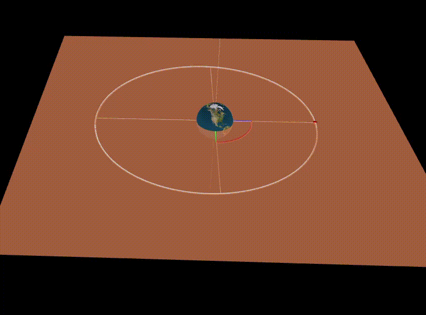

# L'argument du Périastre
Noté `ω`, c'est l'angle en `°` entre le **nœud ascendant** et le **périastre**. 

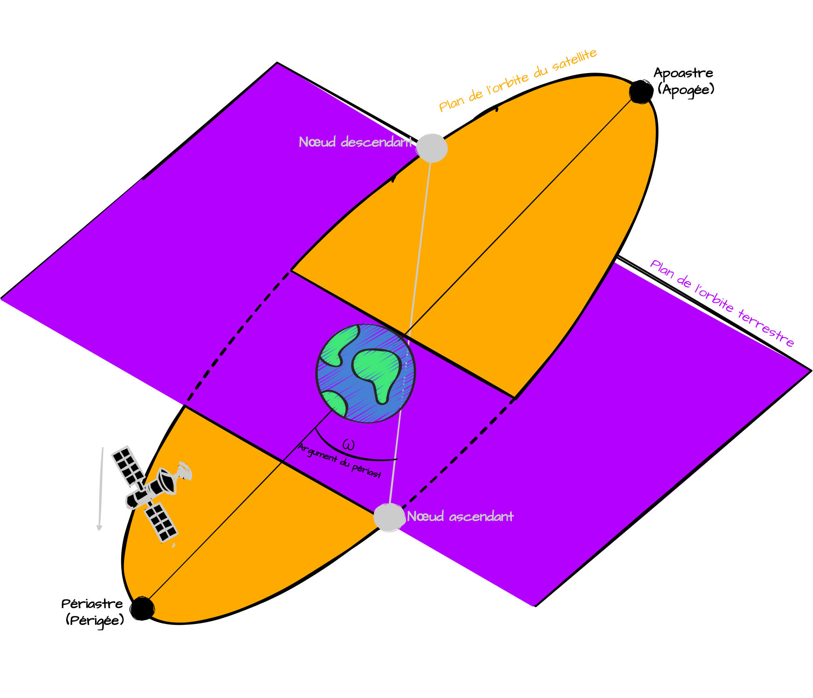
Le **périastre**, c'est le point sur l'orbite où le satellite est au plus proche de l'astre autour duquel il tourne. 
Si l'astre c'est la **Terre**, on parle de **périgée** et d'**apogée** (**périhélie** et **aphélie** pour le **Soleil**).
Voyons ce qui se passe quand on change cet valeur : 

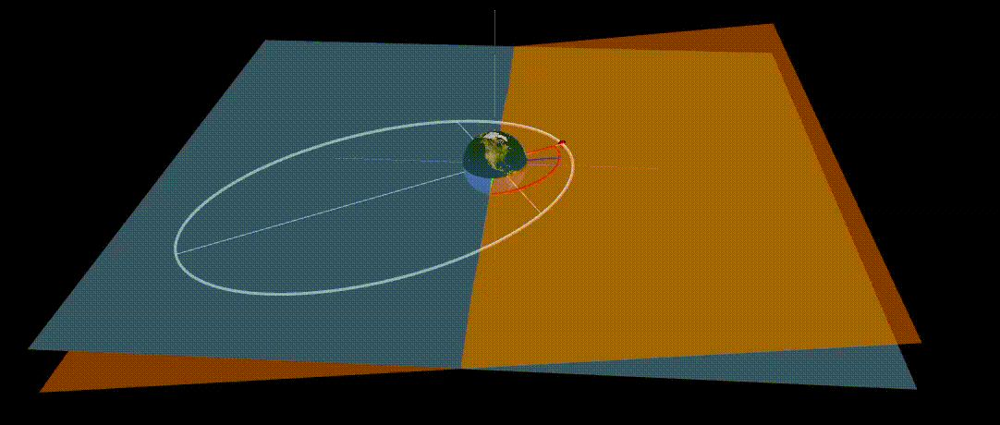

# L'anomalie vraie
Noté `𝜈`, c'est l'angle en `°` entre le **périastre** d'une orbite et la position actuelle du satellite. En fait, c'est ce paramètre qui nous permet de situer le satellite sur notre orbite. Sur le schéma ci-dessous, en fonction de l'angle, le satellite sera à différents endroits sur l'orbite.
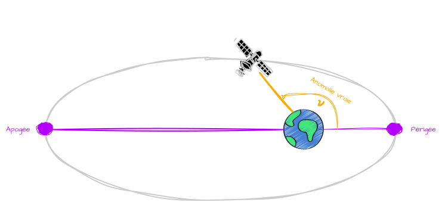

Donc voilà, on a : 
- La **taille** et la **forme** de notre orbite grâce au **demi-grand axe** et l'**excentricité**.
- L'**orientation** de l'orbite grâce à l'**inclinaison**, la **longitude du nœud ascendant** et l'**argument du périastre**.
- La **position** du satellite grâce à l'**anomalie vraie**.
  
Et c'est bon, on a réussi à arriver jusqu'au bout, **BRAVO** 😎.
Retenez surtout qu'on va souvent utiliser les **TLE** car c'est grâce à eux qu'on pourra prédire le passage d'un satellite à un endroit bien précis. 
Pour ceux qui auraient besoin d'une autre représentation visuelle, y a [cette super vidéo](https://www.youtube.com/watch?v=QZrYaKwZwhI).
