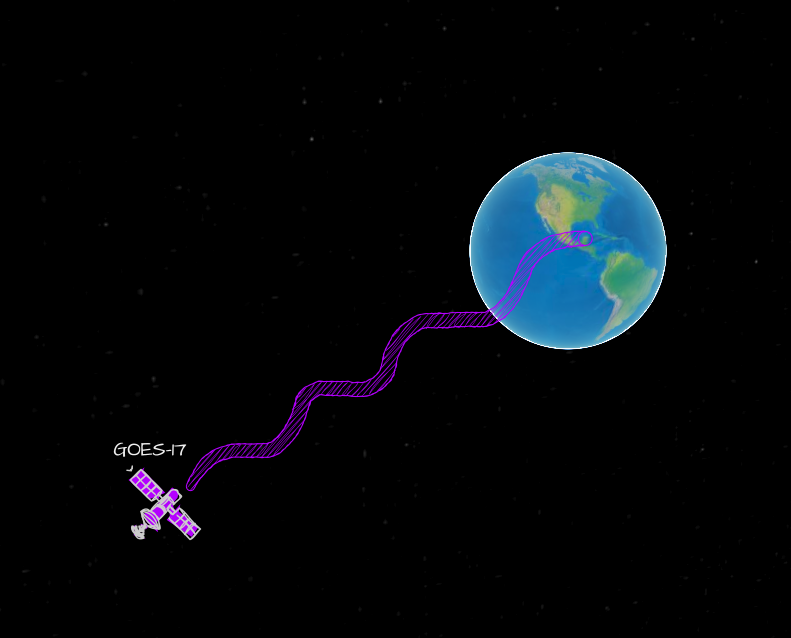
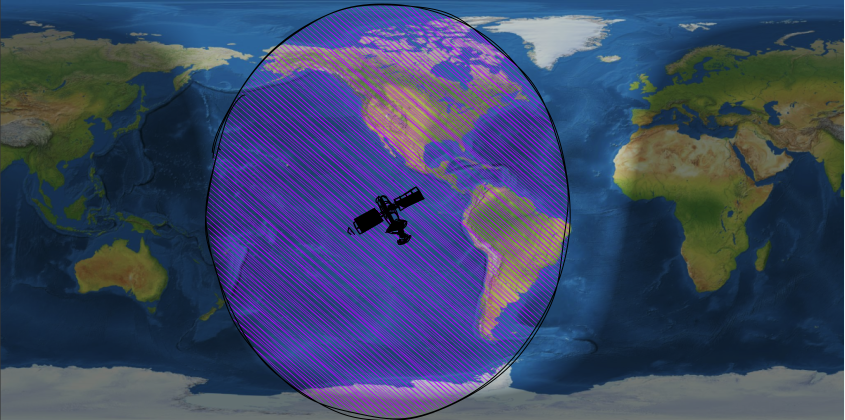
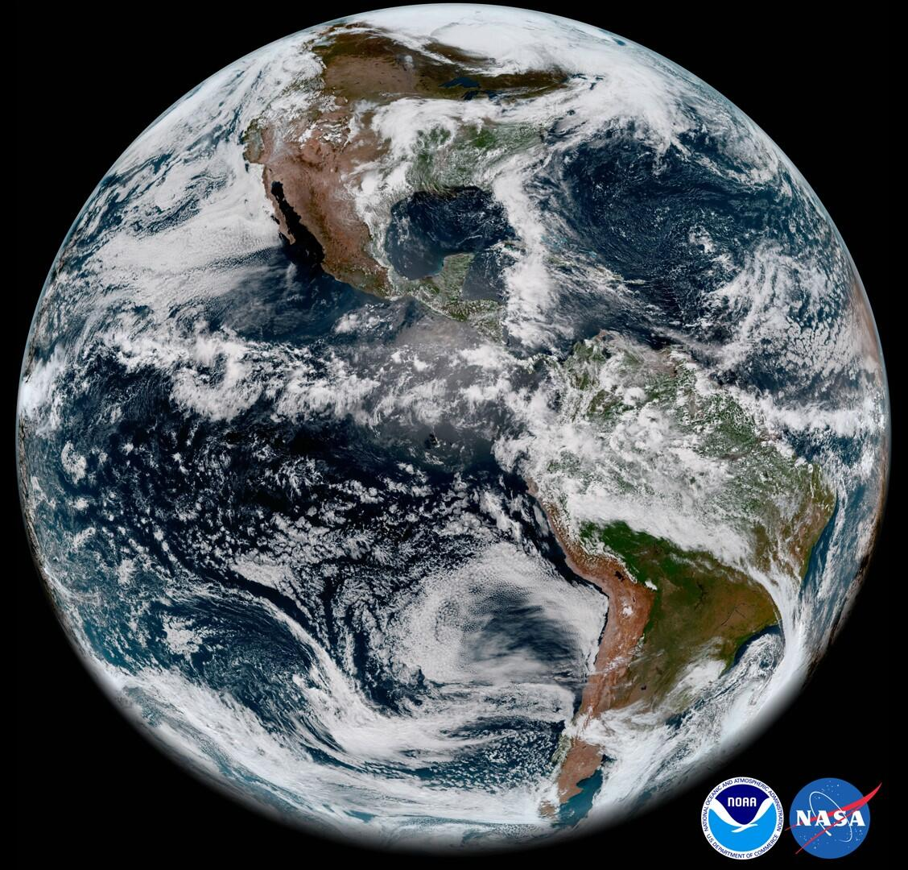
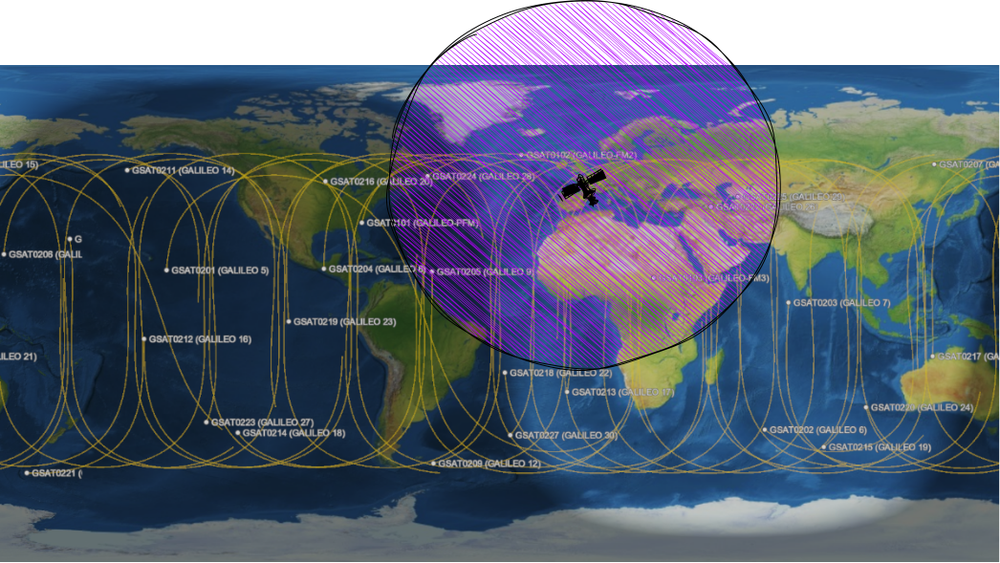
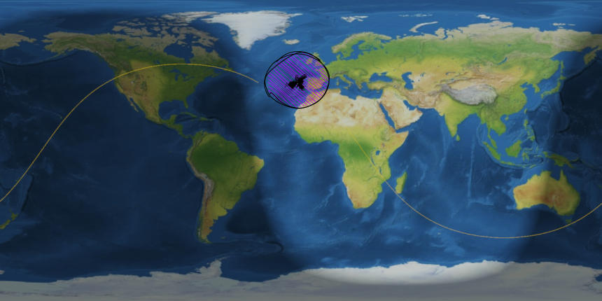
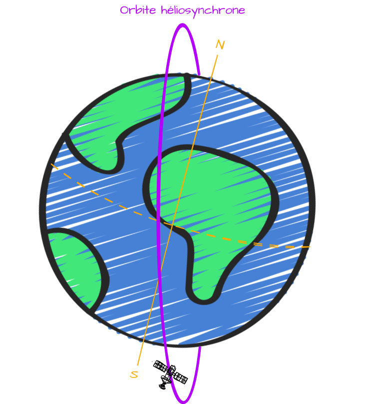
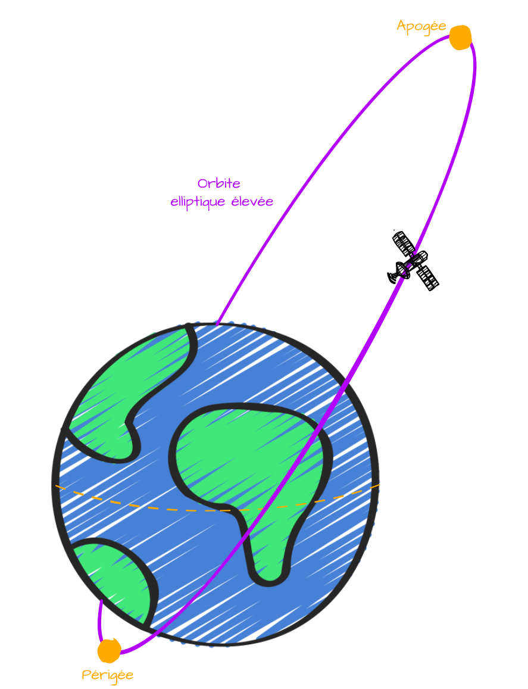

Lorsque l'on envoie un satellite dans l'espace, on a le choix avec une infinité d'orbites disponibles. 
Pour la grande majorité des satellites, ce qui compte, c'est la **Terre**, puisque c'est avec elle qu'ils vont interagir. Ainsi, pour être efficace, ils doivent être placés sur des **orbites** qui tiennent compte à la fois de leur propre mouvement autour de la **Terre** mais aussi de la rotation de cette dernière sur son axe.
Il n'y a donc que quelques **orbites** spécifiques qui optimisent tout ça, et on va comprendre pourquoi dans ce cours.

# Orbite géostationnaire (GEO)
Il s'agit d'une orbite qui match parfaitement avec la rotation de la **Terre**. Du coup, les satellites placés sur cette orbite apparaissent comme *"stationnaires"* ou immobiles au-dessus d'une position donnée. Comme ils tournent en même temps que la **Terre**, ils mettent **24h** à faire le tour de cette dernière (**23h 56min 4s** exactement).
On va utiliser [satvis](https://satvis.space/next/?tags=&sats=GOES%7E17) pour mieux comprendre et prendre comme exemple, le satellite **météorologique** [GOES-17](https://en.wikipedia.org/wiki/GOES-17)

Sur cette image, on peut voir que ce satellite a un champ de vision énorme sur les 2 continents américains, donc presque tout un **hémisphère** 🌎.
Si on met la vue en **2D**, la couverture du satellite donnerait ça : 

Et ainsi, on peut récupérer ce type d'image bien pratique pour la **météo** par exemple : 

Cette orbite n'est pas pratique uniquement pour faire des photos mais aussi pour des services comme la **télévision** par satellite.
Bon, l'orbite paraît idéal pour tout type d'activité mais en réalité, elle a un désavantage, sa distance de la **Terre** qui est de **35786km** (au niveau de l'**équateur**) ! Donc non seulement, c'est très couteux et gourmand d'envoyer un satellite aussi loin mais surtout, il faut prendre en compte un **délai** de **22 secondes** pour qu'une information aille du **satellite** jusqu'à la **Terre** ou l'inverse ce qui peut rendre plus difficile certaines opérations ⏳.

# Orbite terrestre moyenne  (MEO)
Rapprochons nous avec l'orbite terrestre moyenne situé entre l'**orbite basse** et l'**orbite géostationnaire**.
C'est une orbite idéale pour les **satellites de navigations** qui fonctionnent par **constellation**. Ainsi, sur cette orbite, chacun d'entre eux peux quand même voir **38%** de la surface de la **Terre** tout en allant assez vite pour couvrir l'entiereté du globe. Leur période orbitale varient entre **2** et **12h**.
On peut voir sur [satvis](https://satvis.space/next/?tags=&scene=2D&elements=Point,Label,Orbit-track&sats=GSAT0201%7E%28GALILEO%7E5%29,GSAT0202%7E%28GALILEO%7E6%29,GSAT0203%7E%28GALILEO%7E7%29,GSAT0204%7E%28GALILEO%7E8%29,GSAT0205%7E%28GALILEO%7E9%29,GSAT0103%7E%28GALILEO-FM3%29,GSAT0215%7E%28GALILEO%7E19%29,GSAT0216%7E%28GALILEO%7E20%29,GSAT0214%7E%28GALILEO%7E18%29,GSAT0213%7E%28GALILEO%7E17%29,GSAT0212%7E%28GALILEO%7E16%29,GSAT0217%7E%28GALILEO%7E21%29,GSAT0218%7E%28GALILEO%7E22%29,GSAT0223%7E%28GALILEO%7E27%29,GSAT0222%7E%28GALILEO%7E26%29,GSAT0221%7E%28GALILEO%7E25%29,GSAT0220%7E%28GALILEO%7E24%29,GSAT0219%7E%28GALILEO%7E23%29,GSAT0224%7E%28GALILEO%7E28%29,GSAT0225%7E%28GALILEO%7E29%29,GSAT0227%7E%28GALILEO%7E30%29,GSAT0101%7E%28GALILEO-PFM%29,GSAT0102%7E%28GALILEO-FM2%29,GSAT0211%7E%28GALILEO%7E14%29,GSAT0209%7E%28GALILEO%7E12%29,GSAT0208%7E%28GALILEO%7E11%29,GSAT0207%7E%28GALILEO%7E15%29,GSAT0206%7E%28GALILEO%7E10%29) par exemple la constellation [Galileo](https://fr.wikipedia.org/wiki/Galileo_(syst%C3%A8me_de_positionnement)) constituée de **30** satellites avec la couverture d'un seul satellite permettant ainsi de savoir où l'on est à tout instant.

 N'hésites pas à consulter [juste ici](./gps.html) mon cours sur le **GPS/GNSS** pour comprendre comment ça fonctionne :)

# Orbite terrestre basse (LEO)
Allons au plus proche de notre surface terrestre avec l'orbite la plus peuplée, l'**orbite basse** (**85%** des satellites actuellement en orbite). Ce sont tous les satellites qui sont à moins de **2000km** de nous à peu près. 
Si c'est la plus remplie, c'est principalement car il faut "peu" de ressources pour les mettre en orbite, rendant l'espace accessible à de plus "petits" acteurs du spatial. En plus, il n'y a quasiment aucun délai pour la communications contrairement au **22 secondes** des géostationnaires.
Comme ils sont proche, ils font aussi le tour de la **Terre** très rapidement, **90 minutes** seulement. C'est ce qui explique que les astronautes à bord de l'**ISS** (qui va à **28000km/h**) voient **16** couchers de soleil par jour 🌅.
Bien que cette orbite puisse balayer plusieurs endroits de la **Terre** rapidemet, sa couverture reste très petite ce qui nécessite de multiplier les **stations de sol** afin d'avoir un contact avec le satellite.

C'est d'ailleurs sur cette orbite qu'est placée la mega constellation de satellites [Starlink](https://www.starlink.com/) de **SpaceX**. Il y en a plus de **6000** aujourd'hui (donc plus de la moitié du nombre total de satellites) et ça ne fait qu'augmenter.  

# Orbite polaire 
L'**orbite polaire** qui est en soit une **orbite basse** tourne autour des pôles terrestres. En fait, son orbite est incliné de **90°**. Comme la **Terre** tourne sur elle même, les satellites sur cette orbite ont une couverture sur toute le globe rapidement.

Bon sur mon schema, niveau échelle par rapport au **Soleil**, on fait comme ci ne rien n'était. Mais on comprend que l'avantage de cette orbite est que les satellites font toujours face au **Soleil** et donc peuvent recevoir en permanence de l'énergie ☀️.

# Orbite héliosynchrone (SSO) 
L'**orbite héliosynchrone** est une orbite **quasi polaire** qui fait aussi partie de l'**orbite basse** où l'on chosit un angle et une inclinaison de sorte que le satellite observe chaque bout de la **Terre** toujours aux **mêmes heures**. Pratique pour les études sur le climat.

C'est cette orbite qu'utilisent les **NOAA** dont on récupéraient les images sur [ce projet](../../Projects/NOAA.html).

# Orbite elliptique élevée (HEO) 
Une orbite particulière qui a une trajectoire elliptique de sorte que le satellite passe de très proche de la **Terre** à très très loin.

C'est par exemple utilisée par les satellites russes. Sur cette orbite, ils se déplacent lentement durant leur **apogée** pour avoir une couverture prolongée au niveau des latitudes nords. Et, ils se déplacent rapidement lors de leur **périgée** au niveau des latitudes sud. Dans cet exemple, on parle plus précisément d'[orbite de Molniya](https://fr.wikipedia.org/wiki/Orbite_de_Molnia). 
Il existe aussi l'[orbite Toundra](https://fr.wikipedia.org/wiki/Orbite_toundra) mais bref, c'est des cas particuliers d'orbites en général les **HEO** qui sont surtout pratiques pour les télécommunications dans les **régions polaires**. 

Et voilà pour les principaux types d'orbites, aujourd'hui, c'est plus de **10000** satellites qui sont actuellement en orbite autour de la **Terre**. Il n'est pas évident de connaître le nombre exacte de satellites mais on peut avoir un bon aperçu avec le site [Orbiting now](https://orbit.ing-now.com/) 🔍.
