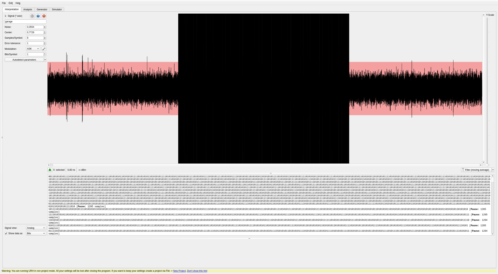
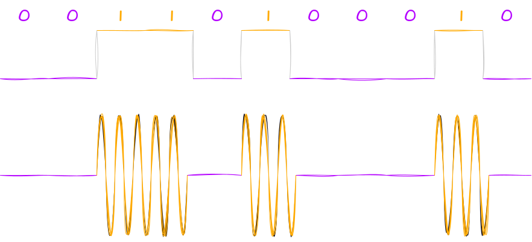

Description du challenge : *Pendant votre test d'intrusion physique, vous remarquez une porte de garage à l'arrière de l'entreprise qui vous mandate. A l'aide de votre RTL-SDR, vous arrivez à enregistrer le signal d'ouverture de la porte. Il vous faut maintenant identifier la séquence de bits envoyée au récepteur de la porte pour pouvoir faire votre propre émetteur.*

Le challenge est disponible à [cette adresse](https://theblackside.fr/challenges/reseau/Porte-de-garage).

On nous demande de retrouver la séquence en **binaire** envoyée au récepteur d'une porte de garage. Pour cela, on nous fournit un fichier `garage.wav`. 
Ouvrons-le avec le logiciel [Universal Radio Hacker](https://github.com/jopohl/urh).

Quand on ouvre un fichier avec **URH**, il essaie automatiquement de décoder le signal en trouvant lui même la modulation et d'autres paramètres. Spoiler : La détection automatique pour ce challenge est foireuse. Faisons-le manuellement, on comprendra bien mieux :) 
Pour commencer, il faut savoir de quelle type de modulation il s'agit. Pour des télécommandes de garage, c'est souvent une modulation de type [ASK](https://en.wikipedia.org/wiki/Amplitude-shift_keying) (**A**mplitude **S**hift **K**eying).
Avec ce type de modulation, qui est numérique, on utilise l'**amplitude** du signal porteur pour représenter les données, où différentes **amplitudes** représentent différents **bits**. Par exemple : 

 
On peut reconnaître visuellement qu'il s'agit bien d'**ASK** avec ces salves et ces temps de pauses qui ont une amplitude différente bien marquée.

Etant donné que le même signal se répète plusieurs fois, on peut "*rogner*" notre signal pour garder une seule instance. Ainsi, il nous reste uniquement un seul signal correspondant à l'ouverture de la porte de garage. Reste à savoir quel encodage a été utilisé. Attention, il ne faut pas confondre la **modulation** avec la **méthode d'encodage**. 
Pour envoyer un message **binaire** qui à la base est donc un signal **numérique**, on va l'encoder, il faut le voir comme la manière dont les **bits** sont organisés.
Et c'est après qu'on vient **moduler** le signal numérique en **ASK** (par exemple) pour le "transformer" en une **onde radio** qui puisse être transmise. 

La première salve très longue (`12ms`) correspond au **préambule**. Une pulsation, souvent composé de `1` permettant de "*réveiller*" le récepteur afin qu'il se tienne prêt à recevoir ce qui suit.
Le reste correspond donc aux données envoyées pour ouvrir la porte de garage, et on remarque une particularité : la longueur des **salves** et des **temps de pause** peut-être différente. Plus précisément, une salve **longue** (`2400μs`) est **toujours** accompagné d'un temps de pause **court** (`1200μs`) et à l'inverse une salve **courte** (`1200μs`) est **toujours** accompagné d'une salve longue (`2400μs`). Cela ressemble à des modulations d'impulsions comme le [PWM](https://fr.wikipedia.org/wiki/Modulation_de_largeur_d%27impulsion) ou le [PDM](https://en.wikipedia.org/wiki/Pulse-density_modulation) à pars que ces derniers utilisent soient un temps de pause fixe, soit un temps de salve fixe, mais là, nous, on a les deux. La méthode d'encodage ressemblerait à quelque choes comme ça :

J'ai pas su trouver le type exacte de modulation, n'hésitez pas à laisser un commentaire si vous l'avez :) 
Bref, dans tous les cas, on peut trouver la séquence binaire juste en comptant les salves et temps de pauses tout en suivant la logique du schéma. 
Maintenant, comme on a **URH**, autant l'utiliser le pauvre. Premièrement, il faut trouver le `Samples/Symbol` qui représente la durée d'**1 bit**. Dans notre cas, c'est `3600μs` parce que comme on l'a vu, un `1` vaut `2400+1200` et un `0` vaut `1200+2400`. Aussi, il faut changer la valeur `Center` qui permet à **URH** de définir un seuil (représenté par la partie verte et rose) de ce qu'il considère comme un `1` ou un `0`. Enfin, supprimons le **préambule**, on en a pas besoin.

Et voilà, on obtient une séquence binaire qui s'avère être le bon flag ! A noter que je suis parti du principe qu'un `1` vaut `long + court` et un `0` vaut `court + long`, en l'occurence c'était bien ça mais dans un autre type de challenge, l'inverse aurait pu être possible. Surtout qu'on a pas de flag au format **ASCII** pour être sur que c'est bon, du coup, à pars en testant les 2 séquences binaires en guise de flag, on a pas trop d'autres moyens de savoir si c'est bon. A pars si on avait la dite porte de garage pour tester :)

