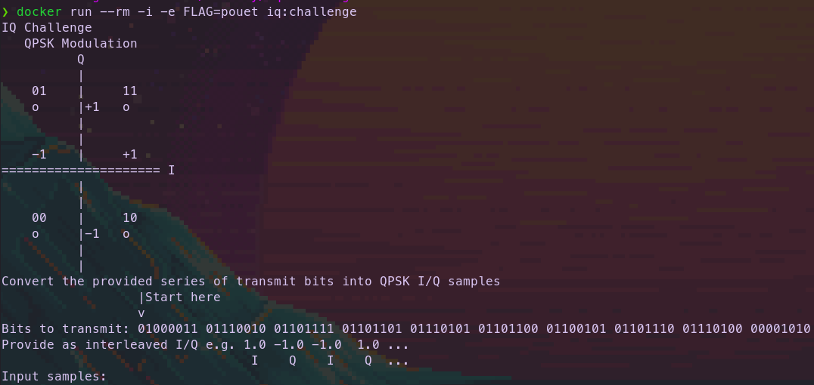
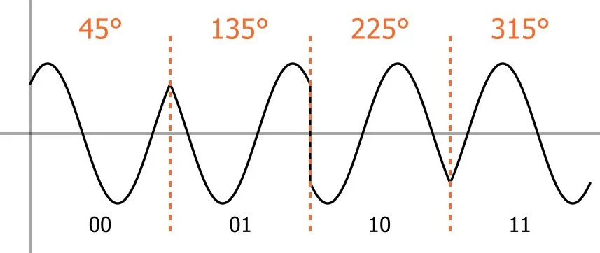
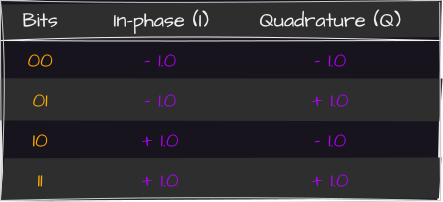

Description du challenge : *Convert the provided series of transmit bits into in-phase quadrature samples.*

Le challenge est disponible à [cette adresse](https://github.com/cromulencellc/hackasat-qualifier-2021/tree/main/iq).

Connectons-nous à l'instance du challenge : 


On nous demande de convertir une série de **bits** en un échantillon **I/Q** en modulation [QPSK](https://fr.wikipedia.org/wiki/Phase-shift_keying) (**Q**uadrature **P**hase **S**hift **K**eying). 

# Modulation QPSK
La modulation **QPSK** est une modulation de phase **numérique** où l'on va modifier la **phase** de la **porteuse** pour transmettre des données. Tu peux retrouver un cours sur ce qu'est la modulation [juste là]({{ site.data.links.am }}) et sur la phase [juste ici]({{ site.data.links.phase }}.

Concrètement, pour cette modulation, les bits sont regroupés par **paires** donc on a 4 combinaisons possibles : `00`, `01`,`10`,`11` et ainsi **4 phases** possibles. En général, chacune d'entre elles est espacée de **90°**. Par exemple,  on pourrait avoir `00` à **0°**, `01` à **90°**, `11` à **180°** et `10` à **270°**.
On peut aussi le voir sur ce schéma avec d'autres valeurs mais qui restent espacées de **90°** :


# Échantillon IQ
**I** (**In-phase**) et **Q** (**Quadrature**) sont les deux composantes orthogonales du signal modulé. Elles représentent respectivement les parties **cosinus** et **sinus** de l'onde **porteuse modulée**.
Si on décompose le signal avec ces deux valeurs, on peut représenter le signal modulé comme un point dans un plan à deux dimensions appelé [diagramme de constellation](https://fr.wikipedia.org/wiki/Diagramme_de_constellation).

Un échantillon **I/Q** permet ainsi de représenter les valeurs numériques des deux composantes du **signal modulé**. Cela nous permet de représenter la modulation en phase du signal comme pour le **QPSK**. 

# Résolution
Pour la résolution du challenge, on va faire un script en `Python`. Sachant qu'en **QPSK**, les bits sont codés par **paire**, on va commencer par cette étape : 

bits = "01000011 01110010 01101111 01101101 01110101 01101100 01100101 01101110 01110100 00001010"

bits_pair = []
i = 0
while i < len(bits):
    if bits[i] == " ": # Pour ignorer les espaces de notre variable bits (Oui, on aurait pu les enlever direct manuellement mais c'est pour que ça reste propre)
        i += 1
    pair = bits[i:i+2]
    bits_pair.append(pair)
    i += 2

print(bits_pair) # ['01', '00', '00', '11', '01', '11', '00', '10', '01', '10', '11', '11', '01', '10', '11', '01', '01', '11', '01', '01', '01', '10', '11', '00', '01', '10', '01', '01', '01', '10', '11', '10', '01', '11', '01', '00', '00', '00', '10', '10']


Chaque combinaison de bits est mappée à un point spécifique dans le plan **I/Q** où **I** (**In-phase**) est l'axe **horizontal** et **Q** (**Quadrature**) l'axe **vertical**.
Par rapport au diagramme qui nous est donné, on peut déduire la façon de coder nos bits : 

Ainsi, on peut faire une table de mappage en utilisant un **dictionnaire** et sortir une liste `iq_samples` qui contient nos `bits` mappés : 

bits_map = {
    "00": "-1.0 -1.0",
    "01": "-1.0 1.0",
    "10": "1.0 -1.0",
    "11": "1.0 1.0"
}

iq_samples = []
for pair in bits_pair:
    iq_value = bits_map.get(pair)
    iq_samples.append(iq_value)

print(iq_samples) # ['-1.0 1.0', '-1.0 -1.0', '-1.0 -1.0', '1.0 1.0', '-1.0 1.0', '1.0 1.0', '-1.0 -1.0', '1.0 -1.0', '-1.0 1.0', '1.0 -1.0', '1.0 1.0', '1.0 1.0', '-1.0 1.0', '1.0 -1.0', '1.0 1.0', '-1.0 1.0', '-1.0 1.0', '1.0 1.0', '-1.0 1.0', '-1.0 1.0', '-1.0 1.0', '1.0 -1.0', '1.0 1.0', '-1.0 -1.0', '-1.0 1.0', '1.0 -1.0', '-1.0 1.0', '-1.0 1.0', '-1.0 1.0', '1.0 -1.0', '1.0 1.0', '1.0 -1.0', '-1.0 1.0', '1.0 1.0', '-1.0 1.0', '-1.0 -1.0', '-1.0 -1.0', '-1.0 -1.0', '1.0 -1.0', '1.0 -1.0']

Et enfin, on peut construire notre échantillon **QPSK** :

qpsk = ' '.join(iq_samples)
print(qpsk)

Plus qu'à lancer notre script en entier et on obtient ça : 
``` bash
python .\iq.py
-1.0 1.0 -1.0 -1.0 -1.0 -1.0 1.0 1.0 -1.0 1.0 1.0 1.0 -1.0 -1.0 1.0 -1.0 -1.0 1.0 1.0 -1.0 1.0 1.0 1.0 1.0 -1.0 1.0 1.0 -1.0 1.0 1.0 -1.0 1.0 -1.0 1.0 1.0 1.0 -1.0 1.0 -1.0 1.0 -1.0 1.0 1.0 -1.0 1.0 1.0 -1.0 -1.0 -1.0 1.0 1.0 -1.0 -1.0 1.0 -1.0 1.0 -1.0 1.0 1.0 -1.0 1.0 1.0 1.0 -1.0 -1.0 1.0 1.0 1.0 -1.0 1.0 -1.0 -1.0 -1.0 -1.0 -1.0 -1.0 1.0 -1.0 1.0 -1.0
```
On le copie colle et on obtient le flag :) 
```bash
> docker run --rm -i -e FLAG=pouet iq:challenge
[...]
Input samples: -1.0 1.0 -1.0 -1.0 -1.0 -1.0 1.0 1.0 -1.0 1.0 1.0 1.0 -1.0 -1.0 1.0 -1.0 -1.0 1.0 1.0 -1.0 1.0 1.0 1.0 1.0 -1.0 1.0 1.0 -1.0 1.0 1.0 -1.0 1.0 -1.0 1.0 1.0 1.0 -1.0 1.0 -1.0 1.0 -1.0 1.0 1.0 -1.0 1.0 1.0 -1.0 -1.0 -1.0 1.0 1.0 -1.0 -1.0 1.0 -1.0 1.0 -1.0 1.0 1.0 -1.0 1.0 1.0 1.0 -1.0 -1.0 1.0 1.0 1.0 -1.0 1.0 -1.0 -1.0 -1.0 -1.0 -1.0 -1.0 1.0 -1.0 1.0 -1.0
You got it! Here's your flag:
pouet
```