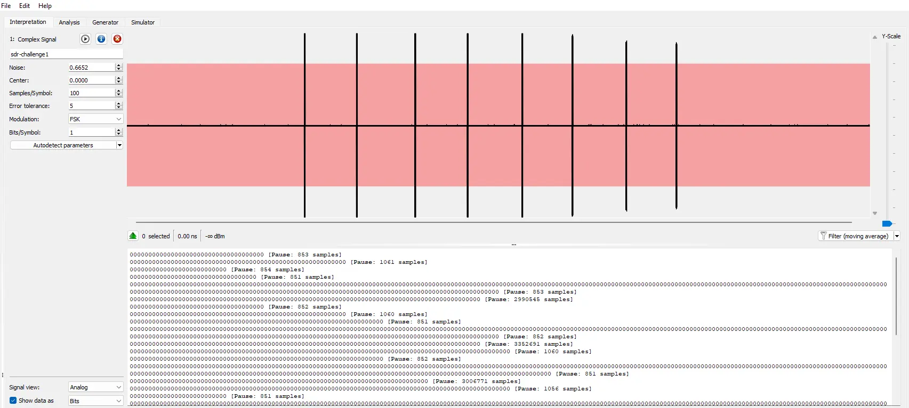
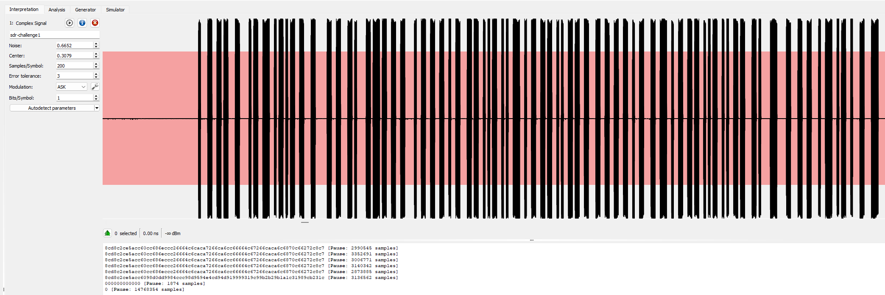
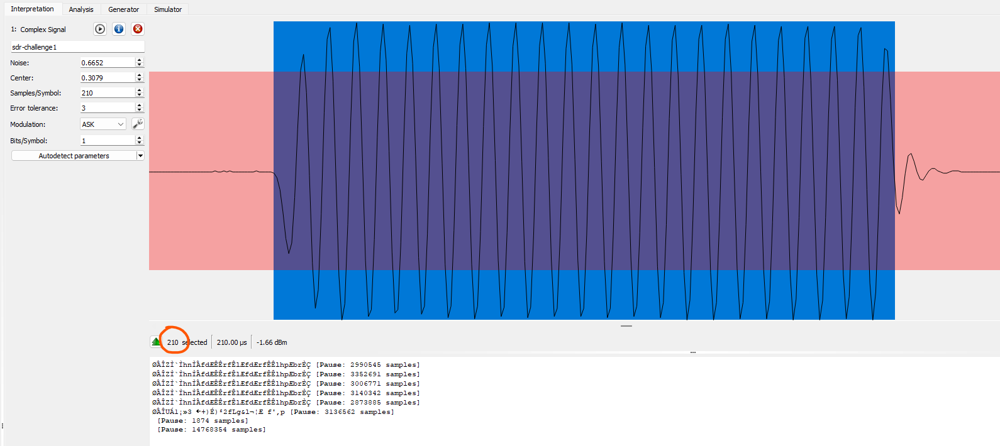

Description du challenge : *We captured alien radio data... Can you crack their message?*

Le challenge est disponible à [cette adresse](https://ringzer0ctf.com/challenges/332).

Pour comprendre le writeup, il est important de comprendre la notion de modulation, alors n'hésite pas à jeter un oeil sur [ce cours]({{ site.data.links.am }}) :) 

On commence avec un fichier `sdr-challenge1.cfile`, ouvrons-le avec [Universal Radio Hacker](https://github.com/jopohl/urh). 

Ok, on a plusieurs morceaux, en zoomant sur l'un d'entre eux, on peut déduire le type de modulation.

Il s'agit d'une modulation [ASK](http://didouqen.ousama.free.fr/Elec/63.pdf) (**A**mplitude **S**hift **K**eying) et plus précisément une modulation [OOK](http://didouqen.ousama.free.fr/Elec/63.pdf) (**O**n **O**ff **K**eying). 
En **ASK** classique, on utilise l'**amplitude** du signal porteur pour représenter les données, où différentes **amplitudes** représentent différents **bits**. 
Et donc, en **OOK**, pour représenter un **bit** à **1**, on va envoyer un signal (**on**) et pour représenter un **0**, on envoie rien (**off**).

Ce type de modulation est très utilisé pour envoyer des données numériques comme avec des clés de portail. 
Depuis **URH**, on peut sélectionner comme type de modulation `ASK`. On peut aussi changer le `Show data as` en sélectionnant `ASCII` afin de pouvoir lire les données en clair.
Truc important à trouver, c'est le `Samples/Symbol` qui pour une modualtion numérique représente la taille d'**1 bit**
Pour la trouver, soit on clique sur `Autodetect`, des fois ça marche (comme ici où il me trouve `200`) mais apprenons à le faire manuellement quand même :)  

Pour ce faire, on va devoir repérer le **plus petit** morceau de signal. 
Zoomons sur le premier morceau de l'image précédente qui semble faire partie des plus petits. Et on sélectionne "à peu près" ce morceau pour regarder en bas la valeur qui nous est affichée. Ici, `210` est la taille du plus petit mot qu'on puisse faire et donc la taille d'**1** symbole. Si on veut faire des mots plus grands, leur taille sera un multiple de `210`. 
Bref, changeons notre `Samples/Symbol` avec cette valeur.

A noter que c'est pas la valeur exacte, c'est une valeur approximative, et d'ailleurs, ce que je trouve est légèrement différent de ce que nous donnait l'**Autodetect**.
Pas grave, on voit qu'au niveau de ce qui est décodé, hors mis la dernière, chaque ligne est similaire. Le même signal est répété.
J'en ai profité pour basculer de la vue **Hex** vers **ASCII** pour voir si un flag apparaissait mais ce serait oublié un détail important sur [URH](https://github.com/jopohl/urh).

En cliquant sur la clé à molette à droite du type de modulation, on peut désactiver le `Pause Threshold`. 
Ce paramètre sert à déterminer les pauses ou les intervalles de silence entre les données du signal. C'est en gros le nombre minimum d'échantillons de silence consécutifs qu'il faut pour dire *"Ah ! là y a une pause"* dans la transmission. 
Par défaut, **URH** met cette valeur sur `8`, donc pour lui, il y a une pause tous les **8 échantillons** consécutifs où le signal est en dessous d'un certains niveau (considéré comme silence).
En désactivant cette contrainte, **URH** ne cherche plus de pauses et réussi correctement à décoder le signal.

Et voilà pour ce challenge :)