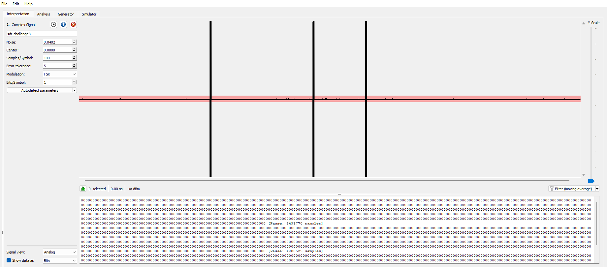
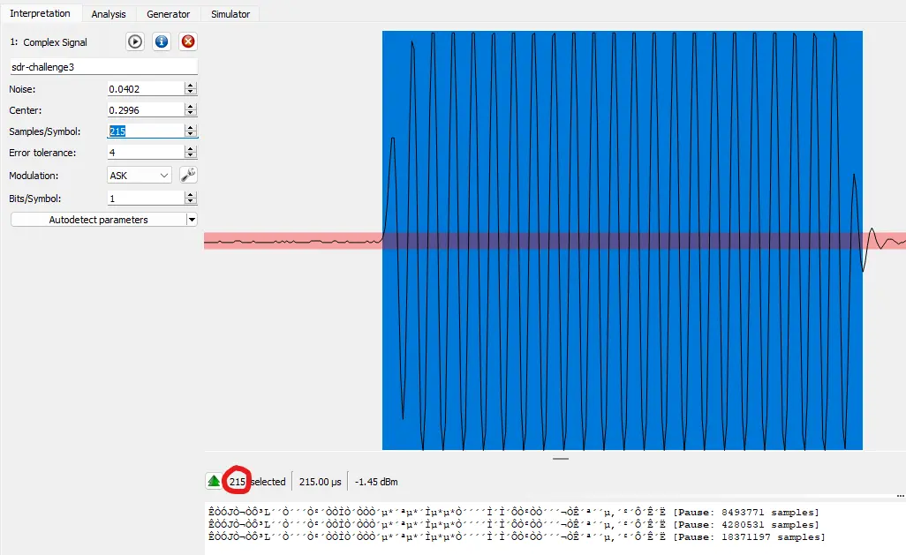

Description du challenge : *The aliens' capabilities have advanced and they've decided to improve the reliability of their transmissions. Can you crack their message?*
Le challenge est disponible à [cette adresse](https://ringzer0ctf.com/challenges/334).
Pour comprendre le writeup, il est important de comprendre la notion de modulation, alors n'hésite pas à jeter un oeil sur [ce cours](../Radio/Radio%20Basics/modulation.html) :) 

Le challenge commence avec un fichier `sdr-challenge3.cfile`. 
Ouvrons-le avec [Universal Radio Hacker](https://github.com/jopohl/urh). 

Comme pour les 2 précédents challenges, on a plusieurs morceaux, zoomant sur l'un d'entre eux. 

Ça ressemble clairement à de l'**ASK**. Si ce type de modulation ne te dit rien, je t'invite à d'abord lire le writeup de [ce challenge](ringzer0-you-turn-me-on-and-off.html) qui traite d'**ASK**. 
On peut alors sélectionner **ASK** comme type de modulation et pour le **Samples/Symbol**, on peut le faire manuellement en sélectionnant le morceau le plus petit pour noter le nombre entouré en **rouge**.

On met la vue en **ASCII** pour voir ce que donne notre signal décodé. On obtient 3 lignes simillaires mais qui ne veulent pas dire grand chose. 
J'oublie pas que durant le [premier challenge](ringzer0-you-turn-me-on-and-off.html), j'avais pris du temps à comprendre pourquoi ça décoder pas car j'avais laissé le **Pause Threshold** à **8**. Donc, je le remet à **0** pour le désactiver. Et à présent, le signal décodé donne ça : 

Bon, ok pas ouf MAIS, on sait que ce challenge est le dernier de sa série et au vue de la description, les **aliens** ont "**amélioré**" la fiabilité de leur transmission. 
Donc je me dis que ça doit être la méthode pour encoder les données qui n'est pas bonne.
Attention, il ne faut pas confondre la **modulation** avec la **méthode d'encodage**. 
Pour envoyer un message **binaire** qui à la base est donc un signal **numérique**, on va l'encoder, il faut le voir comme la manière dont les **bits** sont organisés. par exemple, le **morse** est une forme d'encodage.
Et c'est après qu'on vient **moduler** le signal numérique en **ASK** (par exemple) pour le "transformer" en une **onde radio** qui puisse être transmise. 
Dans le cas d'**Universal Radio Hacker**, il utilise par défault comme méthode pour décoder le [NRZ](https://fr.wikipedia.org/wiki/Non_Return_to_Zero) (**N**on **R**eturn To **Z**ero). On peut le voir dans l'onlget **Analysis** souligné en rouge : 

**URH** a déjà des presets de quelques méthode d'encodage connues comme le [codage de Manchester](https://fr.wikipedia.org/wiki/Codage_Manchester). Pour ce dernier, un **bit** à **0** est représenté avec une **transition** de bas en haut (0 à 1) au milieu de l'intervalle. Pour un **bit** à **1**, c'est l'inverse.

A noter, les traits blancs qui ne font pas partie de l'encodage, ils sont juste là pour relier deux mêmes valeurs consécutives.
Sur **URH**, on a le **Manchester 1** et le **Manchester 2** (Le **Differential Manchester** c'est autre chose). 
La différence entre le **Manchester I** et **2** c'est juste que le **Manchester 2** inverse les bits. Donc les **0** deviennent des **1** et les **1** des **0**.
Et si on choisit le **Manchester 2**, on voit que le **flag** apparaît :)

Et voilà pour ce dernier challenge de transmission **alien**.

