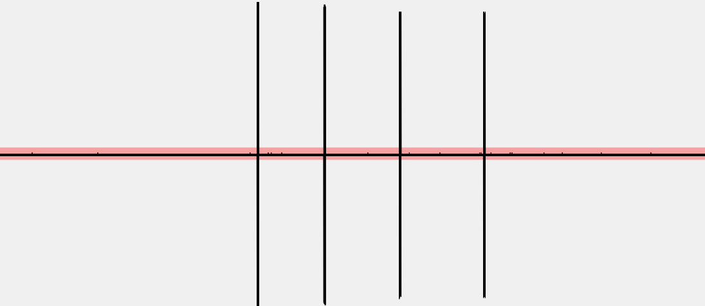
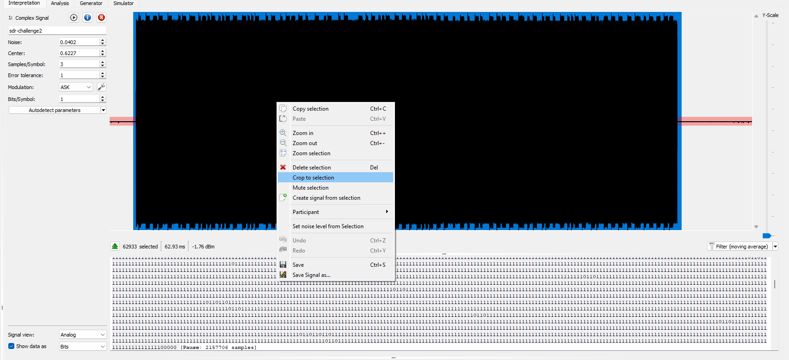
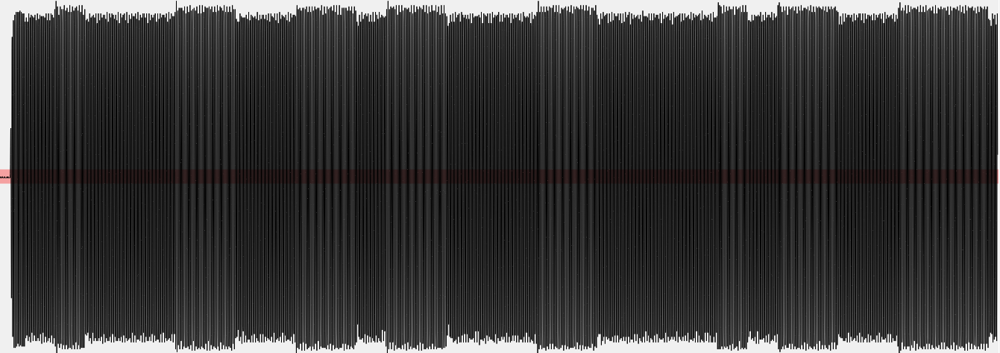
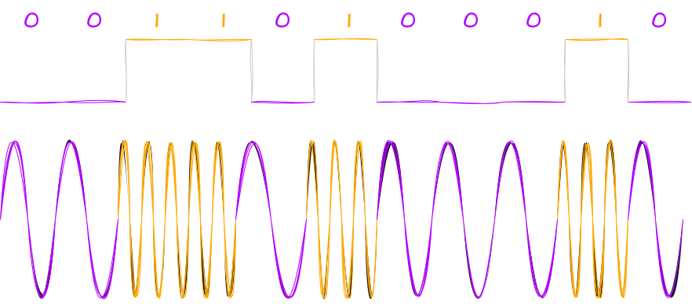
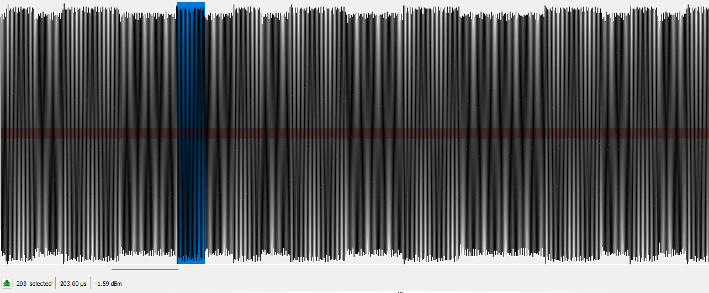
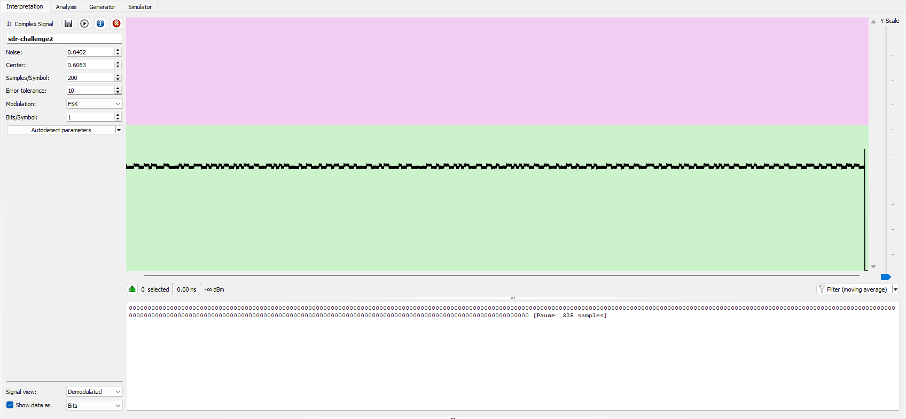

Description du challenge : *The aliens are on to us... They've started wearing tin foil hats and switched things up with their radio transmission. Can you crack their latest message?*
Le challenge est disponible à [cette adresse](https://ringzer0ctf.com/challenges/333).
Pour comprendre le writeup, il est important de comprendre la notion de modulation, alors n'hésite pas à jeter un oeil sur [ce cours]({{ site.data.links.am }}) :) 

Le challenge commence avec un fichier `sdr-challenge2.cfile`, ouvrons-le avec [Universal Radio Hacker](https://github.com/jopohl/urh). 

On retrouve plusieurs morceaux similaires, probablement plusieurs fois le même signal. Zoomons sur l'un d'entre eux pour le *rogner* afin de travailler uniquement sur un seul morceau.

En zoomant encore plus, on remarque quelque chose de très intéressant. En effet, certaines parties semblent plus "*rapprochés*" que d'autres : 

Par rapproché, on entend que la distance entre chaque période est différente, et donc que la **fréquence** est différente. Plus précisément, on a **2 fréquences** distinctes plus ou moins longues.
On peut alors sans prendre de risque supposer qu'il s'agit d'une modulation **FSK** (**F**requency **S**hift **K**eying).
Ce type de modulation numérique utilise une fréquence pour représenter un **0** et une autre pour représenter un **1**.

Reveons à [URH](https://github.com/jopohl/urh), et sélectionnons comme type de modulation `FSK`. Ensuite, il faut trouver le `Samples/Symbol` qui pour une modualtion numérique représente la durée d'**1 bit**. Pour la trouver, il faut sélectionner le plus petit morceau possible et noter comme dans mon cas le nombre `203µs` en bas. 

Donc, on va dire que le `Samples/Symbol` vaut à peu près `200µs`. On peut sélectionner n'importe quel autre morceau d'une même fréquence, et il fera forcément `400µs` ou `600` ou `800` etc... ce qui confirme qu**1 bit** vaudra toujours `200µs`. Bref, on peut mettre dans `Samples/Symbol` la valeur de `200`.
Aussi, une bonne règle générale et de mettre minimum **5%** d'`Error tolerance` par rapport au `Samples/Symbol`. C'est juste au cas où y a des erreurs lors de la démodulation et on peut l'augmenter progressivement si on constate des résultats incohérents. On va pouvoir passer en vue `Demodulated` pour poursuivre notre investigation, ce qui nous donne quelque chose comme ça :

Maintenant, faut qu'on spécifie à [URH](https://github.com/jopohl/urh) quelle fréquence est le `1` et laquelle est le `0`. Pour cela, en vue `Demodulated`, on a une couleur **rose** qui représente les `1` et une **verte** pour les `0`. C'est ce qui explique pourquoi pour l'instant, comme tout notre signal est dans le **vert**, **URH** le décode avec que des `0`. Mais si on vient déplacer le curseur entre les 2 parties pour le positionner pile *au milieu* du signal donc là où **URH** a bien détecté que 2 fréquences sont différentes, alors maintenant, on peut voir que ça nous décode des `0` et des `1`. Et si dans `Show data as`, on bascule de `Bits` à `ASCII`, on peut voir notre flag ! 

Le curseur peut être un peu difficile à positionner, on peut jouer manuellement avec la valeur `Center`à gauche qui représente la même chose que de déplacer le curseur. On peut aussi jouer avec le `Error Tolerance` si on a quelques caractères bizarres.